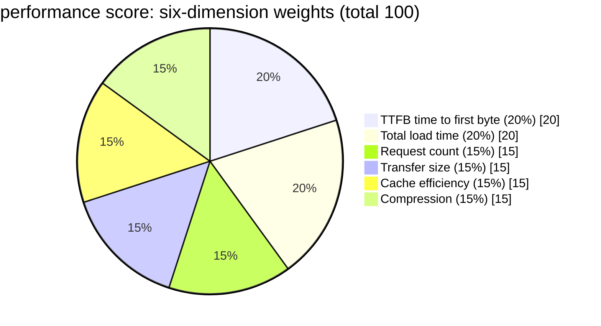
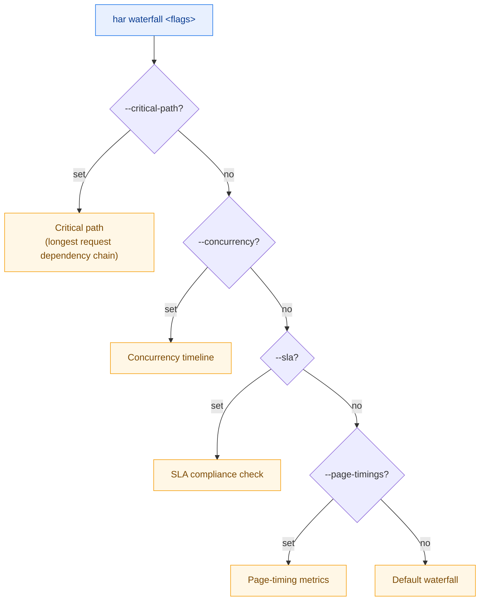

# Deep Analysis

The 8 Level 4 commands are for the moment when you already know what is in the HAR and now need to explain it: performance scoring, cookie/cache audits, index queries, per-domain/content-type/connection stats, and waterfall visualization. They are read-only and do not modify the file — ideal for reporting and triage.

Every example below runs from the repository root against `testdata/example.har` or `testdata/full.har`.

## performance — Performance Score

A Lighthouse-style score that outputs a **grade of A/B/C/D** plus actionable recommendations. No flags required — run it and read the verdict.

```bash
har -f testdata/full.har performance
```

### Six weighted dimensions

The score is built from six dimensions weighted to total 100:



| Dimension | Weight | Focus |
|-----------|--------|-------|
| TTFB (time to first byte) | 20% | Whether the server responds promptly |
| Total load time | 20% | Whether the overall duration is excessive |
| Request count | 15% | Whether there are too many requests |
| Transfer size | 15% | Whether the byte count is too high |
| Cache efficiency | 15% | Whether cacheable resources are actually cached |
| Compression | 15% | Whether text responses use gzip/br |

### Flags

This command has no flags of its own; it uses only the [global flags](./global-flags.md).

### Examples

Emit a JSON report for archival and comparison:

```bash
har -f testdata/full.har performance --format json -o perf.json
```

Text form to read the grade and recommendations directly:

```bash
har -f testdata/full.har performance
```

### How it works

The CLI calls `(*Har).PerformanceScore()`, which returns a `*PerformanceReport`. Each dimension carries a sub-score; the weighted sum is the total, and `Grade()` maps it to A (≥90), B (≥80), C (≥60), or D (otherwise). Recommendations come from the per-dimension modules, targeting whichever dimensions scored low. The CLI either serializes the report to JSON or renders it via `formatPerformanceReport`.

## cookie — Cookie Audit

Inspect cookie security attributes and lifecycle. Defaults to a security audit; pass `--evolution` to switch to a cookie evolution timeline.

```bash
har -f testdata/full.har cookie
```

### What it checks

In audit mode each cookie is checked for:

- **Expiry/session**: whether persistent cookies are necessary and session cookies are reasonable
- **Secure**: whether the cookie is HTTPS-only
- **HttpOnly**: whether it is protected from JavaScript reads
- **SameSite**: whether SameSite is set (Lax/Strict/None)
- **Third-party**: whether it is delivered cross-site
- **Oversized**: whether the size is abnormal
- **Duplicates**: whether cookies with the same name conflict across entries

### Flags

| Flag | Type | Default | Description |
|------|------|---------|-------------|
| `--audit` | bool | `true` | Run the cookie security audit |
| `--evolution` | bool | `false` | Show the cookie evolution timeline |
| `--name` | string | `""` | Show only the cookie with this name |
| `--severity` | string | `info` | Minimum severity filter (`info`/`low`/`medium`/`high`) |

### Examples

Inspect a single cookie's attributes:

```bash
har -f testdata/full.har cookie --name session_id
```

View how cookies evolve across the request sequence (added, removed, value changes):

```bash
har -f testdata/full.har cookie --evolution
```

Show only MEDIUM and above:

```bash
har -f testdata/full.har cookie --severity medium
```

JSON output for downstream processing:

```bash
har -f testdata/full.har cookie --format json -o cookie.json
```

### How it works

The audit path calls `(*Har).CookieAudit()` returning a `*CookieAuditReport`; the evolution path calls `(*Har).CookieEvolution()` returning `map[string][]CookieEvolutionEntry`. `--name` filters by name in both branches; `--severity` filters audit findings via `report.FindBySeverity`. The CLI picks `formatCookieAuditReport` or the evolution table depending on the branch.

## cache — Cache Analysis

Parse `Cache-Control`, `ETag`, `Last-Modified`, `Vary` and other cache headers to assess each response's cacheability.

```bash
har -f testdata/full.har cache
```

### Flags

| Flag | Type | Default | Description |
|------|------|---------|-------------|
| `--non-cacheable` | bool | `false` | Show only non-cacheable entries |
| `--url` | string | `""` | Show the cache assessment for this URL only |

### Examples

List only non-cacheable entries to find cache misses:

```bash
har -f testdata/full.har cache --non-cacheable
```

Inspect one URL's cache assessment:

```bash
har -f testdata/full.har cache --url "https://example.com/static/app.js"
```

JSON output:

```bash
har -f testdata/full.har cache --format json -o cache.json
```

### How it works

The CLI calls `(*Har).CacheAnalysis()`, which returns a `*CacheReport`. For each entry the report parses the cache headers, classifies cacheability (cacheable / needs validation / not cacheable), and gives a reason (e.g. `no-store`, `no-cache`, missing validator). `--non-cacheable` filters results client-side; `--url` filters by exact URL.

## index — Build & Query Index

Build an in-memory multi-key index over the HAR for fast lookups by URL, method, status code, domain, MIME, or URL regex. **With no flags it defaults to showing index statistics.**

```bash
har -f testdata/full.har index --stats
```

### Flags

| Flag | Type | Default | Description |
|------|------|---------|-------------|
| `--stats` | bool | `false` | Show index statistics |
| `--url` | string | `""` | Look up entries by exact URL |
| `--method` | string | `""` | Look up entries by HTTP method |
| `--status` | int | `0` | Look up entries by status code (0 = no filter) |
| `--domain` | string | `""` | Look up entries by domain |
| `--mime` | string | `""` | Look up entries by MIME type |
| `--pattern` | string | `""` | Look up entries by URL regex |

### Examples

Find all POST requests:

```bash
har -f testdata/full.har index --method POST
```

Find every 404:

```bash
har -f testdata/full.har index --status 404
```

By domain:

```bash
har -f testdata/full.har index --domain example.com
```

By MIME for all JSON responses:

```bash
har -f testdata/full.har index --mime "application/json"
```

By regex for v2 API calls:

```bash
har -f testdata/full.har index --pattern "api/v[0-9]+"
```

### How it works

The CLI calls `(*Har).BuildIndex()` to construct the multi-key index, then dispatches to `LookupByURL` / `LookupByMethod` / `LookupByStatus` / `LookupByDomain` / `LookupByMIME` / `LookupByPattern` depending on which flag is set. If none is set it falls back to the `--stats` branch, printing the index size (entry count and per-key cardinality).

## domains — Per-Domain Statistics

Aggregate all requests by domain into request count, time, size, and error metrics, with sorting and truncation.

```bash
har -f testdata/full.har domains
```

### Flags

| Flag | Type | Default | Description |
|------|------|---------|-------------|
| `--sort` | string | `count` | Sort key (`count`/`time`/`size`/`errors`) |
| `--limit`/`-n` | int | `0` | Show only the top N domains (0 = all) |

### Examples

Sort by total time to find the slowest domains:

```bash
har -f testdata/full.har domains --sort time
```

Sort by size, take the top 10:

```bash
har -f testdata/full.har domains --sort size --limit 10
```

Sort by error count to pinpoint failing domains:

```bash
har -f testdata/full.har domains --sort errors
```

### How it works

The CLI calls `(*Har).DomainSummary()`, which returns `map[string]*DomainStats` (each entry holds request count, total time, total size, and error count). The CLI sorts by the chosen `--sort` key and applies `--limit` for truncation.

## content — Content-Type Analysis

Break down response body sizes, compression, and category distribution by MIME type.

```bash
har -f testdata/full.har content
```

### Flags

| Flag | Type | Default | Description |
|------|------|---------|-------------|
| `--by-mime` | bool | `false` | Show a detailed per-MIME breakdown |

### Examples

Default roll-up by category (scripts/styles/images/fonts/documents/JSON/other):

```bash
har -f testdata/full.har content
```

Expand to every specific MIME:

```bash
har -f testdata/full.har content --by-mime
```

JSON output:

```bash
har -f testdata/full.har content --format json
```

### How it works

The CLI calls `(*Har).ContentTypeDistribution()`, which returns MIME-aggregated stats. `--by-mime` controls whether the breakdown goes to specific MIMEs (e.g. `application/json`, `text/css`) or rolls up into categories. Compression ratio is inferred from the response `Content-Encoding`.

## connections — Connection Reuse

Show which entries share a connection (connection-pool reuse analysis). No flags of its own.

```bash
har -f testdata/full.har connections
```

### Examples

JSON output for programmatic consumption:

```bash
har -f testdata/full.har connections --format json
```

### How it works

The CLI calls `(*Har).ConnectionReuse()`, which groups entries by the `connection` field. In HAR 1.2 the `connection` field identifies a single TCP connection; multiple entries sharing an ID indicate reuse. The CLI renders this as a reuse table with summary stats.

## waterfall — Waterfall & Timeline

Render request timing as an ASCII waterfall, or switch to critical path, concurrency, SLA, or page-timing sub-views.

```bash
har -f testdata/full.har waterfall
```

### Mutual-exclusion priority

The five views are mutually exclusive. The CLI picks the first flag that is set, in this order:



When multiple flags are passed at once, the one earlier in this list wins.

### Flags

| Flag | Type | Default | Description |
|------|------|---------|-------------|
| `--critical-path` | bool | `false` | Show the critical path |
| `--concurrency` | bool | `false` | Show the concurrency timeline |
| `--sla` | stringSlice | `[]` | SLA rules, format `name:urlPattern:maxDurationMs` |
| `--page-timings` | bool | `false` | Show page-timing metrics |

### Examples

::: code-group

```bash [Default waterfall]
har -f testdata/full.har waterfall
```

```bash [Critical rendering path]
har -f testdata/full.har waterfall --critical-path
```

```bash [Concurrency timeline (spot parallelism peaks)]
har -f testdata/full.har waterfall --concurrency
```

```bash [SLA checks: API paths within 2s, static assets within 500ms]
har -f testdata/full.har waterfall \
  --sla "API:/api/:2000" \
  --sla "Static:/static/:500"
```

```bash [Page-timing metrics (onContentLoad, onLoad, etc.)]
har -f testdata/full.har waterfall --page-timings
```

:::

::: tip --sla format
Each rule has three colon-separated fields: `name:urlPattern:maxDurationMs`. `urlPattern` is a URL substring match; `maxDurationMs` is the maximum allowed duration in milliseconds for matching entries. Breaches are flagged in the report with the overshoot.
:::

### How it works

The views map onto SDK methods: `(*Har).CriticalPath()` returns the entry sequence on the critical path; `(*Har).ConcurrencyTimeline()` returns time-sliced concurrency; `(*Har).SLACheck(rules)` takes `[]SLARule` and returns per-rule compliance results; `(*Har).PageTimingMetrics()` returns page timings; `(*Har).Waterfall()` returns the default waterfall data. The CLI selects a branch by the priority above; `parseSLARules` turns `--sla` strings into `[]SLARule`.

## Summary

| Command | Angle | Modifies files? |
|---------|-------|-----------------|
| `performance` | Performance score | No |
| `cookie` | Cookie security / evolution | No |
| `cache` | Cache cacheability | No |
| `index` | In-memory index queries | No |
| `domains` | Per-domain aggregation | No |
| `content` | Per-MIME aggregation | No |
| `connections` | Connection reuse | No |
| `waterfall` | Timing visualization | No |

All of Level 4 is read-only, so experiment freely. Pair it with the [Performance Tuning workflow](../workflows/performance.md) for a complete triage chain.
