# Basic Operations

The 6 Level 1 commands cover the most frequent HAR analysis actions: glance at the whole, list entries, search by condition, inspect headers, break down timing, and extract response bodies. They are read-only and do not modify the file — the natural first stop for everyday triage.

Every example below runs from the repository root against `testdata/example.har` or `testdata/full.har`.

## info — HAR Summary

One command paints the whole picture of the HAR: version, creator, page count, request count, transfer size, time percentiles (median / P95 / P99), status code and method distribution, top-10 domains and content types. Run it to learn what the capture "looks like".

::: code-group

```bash [Text summary]
har -f testdata/example.har info
```

```bash [JSON (for archival/comparison)]
har -f testdata/example.har info --format json
```

```bash [Write to file for the record]
har -f testdata/full.har info --format json -o summary.json
```

:::

### Flags

This command has no flags of its own; it uses only the [global flags](./global-flags.md).

### How it works

The CLI calls `(*Har).Statistics()` returning a `*HarStatistics` (with `TotalRequests` / `TotalTransferred` / `P95Time`, etc.); the text output additionally calls `StatusCodeDistribution()` / `MethodDistribution()` / `ContentTypeDistribution()` to render the "distribution" sections. `formatInfoText` stitches these into sectioned text; JSON goes through `MarshalIndent` over the `*HarStatistics`.

## list — List Entries

List each request (method, status, size, duration, URL) with sorting, filtering, and truncation. Common for "list the slow / big / failing ones first".

```bash
har -f testdata/full.har list --limit 20
```

Sort by size, only GETs:

```bash
har -f testdata/full.har list --sort size --method GET
```

Filter by status, ascending order:

```bash
har -f testdata/full.har list --status 200 --sort time --order asc
```

### Flags

| Flag | Type | Default | Description |
|------|------|---------|-------------|
| `--limit`/`-n` | int | `0` | Limit output to N entries (0 = all) |
| `--sort` | string | `time` | Sort key (`time`/`size`/`url`/`status`) |
| `--order` | string | `desc` | Sort direction (`asc`/`desc`) |
| `--method` | string | `""` | Filter by HTTP method |
| `--status` | int | `0` | Filter by status code (0 = no filter) |
| `--domain` | string | `""` | Filter by domain |

::: tip url/status sorting
`--sort url` and `--sort status` currently preserve the original HAR order (the SDK has no matching sort method); when you need a strict URL or status sort, pipe through `--format json | jq` externally.
:::

### How it works

`--method`/`--status` go through `h.FilterWith(har.WithFilterMethod(...), har.WithFilterStatusCode(...))`; `--domain` is applied client-side on the result with `har.ExtractDomain`. The sort branch calls `FilterResult.SortBySize[Desc]` / `SortByDuration[Desc]`; `--limit` calls `result.Limit(n)`. Output is dispatched by `internal.WriteOutput`; text goes through `formatListTable` (a tabwriter table).

## find — Multi-dimensional Search

22 flags for multi-dimensional search: URL (with regex), method, status code and range, content type, resource type, domain, server IP, connection ID, request/response headers, cookies, time range, slow/fast/largest, errors/redirects/cache hits — combined. Multiple conditions are **intersected**.

```mermaid
flowchart TD
    START["What do you want to find?"]:::q
    START --> Q1{"Errors / redirects?"}
    Q1 -- "4xx/5xx" --> F1["--errors"]:::flag
    Q1 -- "3xx" --> F2["--redirects"]:::flag
    START --> Q2{"Slow / fast / large?"}
    Q2 -- "slower than threshold" --> F3["--slow N"]:::flag
    Q2 -- "N slowest" --> F4["--slowest N"]:::flag
    Q2 -- "N fastest" --> F5["--fastest N"]:::flag
    Q2 -- "N largest" --> F6["--largest N"]:::flag
    START --> Q3{"By status code?"}
    Q3 -- "exact" --> F7["--status-code"]:::flag
    Q3 -- "range" --> F8["--status-min / --status-max"]:::flag
    START --> Q4{"By URL / domain / IP?"}
    Q4 -- "substring" --> F9["pattern positional"]:::flag
    Q4 -- "regex" --> F10["pattern --regex"]:::flag
    Q4 -- "domain" --> F11["--domain"]:::flag
    Q4 -- "server IP" --> F12["--server-ip"]:::flag
    START --> Q5{"By headers / cookies?"}
    Q5 -- "request header" --> F13["--header"]:::flag
    Q5 -- "response header" --> F14["--response-header"]:::flag
    Q5 -- "cookie name" --> F15["--cookie"]:::flag
    START --> Q6{"By time range?"}
    Q6 -- "start/end" --> F16["--start-time / --end-time"]:::flag
    START --> Q7{"Other dimensions?"}
    Q7 -- "method" --> F17["--method"]:::flag
    Q7 -- "content type" --> F18["--content-type"]:::flag
    Q7 -- "resource type" --> F19["--resource-type"]:::flag
    Q7 -- "connection ID" --> F20["--connection"]:::flag
    Q7 -- "cache hits" --> F21["--cache-hits"]:::flag

    classDef q fill:#e8f0fe,stroke:#1a73e8,color:#0b3d91
    classDef flag fill:#fff7e6,stroke:#f59e0b,color:#7c4a03
```



Find every 4xx/5xx error request:

```bash
har -f testdata/full.har find --errors
```

The 10 slowest:

```bash
har -f testdata/full.har find --slowest 10
```

Search by URL substring, then add a response-header condition:

```bash
har -f testdata/full.har find "api/users" \
  --response-header "Content-Type:application/json"
```

Filter by request-header presence (name only, no value means "header exists"):

```bash
har -f testdata/full.har find --header Authorization
```

Filter by time range (RFC3339):

```bash
har -f testdata/full.har find \
  --start-time "2024-01-01T00:00:00Z" \
  --end-time   "2024-12-31T23:59:59Z"
```

Regex URL + domain:

```bash
har -f testdata/full.har find "^/api/v2" --regex --domain api.example.com
```

### Flags

| Flag | Type | Default | Description |
|------|------|---------|-------------|
| `--regex` | bool | `false` | Treat the positional pattern as a regex |
| `--method` | string | `""` | Filter by HTTP method |
| `--status-code` | int | `0` | Filter by exact status code |
| `--status-min` | int | `0` | Minimum status code (range filter) |
| `--status-max` | int | `0` | Maximum status code (range filter) |
| `--content-type` | string | `""` | Filter by content type |
| `--resource-type` | string | `""` | Filter by resource type (document/script/stylesheet/image/font/xhr, etc.) |
| `--domain` | string | `""` | Filter by domain |
| `--server-ip` | string | `""` | Filter by server IP |
| `--connection` | string | `""` | Filter by connection ID |
| `--header` | stringSlice | `[]` | Filter by request header, format `name` or `name:value` |
| `--response-header` | stringSlice | `[]` | Filter by response header, same format |
| `--cookie` | string | `""` | Filter by presence of a cookie with this name |
| `--start-time` | string | `""` | Start time (RFC3339) |
| `--end-time` | string | `""` | End time (RFC3339) |
| `--slow` | float64 | `0` | Find requests slower than this many ms |
| `--slowest` | int | `0` | Find the N slowest requests |
| `--fastest` | int | `0` | Find the N fastest requests |
| `--largest` | int | `0` | Find the N largest responses by size |
| `--errors` | bool | `false` | Find all 4xx/5xx |
| `--redirects` | bool | `false` | Find all 3xx |
| `--cache-hits` | bool | `false` | Find entries with cache hits |
| `--limit`/`-n` | int | `0` | Limit output to N entries (0 = all) |

::: tip Multiple conditions are intersected
`--errors --slow 1000` means "both an error and slower than 1s". `--slowest` / `--fastest` / `--largest` first take the Top-N of the full set and then intersect with the other conditions, so `find --slowest 10 --method GET` returns "GET requests that fall within the 10 slowest overall", not "the 10 slowest GETs".
:::

### How it works

URL/method/status-code/content-type/resource-type/slow go through one `h.FilterWith(...)` call; `--domain` is applied client-side on the result with `har.ExtractDomain`; `--response-header`/`--cookie`/`--server-ip`/`--connection`/`--cache-hits`/`--redirects`/time-range/`--slowest`/`--fastest`/`--largest` each call the matching `FindBy*` / `FindCacheHits` / `SlowestRequests` method, then `intersectResults` intersects by "URL+Method" key. `--limit` finally calls `result.Limit(n)`.

## headers — Show Headers

Display request and response headers for matching entries. Show only one side, or filter by header name (case-insensitive).

```bash
har -f testdata/full.har headers "api/users"
```

Response headers only, just `content-type`:

```bash
har -f testdata/full.har headers --response --name content-type
```

First 5 entries' request headers:

```bash
har -f testdata/full.har headers --request --limit 5
```

### Flags

| Flag | Type | Default | Description |
|------|------|---------|-------------|
| `--request` | bool | `false` | Show request headers only |
| `--response` | bool | `false` | Show response headers only |
| `--name` | string | `""` | Filter by header name (case-insensitive) |
| `--limit`/`-n` | int | `1` | Number of entries to show |

::: tip Both unset means show both
When neither `--request` nor `--response` is set, the CLI sets both to `true`, showing request and response headers together. `--limit` defaults to 1, so with no flags you see only the first entry.
:::

### How it works

The positional arg filters by URL substring (`strings.Contains`); `--limit` truncates client-side. `--name` matches with `strings.EqualFold` (case-insensitive). When both `--request` and `--response` are false, both are set to true. Output goes through `internal.WriteOutput`: JSON via `buildHeadersJSON` (each entry carrying `requestHeaders` / `responseHeaders` maps), text via `formatHeadersText` with per-entry sections.

## timing — Timing Breakdown

Split each request's `Timings` into seven phases — blocked / dns / connect / ssl / send / wait / receive — or switch to a summary view of averages and maxes.

```bash
har -f testdata/full.har timing
```

Sort by wait to see which requests "waited on the server" longest:

```bash
har -f testdata/full.har timing --sort wait --limit 10
```

Summary (per-phase average and max):

```bash
har -f testdata/full.har timing --summary
```

Only one API's timing:

```bash
har -f testdata/full.har timing --filter "api/users"
```

### Flags

| Flag | Type | Default | Description |
|------|------|---------|-------------|
| `--filter` | string | `""` | URL filter substring |
| `--sort` | string | `time` | Sort key (`time`/`wait`/`dns`/`connect`) |
| `--limit`/`-n` | int | `0` | Limit output to N entries (0 = all) |
| `--summary` | bool | `false` | Show aggregate stats (mutually exclusive with per-entry) |

::: tip --summary is mutually exclusive with per-entry
`--summary` has the highest priority: once true, it takes the `(*Har).TimingStatistics()` summary branch and `--filter`/`--sort`/`--limit` no longer apply (the summary is over the full set). To filter-then-summarize, get the target set with `find`/`list` first, or process JSON with `jq` externally.
:::

### How it works

`--filter` filters by URL substring client-side; `sortEntries` sorts descending by the `--sort` field (`time` uses `entry.Time`, the others use `entry.Timings.*`); `--limit` truncates. The `--summary` branch calls `(*Har).TimingStatistics()` returning a `*TimingsSummary` (per-phase Avg/Max). Negative timing values (which the HAR spec uses for "not applicable") are rendered as `-` by `formatTimingValue`.

## extract — Extract Response Content

Pull the response body out of matching entries, auto-decoding base64 and gzip/deflate by default. Ideal for "grab this API's JSON and look at it directly".

```bash
har -f testdata/full.har extract "api/users"
```

Pull entry index 3:

```bash
har -f testdata/full.har extract --index 3
```

Save it straight to a file:

```bash
har -f testdata/full.har extract --index 3 -o response.json
```

Extract all matches, concatenated with separators:

```bash
har -f testdata/full.har extract "api/" --all
```

### Flags

| Flag | Type | Default | Description |
|------|------|---------|-------------|
| `--index` | int | `-1` | Extract the entry at this index (`-1` = no index) |
| `--decode` | bool | `true` | Auto-decode base64/gzip/deflate |
| `--all` | bool | `false` | Extract all matching entries (default: first only) |

::: tip Selection priority
When `--index` is in range (`0 ≤ index < len`), that entry is extracted directly, **ignoring** the URL pattern and `--all`; otherwise entries are filtered by URL substring, and `--all` decides whether only the first or all of them are returned. With no match and no `--all`, "no matching entries" is printed to stderr.
:::

### How it works

When `--index` hits, `extractSingleEntry` runs; otherwise entries are filtered by URL substring, `--all` runs `extractMultipleEntries` (sectioned output with `# Entry #N` headers per entry), else `entries[0]`. With `--decode` true, `(*Entries).DecodeContent()` auto-decodes base64 and compression; with false, the raw `entry.Response.Content.Text` is used. Output goes through `internal.WriteStringOutput` to a file or stdout.

## Summary

| Command | Angle | Modifies files? |
|---------|-------|-----------------|
| `info` | Whole picture | No |
| `list` | Entry list | No |
| `find` | Multi-dimensional search | No |
| `headers` | Header detail | No |
| `timing` | Timing breakdown | No |
| `extract` | Response body | No |

All of Level 1 is read-only — experiment freely. To compare, merge, split, or validate, move on to [File Operations](./files.md).
