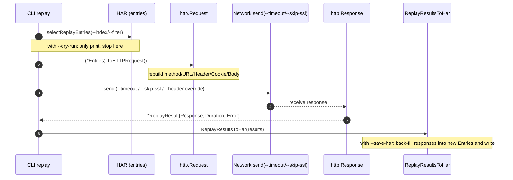

# Transform & Export

The 4 Level 5 commands rewrite the HAR itself or convert it to other formats: `transform` rewrites requests, `export` changes format, `dedup` removes duplicates, and `replay` re-executes requests. They produce new files (or new-format output) and are suited to migration, cleaning, and regression testing.

Every example below runs from the repository root against `testdata/example.har` or `testdata/full.har`.

## transform — Transform Requests

Rewrite URLs, add or remove headers, switch schemes, and drop query parameters. Outputs a new HAR unless `--in-place` is given. All rule flags are stringSlice and can be repeated.

```bash
har -f testdata/full.har transform --rewrite-url "http://localhost->https://api.example.com" -o prod.har
```

### Flags

| Flag | Type | Default | Description |
|------|------|---------|-------------|
| `--rewrite-url` | stringSlice | `[]` | URL rewrite rule, format `from->to` |
| `--remove-header` | stringSlice | `[]` | Request-header names to remove |
| `--add-header` | stringSlice | `[]` | Header to add, format `name:value` |
| `--add-header-target` | string | `both` | Add target (`request`/`response`/`both`) |
| `--change-scheme` | stringSlice | `[]` | Scheme change rule, format `from->to` |
| `--remove-query-param` | stringSlice | `[]` | Query-parameter names to remove |
| `--in-place` | bool | `false` | Rewrite the input file in place |

### Examples

Rewrite staging URLs to production:

```bash
har -f testdata/full.har transform \
  --rewrite-url "http://staging.example.com->https://prod.example.com" \
  -o prod.har
```

Strip sensitive headers to avoid leakage:

```bash
har -f testdata/full.har transform \
  --remove-header Authorization --remove-header Cookie \
  -o clean.har
```

Add a header to both request and response:

```bash
har -f testdata/full.har transform \
  --add-header "X-Env:production" \
  --add-header-target both \
  -o with-headers.har
```

Upgrade all http to https:

```bash
har -f testdata/full.har transform --change-scheme "http->https" -o https.har
```

Remove cache-buster query params (see the dedup note below):

```bash
har -f testdata/full.har transform --remove-query-param "_" --remove-query-param "cb" -o stripped.har
```

Chain multiple `--rewrite-url` rules:

```bash
har -f testdata/full.har transform \
  --rewrite-url "http://localhost->https://api.example.com" \
  --rewrite-url "http://127.0.0.1->https://api.example.com" \
  -o prod.har
```

Rewrite in place (overwrites the original — back up first):

```bash
har -f testdata/full.har transform --change-scheme "http->https" --in-place
```

### How it works

The CLI translates each flag into a `[]har.TransformRule`: `--rewrite-url` → `TransformURLRewrite`, `--remove-header` → `TransformHeaderRemove`, `--change-scheme` → `TransformSchemeChange`, `--remove-query-param` → `TransformQueryParamRemove`. Once assembled, it calls `(*Har).Transform(rules)` to return a new `*Har`; `--add-header` takes a separate path through `(*Har).AddHeaders(map, target)` where `target` is `--add-header-target`. With `--in-place` the CLI calls `(*Har).TransformInPlace(rules)` to mutate the original and write it back; otherwise it writes via `ToJSON(true)` to `-o` or stdout.

## export — Export to Other Formats

Convert the HAR into executable curl/wget/python code, or data formats such as xml/yaml/json/jsonl/csv/markdown/html/text. `format` is a required positional argument.

```bash
har -f testdata/full.har export curl
```

### Supported formats

| format | Output |
|--------|--------|
| `curl` | One curl command per entry |
| `wget` | One wget command per entry |
| `python` | Python `requests` code |
| `postman` | Postman Collection JSON |
| `xml` | XML document |
| `yaml` | YAML document |
| `json` | Standard HAR JSON (single entry selectable) |
| `jsonl` | JSON Lines, one entry per line |
| `csv` | CSV table |
| `markdown` / `md` | Markdown table |
| `html` | HTML table |
| `text` | Plain-text table |

### Flags

| Flag | Type | Default | Description |
|------|------|---------|-------------|
| `--index` | int | `-1` | Export only the entry at this index (-1 = all) |
| `--filter` | string | `""` | URL filter pattern; export only matching entries |

### Examples

Generate curl commands to reproduce the session:

```bash
har -f testdata/full.har export curl
```

Generate Python requests code:

```bash
har -f testdata/full.har export python -o replay.py
```

Export a Postman collection:

```bash
har -f testdata/full.har export postman -o collection.json
```

Export only entry 0 as JSON:

```bash
har -f testdata/full.har export json --index 0 -o entry0.json
```

Filter by URL, then export as JSONL:

```bash
har -f testdata/full.har export jsonl --filter "api" -o entries.jsonl
```

Export a Markdown report table:

```bash
har -f testdata/full.har export markdown -o report.md
```

Export an HTML table:

```bash
har -f testdata/full.har export html -o report.html
```

### How it works

Each format maps to an SDK method: `(*Har).ToCurl()`, `ToWget()`, `ToPythonRequests()`, `ToPostmanCollection()` (returns `[]byte`), `ToXML()`, `ToYAML()`, `ToJSON(indent)`. `--index` selects a single entry client-side; `--filter` narrows entries by URL substring before export. `jsonl`, `csv`, `markdown`, `html`, and `text` are assembled by the CLI's internal formatters from the entry list.

## dedup — Find/Remove Duplicates

Identify or remove duplicate and near-duplicate requests. Defaults to the `pattern` strategy; pass `--remove` to output a cleaned HAR.

```bash
har -f testdata/full.har dedup
```

### Three strategies

::: info Three dedup strategies
| Strategy | How it matches | When to use |
|----------|----------------|-------------|
| `exact` | URLs are identical | Strict character-for-character duplicates |
| `pattern` | URLs are identical after ignoring specified params | Near-duplicates with cache busters (default) |
| `content-hash` | Response-body hashes match | Different URLs, identical content |

`pattern` is the default because it recognizes cache busters like `_`, `cb`, and `timestamp` — params whose value changes per request even though the request is effectively a duplicate. List the params to ignore with `--ignore-param`.
:::

### Flags

| Flag | Type | Default | Description |
|------|------|---------|-------------|
| `--strategy` | string | `pattern` | Dedup strategy (`exact`/`pattern`/`content-hash`) |
| `--ignore-param` | stringSlice | `[]` | Query params to ignore when comparing |
| `--compare-headers` | bool | `false` | Include request headers in the comparison |
| `--compare-body` | bool | `false` | Include request bodies in the comparison |
| `--remove` | bool | `false` | Remove duplicates and output a cleaned HAR |

### Examples

Default pattern strategy to find duplicates:

```bash
har -f testdata/full.har dedup
```

Exact URL matching:

```bash
har -f testdata/full.har dedup --strategy exact
```

Content-hash matching (find identical responses under different URLs):

```bash
har -f testdata/full.har dedup --strategy content-hash
```

Ignore common cache busters before deduping:

```bash
har -f testdata/full.har dedup \
  --ignore-param "_" \
  --ignore-param "cb" \
  --ignore-param "timestamp" \
  --ignore-param "_t"
```

Compare headers and bodies too (stricter):

```bash
har -f testdata/full.har dedup --compare-headers --compare-body
```

Remove duplicates and output a clean HAR:

```bash
har -f testdata/full.har dedup --remove -o cleaned.har
```

### How it works

The CLI initializes options from `har.DefaultDeduplicateOptions()` and writes in `--strategy`, `--ignore-param`, `--compare-headers`, and `--compare-body`. With `--remove` it calls `(*Har).Deduplicate(opts)` to return a deduped new `*Har`, then writes it via `ToJSON(true)`; otherwise it calls `(*Har).FindDuplicates(opts)` to get duplicate groups and formats them for display. The `pattern` strategy strips ignored params before comparing URLs; `content-hash` hashes the response body and compares.

## replay — Replay HTTP Requests

Re-execute recorded requests for regression testing, disaster-recovery validation, or API-migration verification. **By default it sends real requests**; use `--dry-run` to preview without sending.



::: warning replay sends real traffic
Without `--dry-run`, `replay` will actually issue requests using the URLs, methods, headers, and bodies recorded in the HAR. Against production, always run `--dry-run` first to verify targets and counts before firing for real.
:::

```bash
har -f testdata/full.har replay --dry-run
```

### Flags

| Flag | Type | Default | Description |
|------|------|---------|-------------|
| `--timeout` | duration | `30s` | Per-request timeout |
| `--no-follow-redirects` | bool | `false` | Do not follow redirects |
| `--max-redirects` | int | `10` | Maximum number of redirects |
| `--skip-ssl` | bool | `false` | Skip SSL certificate verification |
| `--header` | stringSlice | `[]` | Override request headers, format `name:value` |
| `--index` | int | `-1` | Replay only the entry at this index (-1 = all) |
| `--filter` | string | `""` | URL filter pattern; replay only matching entries |
| `--dry-run` | bool | `false` | Preview only; do not send requests |
| `--save-har` | string | `""` | Save replay results as a new HAR file |

### Examples

Preview the requests that would be replayed (no traffic):

```bash
har -f testdata/full.har replay --dry-run
```

Run for real with a 10-second timeout:

```bash
har -f testdata/full.har replay --timeout 10s
```

Skip SSL verification (self-signed environments):

```bash
har -f testdata/full.har replay --skip-ssl
```

Replay only entry 0:

```bash
har -f testdata/full.har replay --index 0
```

Replay only entries matching `api`:

```bash
har -f testdata/full.har replay --filter "api"
```

Override the Authorization header before replaying:

```bash
har -f testdata/full.har replay --header "Authorization:Bearer NEW_TOKEN"
```

Do not follow redirects:

```bash
har -f testdata/full.har replay --no-follow-redirects
```

Save replay results as a HAR for later diffing against the original:

```bash
har -f testdata/full.har replay --timeout 10s --save-har results.har
```

### How it works

The CLI builds a `har.ReplayOptions{Timeout, FollowRedirects, MaxRedirects, SkipSSL, Headers}` (`--no-follow-redirects` inverts into `FollowRedirects`). `--index` and `--filter` feed `selectReplayEntries` to pick the `[]har.Entries` to replay. Each entry calls `(*Entries).Replay(opts)` returning a `*ReplayResult`; with `--save-har` the CLI assembles results into a new `*Har` via `har.ReplayResultsToHar(results)` and writes it out. `--dry-run` skips the `Replay` call entirely and just prints the requests that would be sent.

## Summary

| Command | Output | Modifies original? |
|---------|--------|--------------------|
| `transform` | New HAR (rewritten) | Only with `--in-place` |
| `export` | Other-format text | No |
| `dedup` | Duplicate report or cleaned HAR | Only `--remove` writes a new file |
| `replay` | Replay results (text or new HAR) | No; `--save-har` writes elsewhere |

A typical chain: `transform` to rewrite URLs → `replay --dry-run` to verify → `replay --save-har` to fire → `diff` to compare. See the full flow in [API Migration Testing](../workflows/api-migration.md).
