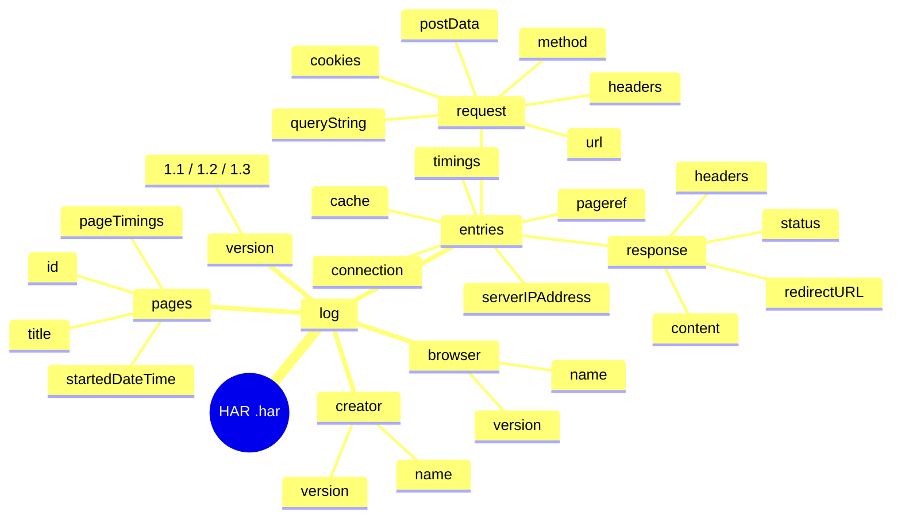
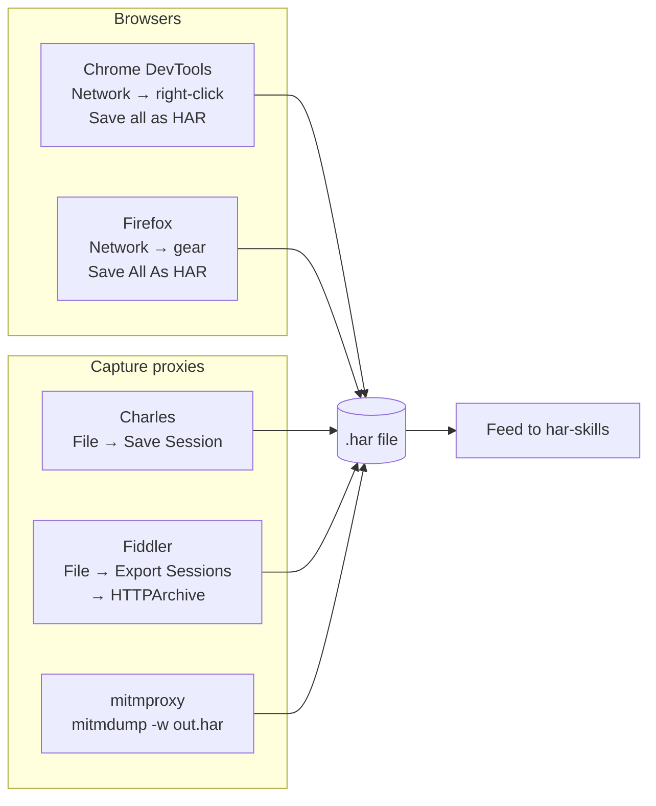

# HAR Format Primer

Before driving HAR Skills, get clear on what a HAR file is, what it looks like, what its fields mean, and how to obtain one. This page is the shared prerequisite for every command and SDK call that follows.

## What is HAR

HAR (HTTP Archive) is a **JSON-formatted archive of HTTP transactions**, defined by the [HTTP Archive spec](http://www.softwareishard.com/blog/har-12-spec/). Browsers and capture tools record every HTTP request/response, timing, cookie, and header from a browsing session and export it as a `.har` file — plain JSON underneath.

Common uses: performance replay analysis, security audits, bug reproduction, API behavior comparison, and sharing redacted traffic.

## Top-level structure

A HAR file is a single top-level object whose root is `log`. The tree below unfolds the structure down to its key fields:



```
{
  "log": {
    "version": "1.2",
    "creator": { "name": "...", "version": "..." },
    "browser":  { "name": "...", "version": "..." },   // optional
    "pages":    [ ... ],                                // optional, page grouping
    "entries":  [ ... ]                                 // core: one per HTTP transaction
  }
}
```

| Field | Meaning |
| --- | --- |
| `version` | HAR format version — 1.1 / 1.2 / 1.3 |
| `creator` | Program name and version that exported this file |
| `browser` | Browser info (optional) |
| `pages` | Page groupings, each with `id`/`title`/`startedDateTime`/`pageTimings` |
| `entries` | Array of HTTP transactions — the analysis subject |

## entries: the core array

Each `entry` describes one complete HTTP request/response transaction:

| Field | Meaning |
| --- | --- |
| `startedDateTime` | When the request started (ISO 8601, with timezone) |
| `time` | Total duration (milliseconds) |
| `request` | The request object (below) |
| `response` | The response object (below) |
| `cache` | Cache metadata (e.g. `beforeRequest`/`afterRequest`) |
| `timings` | Per-phase timing breakdown (below) |
| `pageref` | Reference to a page `id` in `pages`, for grouping |
| `serverIPAddress` | Server IP |
| `connection` | Connection ID, used for connection-reuse analysis |

### request structure

```json
{
  "method": "GET",
  "url": "https://example.com/test",
  "httpVersion": "HTTP/1.1",
  "cookies": [],
  "headers": [
    { "name": "Accept", "value": "*/*" }
  ],
  "queryString": [],
  "headersSize": 150,
  "bodySize": 0,
  "postData": { "mimeType": "...", "text": "..." }   // present only when there is a body
}
```

| Field | Meaning |
| --- | --- |
| `method` | HTTP method |
| `url` | Full request URL |
| `httpVersion` | HTTP protocol version |
| `cookies` | Cookies sent with the request |
| `headers` | Request headers, each `{name, value}` |
| `queryString` | Query parameters, each `{name, value}` |
| `headersSize` | Request header size in bytes |
| `bodySize` | Request body size in bytes |
| `postData` | Request body (mimeType + text or params) |

### response structure

```json
{
  "status": 200,
  "statusText": "OK",
  "httpVersion": "HTTP/1.1",
  "cookies": [],
  "headers": [
    { "name": "Content-Type", "value": "text/plain" }
  ],
  "content": {
    "size": 100,
    "mimeType": "text/plain"
  },
  "redirectURL": "",
  "headersSize": 200,
  "bodySize": 100
}
```

| Field | Meaning |
| --- | --- |
| `status` | HTTP status code |
| `statusText` | Status reason phrase |
| `httpVersion` | HTTP version of the response |
| `cookies` | Parsed Set-Cookie array |
| `headers` | Response headers |
| `content` | Response body metadata: `size`, `mimeType`, `text`, `encoding` (e.g. base64) |
| `redirectURL` | Redirect target URL |
| `headersSize` | Response header size in bytes |
| `bodySize` | Response body size in bytes |

## timings: per-phase durations

`timings` splits a request's total time into network phases, in milliseconds. The chart below lays the seven phases out on a timeline in their typical order (values are illustrative — real values depend on the network):

```mermaid
gantt
  title Phases of an HTTP request (illustrative, ms)
  dateFormat X
  axisFormat %S
  section Queue & connect
  blocked  :0, 5
  dns      :5, 12
  connect  :12, 27
  ssl      :27, 45
  section Send & receive
  send     :45, 46
  wait     :46, 120
  receive  :120, 145
```



| Field | Meaning |
| --- | --- |
| `blocked` | Waiting for a network connection (including queueing) |
| `dns` | DNS resolution |
| `connect` | TCP connection establishment |
| `ssl` | TLS handshake |
| `send` | Sending the request |
| `wait` | Waiting for first byte (TTFB) |
| `receive` | Receiving the response body |

::: warning -1 means "not measured"
The spec says: **a phase that was not measured has value `-1`**. When parsing and aggregating, you must treat `-1` as "missing," not "0" — otherwise averages get dragged down. HAR Skills honors this convention in methods like `TimingStatistics()`.
:::

The sum of phases (ignoring `-1`) should approximate `entry.time`. HAR Skills' `validate` command checks this consistency (`--timings-tolerance` controls the tolerance, default 10ms).

## How to obtain a HAR file

Each tool exports via a different path, but the product is always the same `.har` JSON:



### Chrome DevTools

1. Open DevTools (F12) → Network panel.
2. Make sure "Preserve log" is checked (keeps logs across navigation).
3. Reproduce your actions, then **right-click the network list → Save all as HAR with content**.

### Firefox

Network panel → gear icon (top right) → **Save All As HAR**.

### Capture tools

| Tool | Export |
| --- | --- |
| Charles | File → Save Session → choose HAR |
| Fiddler | File → Export Sessions → HTTPArchive |
| mitmproxy | `mitmdump -w out.har`, or export from `mitmweb` |

::: tip Recording advice
For cleaner downstream analysis, clear the cache before recording (or check "Disable cache" in DevTools). Otherwise many `304`/`disk cache` entries will muddy performance and cache analysis.
:::

## Extension fields: underscore prefix

::: details The HAR spec lets tools add custom fields, prefixed with `_`
The HAR spec lets tools add custom fields, conventionally prefixed with an **underscore `_`**. Chrome DevTools uses these heavily:

| Field | Meaning |
| --- | --- |
| `_initiator` | What initiated the request (script/parser/etc.) |
| `_resourceType` | Resource type (xhr/script/stylesheet/...) |
| `_priority` | Request priority |
| `_webSocketMessages` | WebSocket messages |

HAR Skills preserves `_`-prefixed extension fields instead of dropping them during parsing. The `find` command's `--resource-type` reads Chrome's `_resourceType` directly. See [Custom Field Fidelity](./internals/custom-fields.md).
:::

## A minimal HAR example

This is `testdata/minimal_valid.har` from the repo — a minimum HAR that passes validation:

```json
{
  "log": {
    "version": "1.2",
    "creator": {
      "name": "Go-HAR Test",
      "version": "1.0"
    },
    "entries": []
  }
}
```

It has only `version`, `creator`, and an empty `entries` array — the minimum the spec requires. Real HARs fill `entries` with the request/response/timings fields described above. More complete samples ship in `testdata/example.har` and `testdata/full.har`.

## Next steps

- Install and run against a real file: [Quick Start](./quick-start.md)
- Validate your HAR with `validate`: [CLI Reference](./cli/files.md)
- Go deeper on field semantics and parsing strategies: [Data Structures](./sdk/data-structures.md), [Parsing Strategies](./sdk/parsing-strategies.md)
