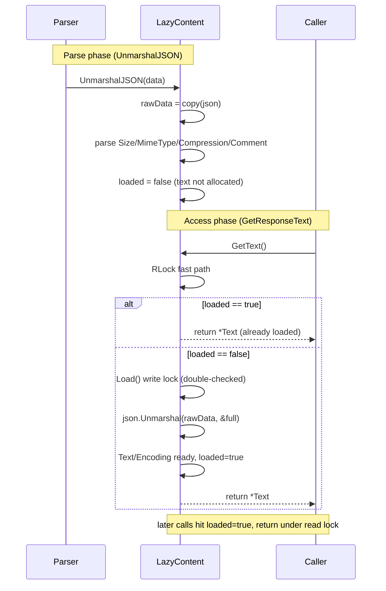
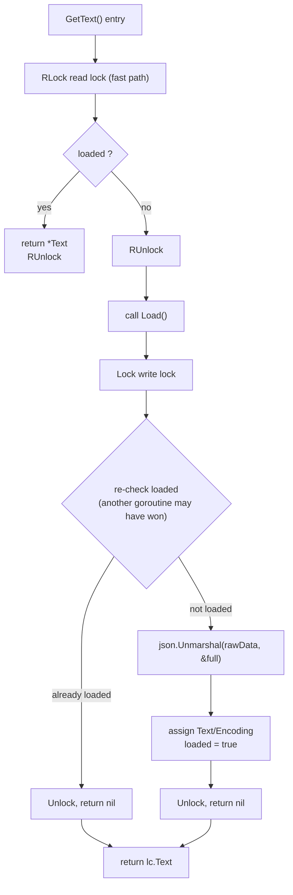
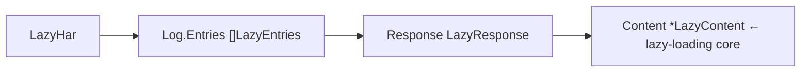
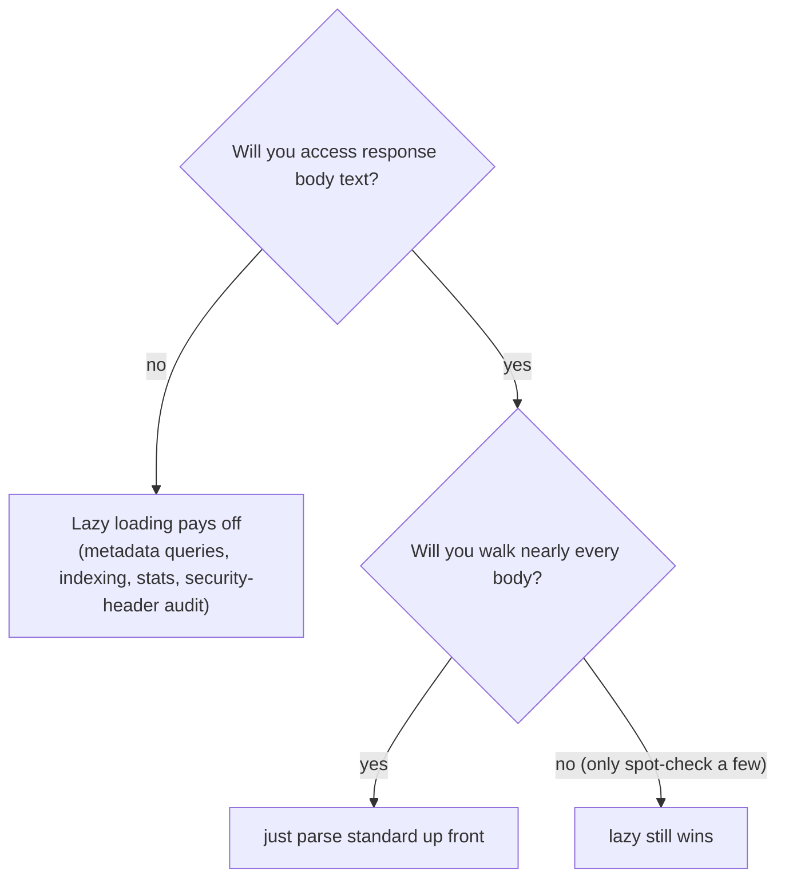

# Lazy Loading Internals

The `response.content.text` field is usually the single largest blob in a HAR file — base64 of images, fonts, and JS bundles can run from hundreds of KB to multiple MB each. Standard parsing deserializes every body up front. `LazyHar` flips this: at parse time it captures only metadata and stashes the raw JSON; the body text is parsed only when something actually asks for it.

## The Problem: Bodies Can Be Huge

A typical HAR entry:

```
entry.response.content = {
  "size": 1843200,            ← metadata, small
  "mimeType": "image/png",    ← metadata, small
  "compression": 0,           ← metadata, small
  "text": "iVBORw0KGgoAAA..." ← the actual body, possibly 2MB+
}
```

When you do statistics, security audits, or URL indexing, you often never read `text`. Yet standard `json.Unmarshal` deserializes it into a Go string and keeps it all resident. For a HAR with thousands of entries, that is gigabytes of waste.

## The Plan: LazyContent — Stash Raw, Parse on Demand

`LazyContent` splits its fields into two tiers:

```go
// lazy.go
type LazyContent struct {
    // Always loaded
    Size        int    `json:"size"`
    MimeType    string `json:"mimeType"`
    Compression int    `json:"compression,omitempty"`

    // Loaded lazily
    Text     *string `json:"text,omitempty"`
    Encoding *string `json:"encoding,omitempty"`
    Comment  string  `json:"comment,omitempty"`

    // Raw data for lazy loading (excluded from JSON serialization)
    rawData   json.RawMessage `json:"-"`
    loaded    bool            `json:"-"`
    loadMutex sync.RWMutex    `json:"-"`
}
```

The trick is a custom `UnmarshalJSON` that **does not parse text/encoding** — it copies the entire raw JSON into `rawData` and parses only the lightweight metadata fields:

```go
// lazy.go
func (lc *LazyContent) UnmarshalJSON(data []byte) error {
    // 1. Stash raw data for lazy loading
    lc.rawData = make(json.RawMessage, len(data))
    copy(lc.rawData, data)

    // 2. Parse only basic info (skip text/encoding, the big fields)
    type BasicContent struct {
        Size        int    `json:"size"`
        MimeType    string `json:"mimeType"`
        Compression int    `json:"compression"`
        Comment     string `json:"comment"`
    }
    var basic BasicContent
    if err := json.Unmarshal(data, &basic); err != nil {
        return WrapJSONUnmarshalError(err)
    }
    lc.Size = basic.Size
    lc.MimeType = basic.MimeType
    lc.Compression = basic.Compression
    lc.Comment = basic.Comment
    lc.loaded = false
    return nil
}
```

`rawData` is a `json.RawMessage` (an alias for `[]byte`, a raw byte slice). It simply retains the JSON bytes that were already read; it does not trigger a string allocation for `text`.

## Load() — Double-Checked Locking

When you actually need the body, call `Load()`. It uses `sync.RWMutex` for double-checked locking — concurrency-safe and parsed exactly once:

```go
// lazy.go
func (lc *LazyContent) Load() error {
    lc.loadMutex.Lock()         // write lock
    defer lc.loadMutex.Unlock()
    if lc.loaded {              // re-check (another goroutine may have won)
        return nil
    }
    type FullContent struct {
        Text     *string `json:"text,omitempty"`
        Encoding *string `json:"encoding,omitempty"`
    }
    var full FullContent
    if err := json.Unmarshal(lc.rawData, &full); err != nil {
        return NewJSONParseError("无法加载延迟加载的内容", err)
    }
    lc.Text = full.Text
    lc.Encoding = full.Encoding
    lc.loaded = true
    return nil
}
```

The public `GetText()` takes the **read lock** fast path — if already loaded, return immediately; otherwise escalate to `Load()` (write lock):

```go
// lazy.go
func (lc *LazyContent) GetText() (*string, error) {
    lc.loadMutex.RLock()              // read lock: fast path
    if lc.loaded {
        text := lc.Text
        lc.loadMutex.RUnlock()
        return text, nil
    }
    lc.loadMutex.RUnlock()

    if err := lc.Load(); err != nil { // write lock: slow path
        return nil, err
    }
    return lc.Text, nil
}
```

Timeline:



## Load() Double-Checked Locking Flow

`Load()` checks once under the read lock and re-checks under the write lock, guaranteeing concurrency-safety and a single parse:



<details>
<summary>ASCII backup diagram</summary>

```
Parse phase (UnmarshalJSON)        Access phase (GetResponseText)
─────────────────────────         ─────────────────────────
│ rawData = copy(json)     │     │ RLock                     │
│ Size/MimeType/... parsed │     │  loaded? ── no ──► Load() │
│ loaded = false           │     │            yes            │
│ text not allocated       │     │            ▼              │
│          │               │     │  return *Text (loaded)    │
│          ▼               │     │  RUnlock / Unlock         │
│  (text uses no memory)   │     │  later hits hit loaded=true │
└──────────────────────────┘     └───────────────────────────┘
```
</details>

## Types and Entry Points



| Type | Role |
|------|------|
| `LazyContent` | lazy body container (`rawData` + `loaded` + `loadMutex`) |
| `LazyResponse` | response holding `*LazyContent` |
| `LazyEntries` | entry holding `LazyResponse`; other fields (Request/Cache/Timings…) stay standard |
| `LazyHar` | top-level container, implements `HARProvider` |

Entry points:

```go
// lazy.go
lh, err := ParseHarWithLazyLoading(harBytes)      // from bytes
lh, err := ParseHarFileWithLazyLoading("big.har") // from file
// Internals: json.Unmarshal the whole LazyHar, but LazyContent.UnmarshalJSON
//             intercepts content parsing and captures only metadata
```

Unified entry via functional options:

```go
provider, err := har.Parse(harBytes, har.WithLazyLoading())
// returns HARProvider (concretely *LazyHar)
```

Index-based access avoids walking every body:

```go
count := lh.GetEntriesCount()            // triggers no body load
entry, err := lh.GetEntry(i)            // triggers no body load
content, err := lh.GetResponseContent(i) // gets LazyContent, still unloaded
text, err := lh.GetResponseText(i)       // ← THIS triggers Load()
```

`(*LazyHar).ToStandardHar()` calls `Load()` per entry before converting to a standard `*Har` — note this loads every body at once, forfeiting the lazy advantage. Use it only when you genuinely need the full standard struct.

## Interface Adapter: lazyContentWrapper

`*LazyContent`'s own signature (`GetText() (*string, error)`) doesn't match `ContentProvider.GetText() string`. `lazyContentWrapper` bridges this:

```go
// lazy_impl.go
type lazyContentWrapper struct {
    content *LazyContent
}

func (w *lazyContentWrapper) GetText() string {
    text, err := w.content.GetText() // (*string, error)
    if err != nil || text == nil {
        return ""
    }
    return *text
}
```

`LazyResponse.GetContent()` returns this wrapper, letting `LazyHar` slot cleanly into the `HARProvider` ecosystem. `GetEncoding()` / `ToStandard()` internally call `Load()` to ensure the body is ready.

## When to Use — and the Cost



<details>
<summary>ASCII backup diagram</summary>

```
┌─────────────────────────────────────────────────────────────┐
│ Will you access response body text?                          │
└────────┬───────────────────────────┬────────────────────────┘
     no  │                       yes │
         ▼                           ▼
   Lazy loading pays off        Will you walk nearly every body?
   (metadata queries,            yes → just parse standard up front
    indexing, stats,              no  (only spot-check a few) → lazy still wins
    security-header audit)
```
</details>

- **Good fit**: huge bodies but you only need metadata — security-header audits, URL/domain indexing, status-code stats, `info` summaries. Parse-phase memory can drop from GB to MB.
- **Cost**: the first body access incurs **extra parse overhead** — `rawData`'s bytes already sit in memory, and `Load()` does a second `json.Unmarshal` to materialize the string. If you end up walking every entry's body, lazy loading is one extra copy over standard parsing.
- **Note**: `rawData` is not freed after `Load()` (the raw JSON is retained) so repeated `GetText()` calls are idempotent and thread-safe. To reclaim it, convert to a standard `*Har` and drop the `LazyHar`.
