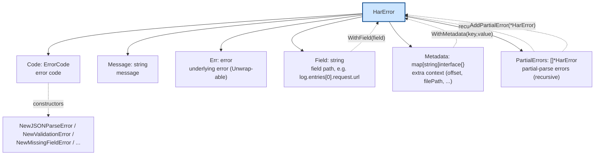
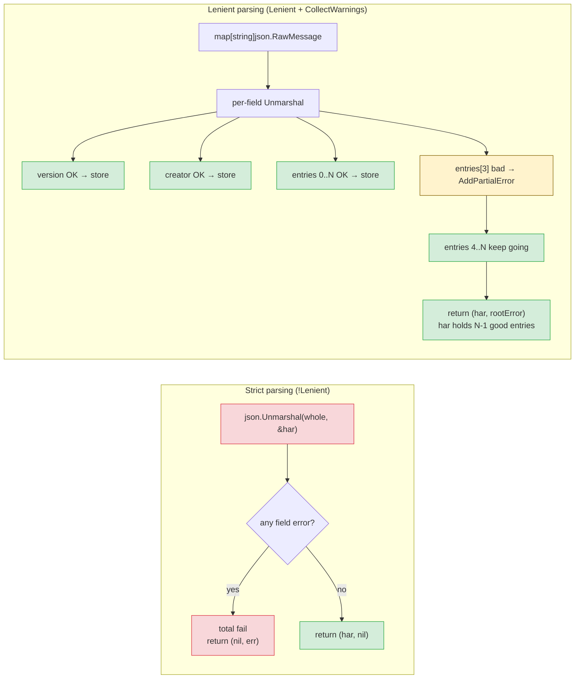
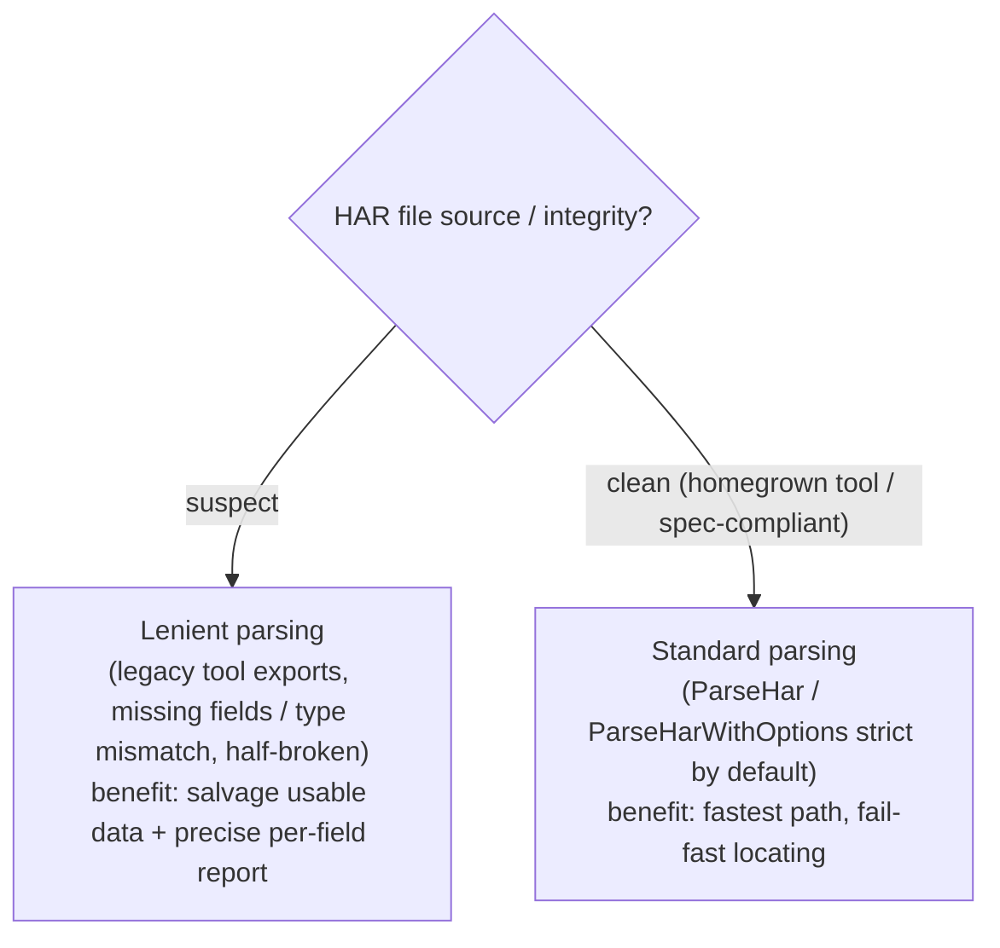

# Lenient Parsing and the Error System

Real-world HAR files are often "half-broken" — legacy tools drop fields, types mismatch, individual entries are malformed. Standard `json.Unmarshal` fails the whole document on the first error, discarding 999 good entries. har-skills pairs a structured `HarError` system with `parseLenient` to deliver per-field tolerance: bad fields become warnings, good data still comes back.

## The Error System

### ErrorCode Enum

```go
// errors.go
type ErrorCode int

const (
    ErrCodeUnknown ErrorCode = iota
    ErrCodeFileSystem      // filesystem error (open/read/close)
    ErrCodeJSONParse       // JSON parse error
    ErrCodeInvalidFormat   // format error (e.g. not JSON)
    ErrCodeValidation      // validation error (violates HAR spec)
    ErrCodeMissingField    // required field missing
    ErrCodeInvalidValue    // field value invalid
    ErrCodeUnsupported     // unsupported operation
)
```

### HarError Struct

```go
// errors.go
type HarError struct {
    Code          ErrorCode            // error code
    Message       string               // message
    Err           error                // underlying error (Unwrap-able)
    Field         string               // field path, e.g. "log.entries[0].request.url"
    Metadata      map[string]interface{}  // extra context (offset, filePath, ...)
    PartialErrors []*HarError          // partial-parse errors (recursive)
}
```

`HarError` is the center of the system. It implements `error` and `Unwrap()` (so `errors.Is/As` work), and carries a set of builders / queries:



| Category | Methods |
|----------|---------|
| Context | `WithField(field)`, `WithMetadata(key, value)` |
| Partial errors | `AddPartialError(*HarError)`, `HasPartialErrors()`, `GetPartialErrors()` |
| Queries | `GetCode()`, `IsFileSystemError()`, `IsJSONParseError()`, `IsFormatError()`, `IsValidationError()` |

`Error()` folds Field, the underlying Err, and PartialErrors into one message so you can see the location and cause at a glance:

```go
// errors.go — Error() output resembles:
// 字段 'log.entries[3].request.url': 无效的URL格式: ... - original error
//   (部分错误: 无法解析第3个entry: ...; 字段 'log.entries[5]': ...)
```

### Constructors and JSON Error Wrapping

```go
// errors.go
NewHarError(code, message, err)        // generic
NewFileSystemError(message, err)       // ErrCodeFileSystem
NewJSONParseError(message, err)        // ErrCodeJSONParse
NewValidationError(message, field)     // ErrCodeValidation + Field
NewInvalidFormatError(message)         // ErrCodeInvalidFormat
NewMissingFieldError(field)            // ErrCodeMissingField + Field
NewInvalidValueError(field, value, reason)  // + Metadata["value"]
NewUnsupportedError(message)           // ErrCodeUnsupported
```

`WrapJSONUnmarshalError` is the key piece: it **classifies** raw `encoding/json` errors and extracts `Offset`/`Field`/type info:

```go
// errors.go
func WrapJSONUnmarshalError(err error) *HarError {
    switch e := err.(type) {
    case *json.UnmarshalTypeError:
        return NewJSONParseError(
            fmt.Sprintf("类型不匹配: 预期 %s 类型，但得到 %s",
                e.Type.String(), e.Value), err).
            WithField(e.Field).WithMetadata("offset", e.Offset)
    case *json.SyntaxError:
        return NewJSONParseError(
            fmt.Sprintf("JSON语法错误: %s", e.Error()), err).
            WithMetadata("offset", e.Offset)
    }
    // Other "cannot unmarshal" shapes also get their message extracted
    if strings.Contains(err.Error(), "cannot unmarshal") { /* ... */ }
    return NewJSONParseError("JSON解析错误", err)
}
```

So callers don't get a bare "unexpected end of JSON input" — they get a structured error with offset, field path, and expected type.

## Lenient Parsing Core: PartialErrors Enable Partial Success

`parseLenient` parses **per field via `json.RawMessage`**: first unmarshal `log` into `map[string]json.RawMessage`, then `json.Unmarshal` each sub-field individually. A field failure records one `PartialError` without interrupting the others:

```go
// parser.go — parseLenient core loop (excerpt)
var logData map[string]json.RawMessage
if err := json.Unmarshal(logBytes, &logData); err != nil {
    return nil, WrapJSONUnmarshalError(err)
}

rootError := &HarError{Code: ErrCodeJSONParse,
    Message: "HAR解析过程中发生错误，但部分内容已成功解析"}

// version field: parse alone; failure only logs a partial
if versionBytes, ok := logData["version"]; ok {
    var version string
    if err := json.Unmarshal(versionBytes, &version); err == nil {
        har.Log.Version = version          // success → put into Har
    } else {
        rootError.AddPartialError(
            NewJSONParseError("无法解析version字段", err).
                WithField("log.version"))
    }
}
// entries array: per-entry RawMessage; one bad entry doesn't break the rest
if entriesBytes, ok := logData["entries"]; ok {
    var entries []json.RawMessage
    if err := json.Unmarshal(entriesBytes, &entries); err == nil {
        for i, entryBytes := range entries {
            var entry Entries
            if err := json.Unmarshal(entryBytes, &entry); err == nil {
                har.Log.Entries = append(har.Log.Entries, entry)
            } else {
                rootError.AddPartialError(
                    NewJSONParseError(
                        fmt.Sprintf("无法解析第%d个entry", i+1), err).
                        WithField(fmt.Sprintf("log.entries[%d]", i)))
            }
        }
    }
}
```

Return logic:

```go
// errors + collect warnings → if valid content was parsed, return Har + warning
if rootError.HasPartialErrors() && options.CollectWarnings {
    if har.Log.Version != "" || len(har.Log.Entries) > 0 || len(har.Log.Pages) > 0 {
        return har, rootError  // partial success
    }
    return nil, rootError      // total failure
}
```

## Strict vs. Lenient



<details>
<summary>ASCII backup diagram</summary>

```
Strict parsing (!Lenient)                  Lenient parsing (Lenient + CollectWarnings)
─────────────────────                    ─────────────────────────────────
│ json.Unmarshal(whole, &har)   │          │ map[string]json.RawMessage      │
│        │                     │          │        ▼ per-field Unmarshal     │
│        ▼                     │          │  version OK → store              │
│  any field error → total fail │          │  creator OK → store              │
│  (return nil, err)           │          │  entries[0..N] OK → store        │
│                              │          │  entries[3] bad → AddPartialError│
│                              │          │  entries[4..N] keep going        │
│                              │          │        ▼                         │
│                              │          │  return (har, rootError)         │
│                              │          │  har holds N-1 good entries      │
└──────────────────────────────┘          └─────────────────────────────────┘
```
</details>

## Entry Points and ParseOptions

```go
// errors.go
type ParseOptions struct {
    Lenient         bool  // lenient mode
    SkipValidation  bool  // skip spec validation
    CollectWarnings bool  // collect warnings instead of failing
    MaxWarnings     int   // max warnings (default 100)
}
```

`ParseOptions` is a **struct-style** option set, complementary to the **functional Options** in `options.go` (`WithSkipValidation()`/`WithMemoryOptimized()` etc.): the former suits explicit, serializable config; the latter suits chained calls. They interconvert via `options.toParseOptions()`.

Four tiers of entry points, from low- to high-level:

```go
// parser.go
// 1. Full control (struct options)
har, err := ParseHarWithOptions(bytes, ParseOptions{Lenient: true, CollectWarnings: true})
har, err := ParseHarFileWithOptions("capture.har", opts)

// 2. Enhanced: returns (*Har, *HarError) with structured error
har, harErr := ParseHarEnhanced(bytes)
har, harErr := ParseHarFileEnhanced("capture.har")

// 3. One-shot lenient
har, err := ParseHarLenient(bytes)        // = Default + Lenient + CollectWarnings
har, err := ParseHarFileLenient("capture.har")

// 4. Warnings mode: returns (*Result, error)
res, err := ParseHarWithWarnings(bytes)        // res.Har + res.Warnings
res, err := ParseHarFileWithWarnings("capture.har")
```

`Result` and `ParseHarWithWarnings`:

```go
// parser.go
type Result struct {
    Har      *Har
    Warnings []*HarError
}
```

It does two more things than `ParseHarLenient`: after parsing it runs `validateURLs` (checks spaces, missing scheme, `url.Parse` failures) and `performFullValidation` (converts `ValidateHarFile` partial errors into warnings), and dedups warnings (`appendWarnings` keys on `field:message`). The final `res.Warnings` is a complete "issue list" while `res.Har` remains usable.

## When to Use



<details>
<summary>ASCII backup diagram</summary>

```
┌──────────────────────────────────────────────────────────────┐
│ HAR file source / integrity?                                  │
└────────┬───────────────────────────┬─────────────────────────┘
  suspect│                       clean│ (homegrown tool / spec-compliant)
         ▼                           ▼
   Lenient parsing                 Standard parsing
   (legacy tool exports,           (ParseHar / ParseHarWithOptions
    missing fields / type             strict by default)
    mismatch, half-broken)         benefit: fastest path, fail-fast locating
   benefit: salvage usable data +
         precise per-field report
```
</details>

- **Good fit**: half-broken HARs — legacy browser/capture-tool exports (non-standard field naming), truncation in transit, manual edits gone wrong. `ParseHarWithWarnings` is especially handy as a "health check" before CI / data ingestion: you get both the result and the issue list.
- **The error system pays off on its own**: even without lenient mode, `WrapJSONUnmarshalError` turns `ParseHar` failures from vague into locatable (offset, field, type), feeding upstream logs and alerts.
- **Note**: lenient mode **does not fix semantic errors** — it can skip fields that fail to parse, but for "right type, illegal value" (e.g. URL missing a scheme) it only records a warning, never rewrites. To fix, pair with the `transform` command or the SDK's `Transform`/`RewriteURL`.
