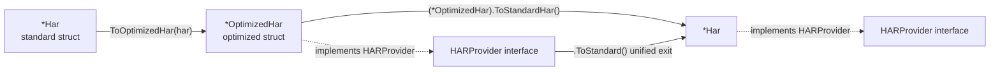
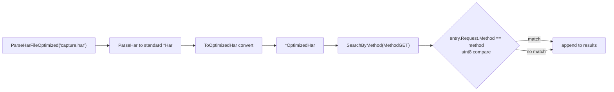
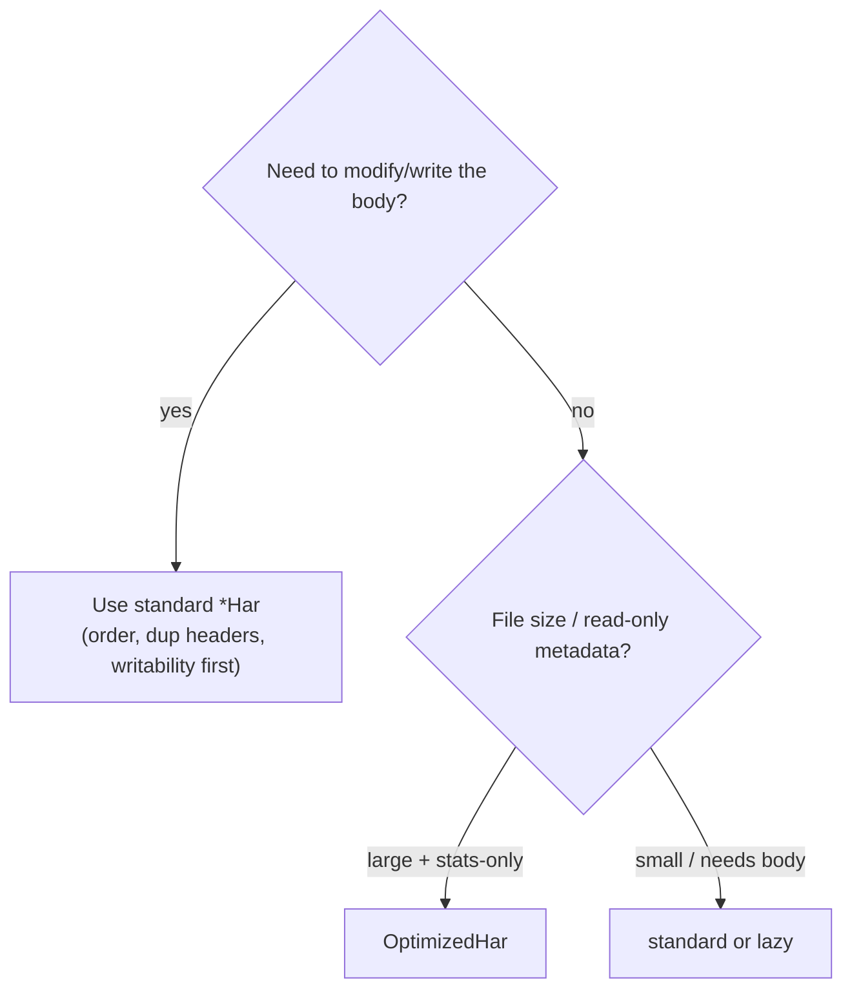

# Memory Optimization Internals

The standard `*Har` struct maps the HAR spec faithfully, which is great for reading and writing but wastes memory when you only need aggregate statistics on large files. `OptimizedHar` attacks the footprint with three moves: enumerate HTTP methods, map-ify headers and query strings, and pointer-ize optional fields.

## The Problem: Wasted Memory in the Standard Struct

Three inefficiencies stand out:

| Hot spot | Standard repr | Problem |
|----------|---------------|---------|
| HTTP method | `string` (8B header + body) | Only 9 values exist; a string is overkill |
| Headers / QueryString | `[]Headers`, `[]QueryString` (slices) | Lookup by name is O(n); slice header is 24B |
| Optional fields (HeadersSize/BodySize/PageRef…) | value types `int`/`string` | Zero value still occupies memory; cannot tell `0` from "absent" |

Memory layout of the same request under both structs:


<details>
<summary>ASCII backup diagram</summary>

```
Standard OptimizedRequest ([]Headers slice)        Optimized OptimizedRequest (map[string]string)

┌──────────────────────────────┐                  ┌──────────────────────────────┐
│ Method    string  ──►"GET"   │ 8B+3B            │ Method    HTTPMethod = 2    │ 1B  (uint8)
│ URL       string  ──►"/api"  │                  │ URL       string            │
│ HTTPVer   string  ──►"HTTP/1.1"                │ HTTPVer   string            │
├──────────────────────────────┤                  ├──────────────────────────────┤
│ Headers   []Headers          │ 24B slice header │ Headers   map[string]string │ O(1) lookup
│  ┌─[0] Name  "Accept"        │                  │  "Accept"     → "*/*"        │
│  │    Value "*/*"            │                  │  "User-Agent" → "curl/8.0"   │
│  └─[1] Name  "User-Agent"    │                  ├──────────────────────────────┤
│       Value "curl/8.0"       │                  │ HeadersSize *int  ──► nil    │ absent = no extra mem
├──────────────────────────────┤                  │ BodySize    *int  ──► &128  │ distinguishes 0 vs absent
│ HeadersSize int = 0          │ 8B (zero)        │                              │
│ BodySize    int = 128        │                  └──────────────────────────────┘
└──────────────────────────────┘   header lookup: O(n)
```
</details>

## Move 1: HTTPMethod Enum

Compress the 9 methods into a `uint8`, dropping the string header and body per request:

```go
// memory.go
type HTTPMethod uint8

const (
    MethodUnknown HTTPMethod = iota
    MethodGET
    MethodPOST
    MethodPUT
    MethodDELETE
    MethodHEAD
    MethodOPTIONS
    MethodPATCH
    MethodCONNECT
    MethodTRACE
)

// Two-way maps for string conversion
var stringToMethod = map[string]HTTPMethod{
    "GET": MethodGET, "POST": MethodPOST, /* ... */
}

func ParseMethod(method string) HTTPMethod {
    if m, ok := stringToMethod[strings.ToUpper(method)]; ok {
        return m
    }
    return MethodUnknown
}
```

`ParseMethod` is case-insensitive and returns `MethodUnknown` on miss — never panics. `GetMethod()` reverses it with a `switch` (see `optimized_impl.go`) so the external API stays string-based and compatible with the standard struct.

## Move 2: Maps Instead of Slices

`Headers` and `QueryString` become `map[string]string`:

```go
// memory.go
type OptimizedRequest struct {
    Method      HTTPMethod
    URL         string
    HTTPVersion string
    Cookies     []Cookie
    Headers     map[string]string // O(1) lookup
    QueryString map[string]string
    PostData    *PostData
    HeadersSize *int
    BodySize    *int
}
```

The trade-off: maps lose original ordering and collapse duplicate headers of the same name. So this struct is **not** suitable when you must preserve order or handle repeated headers. Statistical analysis (per-domain aggregation, status-code counts) rarely cares about order — a good fit.

Header lookup drops from O(n) to O(1):

```go
func (req *OptimizedRequest) GetRequestHeaderValue(name string) (string, bool) {
    value, ok := req.Headers[name]
    return value, ok
}
```

## Move 3: Pointers for Optional Fields

In HAR, `HeadersSize`, `BodySize`, `PageRef`, `ServerIPAddress`, `Connection`, `TransferSize` are all optional. The standard struct uses value types, so zero (`0`/`""`) is indistinguishable from "absent". The optimized struct uses pointers:

```go
type OptimizedTimings struct {
    Blocked         *float64 // nil = timing phase not captured
    DNS             *float64
    Connect         *float64
    Send            *float64
    Wait            *float64
    Receive         *float64
    Ssl             *float64
    BlockedQueueing *float64
    BlockedProxy    *float64
}
```

The getters can therefore return `-1` for "absent", matching the HAR convention that uncaptured timings are `-1`:

```go
// optimized_impl.go
func (t *OptimizedTimings) GetDNS() float64 {
    if t == nil {
        return -1
    }
    if t.DNS != nil {
        return *t.DNS
    }
    return -1 // absent
}
```

During conversion (`convertToOptimizedEntry`) the pointer is only allocated when the source value is non-zero, so genuinely-absent fields cost zero heap memory:

```go
// memory.go
if entry.Timings.Blocked != 0 {
    blocked := entry.Timings.Blocked
    optimizedEntry.Timings.Blocked = &blocked // allocate only when present
}
```

## Types and Conversion

The whole optimized family mirrors the standard family 1:1 and converts both ways:



<details>
<summary>ASCII backup diagram</summary>

```
        ToOptimizedHar(har)                (*OptimizedHar).ToStandardHar()
*Har ─────────────────────────► *OptimizedHar ─────────────────────────► *Har
   ▲                                 │                                        │
   │                                 │ implements HARProvider                  │ implements HARProvider
   └─────────────────────────────────┘                                        │
        .ToStandard()  (unified HARProvider exit)                              │
```
</details>

Type roster (all in `memory.go`):

| Type | Standard counterpart | Key difference |
|------|----------------------|----------------|
| `OptimizedHar` | `Har` | holds `[]OptimizedEntries` |
| `OptimizedEntries` | `Entries` | `PageRef/ServerIP/Connection` pointer-ized |
| `OptimizedRequest` | `Request` | `Method` enum, `Headers/QueryString` maps |
| `OptimizedResponse` | `Response` | `Headers` map, `Content/TransferSize` pointers |
| `OptimizedContent` | `Content` | `Text/Encoding/Comment` pointers |
| `OptimizedTimings` | `Timings` | all fields pointer-ized, absent returns -1 |

`OptimizedHar` implements the `HARProvider` interface (`GetVersion/GetCreator/GetBrowser/GetPages/GetEntries/ToStandard`), so it interoperates with the standard and lazy structs — once you hold a `HARProvider`, call `.ToStandard()` to get the full `*Har`.

## Entry Points and Search

Direct entry points (bypassing functional options):

```go
// memory.go
oh, err := ParseHarFileOptimized("capture.har") // from file
oh, err := ParseHarOptimized(harBytes)          // from bytes
// Internals: ParseHar to standard Har, then ToOptimizedHar
```

Unified entry via functional options:

```go
provider, err := har.Parse(harBytes, har.OptMemoryEfficient...)
// OptMemoryEfficient = WithMemoryOptimized() + WithSkipValidation()
// returns HARProvider (concretely *OptimizedHar); .ToStandard() to get *Har
```

`OptimizedHar` ships a few fast searches built on the optimized layout (`SearchByURL/SearchByMethod/SearchByStatusCode`). The method search compares `uint8` directly — no string comparison:



```go
func (oh *OptimizedHar) SearchByMethod(method HTTPMethod) []OptimizedEntries {
    var results []OptimizedEntries
    for _, entry := range oh.Log.Entries {
        if entry.Request.Method == method { // uint8 compare
            results = append(results, entry)
        }
    }
    return results
}
```

## When to Use



<details>
<summary>ASCII backup diagram</summary>

```
            ┌─────────────────────────────────────────────┐
            │         Need to modify/write the body?       │
            └──────────────┬──────────────────────────────┘
              yes          │              no
        ┌─────────────────┘              └─────────────────┐
        ▼                                                   ▼
  Use standard *Har                          File size / read-only metadata?
  (order, dup headers,                       ┌───────────────┐
   writability first)                    yes  │ large + stats-only │
                                         └──┬─► OptimizedHar
                                             no  │ small / needs body │
                                                 └─► standard or lazy
```
</details>

- **Good fit**: statistical analysis on large files (`Statistics`, per-domain/status aggregation, `SearchBy*`) where you only need aggregates, never edit the body, and don't care about header order.
- **Bad fit**: round-tripping a HAR with original order preserved, keeping duplicate same-name headers, or exporting curl/postman from the body text — use the standard `*Har`, or call `.ToStandard()` before export.

> Note: `OptimizedContent.GetCompression()` always returns `0` (the optimized struct doesn't track compression). If you need compression info, use the standard struct or `ToStandard()`.
