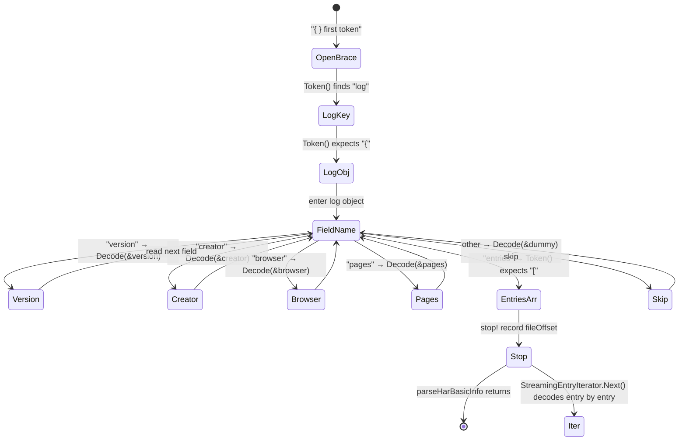
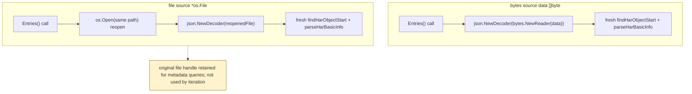
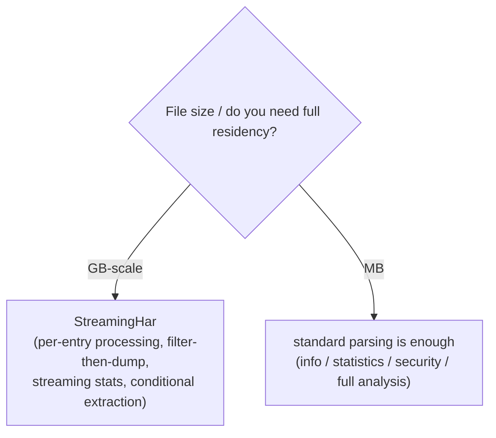

# Streaming Parsing Internals

A multi-GB HAR file cannot live resident in memory — just reading the `[]byte` already exceeds the budget. `StreamingHar` drives `json.Decoder` token by token: it parses only metadata, then decodes the `entries` array one element at a time, so entries stream through your handler like parts on a conveyor.

## The Problem: GB-scale Files Can't Be Resident

Standard `ParseHar` starts with `json.Unmarshal(bytes, &har)`, which requires the entire file's `[]byte` in memory. A 2GB HAR needs at least 2GB of contiguous heap on 64-bit Go — before counting the deserialized object graph. That's both impractical and unnecessary: most analyses only need to walk each entry once.

## The Plan: Token/Decode Incremental Advancement with json.Decoder

`encoding/json`'s `Decoder` advances one token at a time. `StreamingHar` parses in two phases:

1. **Metadata phase**: drive `Token()` into the `log` object, `Decode` each `version/creator/browser/pages` field, until hitting the array-start `[` after `entries`.
2. **Entry phase**: park just past `[`, then loop `decoder.More()` + `decoder.Decode(&entry)` to parse one `Entries` at a time until `]`.

### Token-Advancement State Machine



<details>
<summary>ASCII backup diagram</summary>

```
                       Token() sequence
                       ─────────────────
  {  ──► "log"  ──►  {  ──►  field-name(string)  ──►  Decode(value)  ──► ... ──►  }
  ▲                                              │
  │                                              │ field name is one of:
  findHarObjectStart                             │  "version"  → Decode(&version)
  (expects first token '{')                      │  "creator"  → Decode(&creator)
                                                 │  "browser"  → Decode(&browser)
                                                 │  "pages"    → Decode(&pages)
                                                 │  "entries"  → Token() expect '[' → stop!
                                                 │  (other)    → Decode(&dummy) skip
                                                 ▼
                                          hit "entries" + '['
                                                 │
                                                 ▼
                                   parseHarBasicInfo returns, record fileOffset
                                                 │
                                                 ▼
                            StreamingEntryIterator.Next() decodes entry by entry
```
</details>

Key code (`streaming.go`):

```go
func findHarObjectStart(decoder *json.Decoder) error {
    token, err := decoder.Token() // expect '{'
    if delim, ok := token.(json.Delim); !ok || delim != '{' {
        return errors.New("expected { at the start of HAR file")
    }
    for {
        token, err := decoder.Token() // find "log"
        if str, ok := token.(string); ok && str == "log" {
            break
        }
    }
    token, _ = decoder.Token() // expect '{'
    if delim, ok := token.(json.Delim); !ok || delim != '{' {
        return errors.New("expected { after log field")
    }
    return nil
}
```

`parseHarBasicInfo` dispatches on the field name with a `switch`; unknown fields get `Decode(&dummy interface{})` — that's the `Decoder` edge over `Unmarshal`: **it can skip fields you don't care about without error**.

## Key: The File Source Is Re-openable

An iterator must be resettable — multiple `Entries()` calls each get an independent cursor. But `json.Decoder` cannot rewind. For a file source (`*os.File`) the strategy is: **reopen the file and replay `findHarObjectStart` + `parseHarBasicInfo` to jump back to the entries array**:

```go
// streaming.go — (*StreamingHar).Entries() file branch
filePath := h.file.Name()
reopenedFile, err := os.Open(filePath)              // reopen
reopenedDecoder := json.NewDecoder(reopenedFile)
findHarObjectStart(reopenedDecoder)                 // relocate to log.{
throwawayHar := &StreamingHar{}
parseHarBasicInfo(reopenedDecoder, throwawayHar)   // re-advance to entries[
return &StreamingEntryIterator{
    har:            h,
    file:           reopenedFile,
    decoder:        reopenedDecoder,
    entriesStarted: true,
}
```

The bytes source (`data []byte`) is simpler — each `Entries()` just makes a fresh `bytes.NewReader`, zero cost.



<details>
<summary>ASCII backup diagram</summary>

```
bytes source data []byte            file source *os.File
────────────────────              ────────────────────────────
Entries()                          Entries()
  └─ json.NewDecoder(bytes.NewReader(data))   └─ os.Open(same path) reopen
      └─ fresh findHarObjectStart + parseHarBasicInfo
                                              (the original file handle is retained
                                               for metadata queries; not used by iteration)
```
</details>

`StreamingHar` records `har.fileOffset = decoder.InputOffset()` at construction, but iteration doesn't actually seek on it — reopening is simpler and more robust, and `os.Open` is cheap on most OSes.

## Types and Interface

```go
// streaming.go
type EntryIterator interface {
    Next() bool          // advance; false when no more
    Entry() *Entries     // current entry
    Err() error          // iteration error (io.EOF normalized to nil)
    Close() error        // release resources
}

type StreamingHar struct {
    file       *os.File   // file source (may be nil)
    fileOffset int64
    mutex      sync.Mutex
    creator    Creator
    browser    Browser
    pages      []Pages
    version    string
    data       []byte     // bytes source (may be nil)
}

type StreamingEntryIterator struct {
    har            *StreamingHar
    decoder        *json.Decoder
    err            error
    file           *os.File
    currentPos     int
    entry          Entries
    closed         bool
    entriesStarted bool
}
```

`StreamingHar` methods split into two groups:

| Method | Notes |
|--------|-------|
| `GetVersion/GetCreator/GetBrowser/GetPages` | metadata access, parsed at construction, O(1) |
| `Entries()` | returns a fresh `*StreamingEntryIterator` (new cursor each time) |
| `GetAllEntries()` | convenience wrapper that collects everything into a slice — **loads all content into memory**, convenience only |
| `Close()` | closes the underlying file handle |

`StreamingEntryIterator.Next()`:

```go
func (it *StreamingEntryIterator) Next() bool {
    if it.closed || it.err != nil { return false }
    if !it.entriesStarted { /* locate "entries" + '[' */ }
    if !it.decoder.More() { return false }       // array exhausted
    var entry Entries
    if err := it.decoder.Decode(&entry); err != nil {
        it.err = wrapStreamingIteratorError("failed to decode streaming entry", err)
        return false
    }
    it.entry = entry
    it.currentPos++
    return true
}
```

## Entry Points

Direct construction from `streaming.go`:

```go
sh, err := NewStreamingHarFromFile("huge.har")  // file source
sh, err := NewStreamingHarFromBytes(data)       // bytes source (note: bytes source still full-Unmarshals metadata first)
it  := sh.Entries()
for it.Next() {
    e := it.Entry() // *Entries
    // process one entry
}
if err := it.Err(); err != nil { /* ... */ }
it.Close()
```

`parse.go` wraps it as `EntryIterator` (aligned with the functional-options system):

```go
// parse.go
func NewStreamingParser(harBytes []byte, opts ...Option) (EntryIterator, error)
func NewStreamingParserFromFile(filePath string, opts ...Option) (EntryIterator, error)
```

> Note: the `Parse(...)` functional-options entry returns `ErrCodeUnsupported` when `useStreaming` is set — streaming parsing doesn't return a complete HAR object; you must use `NewStreamingParser*`. This is intentional.

## Important: StreamingHar Is Not a Full HARProvider

`StreamingHar` **does not implement** the `HARProvider` interface — it has no `GetEntries() []EntryProvider` (that would require full residency). It's a streaming-only entry point exposing metadata access and iterators. If you need full `HARProvider` semantics, stuff `GetAllEntries()`'s result into a `*Har` — but that surrenders streaming's memory advantage.

## When to Use



<details>
<summary>ASCII backup diagram</summary>

```
┌──────────────────────────────────────────────────────────────┐
│ File size / do you need full residency?                       │
└────────┬───────────────────────────┬─────────────────────────┘
  GB-scale│                       MB │
         ▼                           ▼
   StreamingHar               standard parsing is enough
   (per-entry processing,      (info / statistics /
    filter-then-dump,           security / full analysis)
    streaming stats,
    conditional extraction)
```
</details>

- **Good fit**: per-entry processing of very large files — streaming stats (per-domain/status counts), filter-then-dump to a new HAR, body extraction only on matching entries.
- **Bad fit**: random access by index, cross-entry operations like diff/merge, or anything requiring the full `HARProvider` interface.
- **Bytes source note**: `NewStreamingHarFromBytes` still `json.Unmarshal`s the whole payload to get metadata — it suits the "already have bytes, want the unified iterator API" case. To actually save memory, use `NewStreamingHarFromFile` and read straight from disk.
