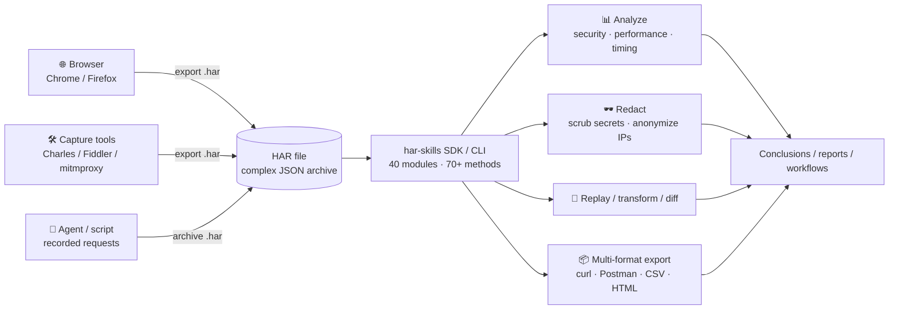
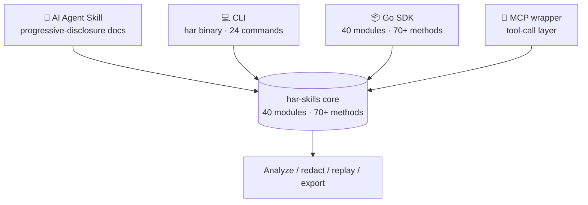

# HAR Skills — AI-native HAR analysis toolkit

HAR Skills is an **AI-Agent-first** analysis toolkit for HAR (HTTP Archive) files, exposing its capabilities both as a **Go SDK** and a **CLI**. From a single toolkit you can parse, search and filter, security-audit, performance-score, redact, replay, transform, diff, and export HAR files in many formats.

The diagram below shows how HAR data flows from browsers and capture tools through har-skills' unified processing into analytical conclusions, redacted artifacts, and multi-format exports:

## The problem it solves

A HAR file is a network-traffic archive exported by browsers and capture tools — essentially a deeply nested JSON. It has three traits that defeat conventional tooling:

- **Large**: a single page load can produce hundreds of requests; a file can reach hundreds of MB.
- **Complex**: deeply nested structures — request/response/headers/cookies/timings/postData layered on top of each other.
- **Sensitive**: Authorization headers, cookies, API keys, and form passwords are often retained verbatim.

::: warning Why "eyeball JSON + one-off scripts" doesn't work
The usual options — eyeballing JSON or stitching one-off scripts — give you nothing reusable, programmable, or auditable. Scripts get thrown away; next HAR, you start over. And a file shared without thorough redaction turns Authorization headers and cookies straight into intrusion credentials.
:::

HAR Skills consolidates the whole pipeline into one toolkit: from raw bytes to structured data, to analytical conclusions and redacted artifacts, all drivable by an AI agent.

## How well it delivers

| Dimension | Number |
| --- | --- |
| Go modules | 40 |
| Public methods | 70+ |
| CLI commands | 24 |
| Runtime dependencies | 0 (zero external deps for the SDK) |
| Test coverage | 100% |
| HAR versions supported | 1.1 / 1.2 / 1.3 |

::: tip What "zero runtime dependencies" means
The SDK depends on no third-party libraries in production — `go get` and compile, with no supply-chain baggage when embedding into any Go project. testify is a test-time dependency only.
:::

## Capability overview

HAR Skills covers the full lifecycle of a HAR file:

| Stage | Capability | Key entry points |
| --- | --- | --- |
| Parsing | 4 strategies (standard, memory-optimized, lazy, streaming) for different sizes and memory budgets | `Parse` / `ParseHarFileAuto` |
| Search & filter | by URL, status code, method, domain, header, cookie, time range, server IP, connection ID, cache hits, and more — regex supported | `find` cmd / `FilterWith` |
| Security audit | checks security headers, cookie attributes, mixed content, CORS, information disclosure; outputs a 0–100 score | `security` / `SecurityAudit()` |
| Performance scoring | Lighthouse-style A/B/C/D grading with recommendations | `performance` / `PerformanceScore()` |
| Redaction | targeted erasure by header, cookie, query param, POST field; IP anonymization | `redact` / `Redact()` |
| Replay | re-send requests with configurable timeout, skip-SSL, custom headers; can save results as HAR | `replay` |
| Transform | rewrite URLs, add/remove headers, switch schemes, drop query params | `transform` / `Transform()` |
| Diff | added/removed/modified detection between two HARs, matchable by URL or index | `diff` / `Diff()` |
| Multi-format export | curl / wget / Python / Postman / XML / YAML / JSON / JSONL / CSV / Markdown / HTML / text | `export` / `ToCurl()` etc. |

::: tip How much one command does
`security`, `performance`, and `waterfall` each emit a full report in a single invocation — a one-off script would need hundreds of lines to match, and would still miss spec details like the `-1` sentinel.
:::

## Core design principles

Four principles keep HAR Skills easy to pick up yet robust in complex engineering settings. Expand each for the details.

::: details Progressive disclosure — summary first, drill down, then internals
Docs and APIs are layered: start with one command for a summary, drill into field-level analysis, then into internals. CLI commands are tiered by difficulty (basic ops → file ops → security → deep analysis → transform & export), so an AI agent can escalate by task complexity.

- Level 1 basic: `info` / `list` / `find` / `headers` / `timing` / `extract`
- Level 2 files: `diff` / `merge` / `split` / `validate`
- Level 3 security: `security` / `redact`
- Level 4 deep: `performance` / `cookie` / `cache` / `index` / `domains` / `content` / `connections` / `waterfall`
- Level 5 transform & export: `transform` / `export` / `dedup` / `replay`
:::

::: details Dual API style — struct-style and functional options are equivalent
The SDK offers two equivalent interfaces:

- **Struct-style**: `h.Statistics()`, `h.SecurityAudit()` — direct, great for scripts and examples.
- **Functional options**: `h.FilterWith(har.WithFilterURL("api"), har.WithFilterMethod("GET"))` — type-safe, composable, extensible, ideal for complex queries.

Both back the same implementation — pick whichever reads better to you.
:::

::: details Provider interface abstracts strategies — parsing decoupled from use
The `HARProvider` interface decouples "how to parse" from "how to use": all four parsing strategies implement it, and a caller gets a `HARProvider` then calls `.ToStandard()` for a `*Har` with the full API. Parsing strategy becomes a swappable decision, not scattered if-else.
:::

::: details Clone semantics (immutable) — transforms return new objects
Every transformation method on `*Har` (redact, transform, add/remove headers) returns a **new** `*Har` instance — the original is untouched. Only methods suffixed `InPlace` mutate. This makes chaining and concurrent sharing safe.
:::

## Four access methods

The same capability surface is reachable via four paths — pick by your runtime:

| Method | When to use | Form |
| --- | --- | --- |
| **AI Agent Skill** | Let Claude / other agents "just use" the tool | Progressive-disclosure Skill docs |
| **CLI** | Terminal, CI/CD, shell scripts | `har` binary, 24 Cobra commands |
| **Go SDK** | Embed in Go programs, build products on top | 40 modules, 70+ methods |
| **MCP** | Let MCP clients call HAR analysis as a tool | MCP wrapper layer |

::: tip Not sure which path?
Ad-hoc analysis in a terminal → CLI; embedded in a Go program → SDK; let an AI agent drive it → Skill; talk to an MCP client → MCP. All four sit on the same implementation and produce identical results.
:::

## Next steps

- Get it installed: [Installation](./install.md)
- Three steps in: [Quick Start](./quick-start.md)
- New to the HAR format? Start with [HAR Format Primer](./har-basics.md)
