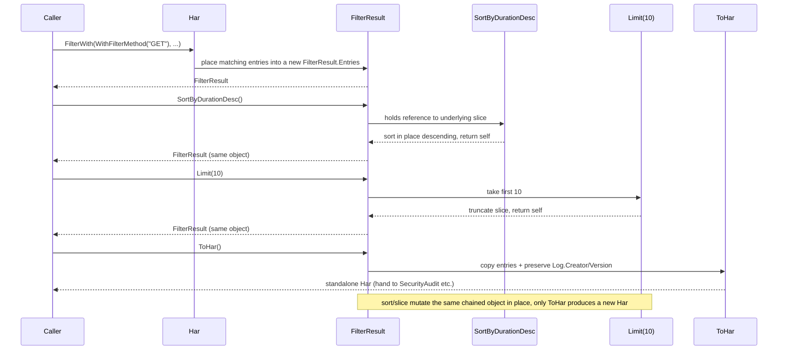
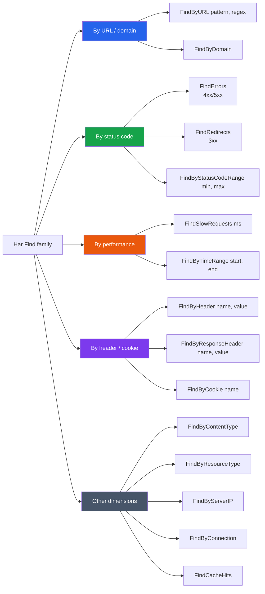

# Filtering and Chained Results

`filter.go` is one of the most used modules in the SDK. `Filter(FilterOptions)` returns a `*FilterResult` that offers a full set of chained methods (sort, slice, chain another filter, convert back to `*Har`). At the same time, a batch of `Find*` shortcut methods hang off `*Har` to cover common queries. `functional_options.go` adds the functional `FilterWith(WithFilter*...)`. Together the three APIs cover "structured filtering + chained transformation + functional assembly".

## FilterOptions fields

`FilterOptions` is the struct-style config; all fields are zero-value friendly (zero means "do not filter on this dimension"):

```go
type FilterOptions struct {
    URL             string    // substring of URL, or regex when UseRegex is set
    Method          string    // HTTP method
    StatusCode      int       // exact status code
    StatusCodeMin   int       // min status code (paired with Max for a range)
    StatusCodeMax   int       // max status code
    ContentType     string    // content type (MIME substring match)
    StartTime       time.Time // lower bound of startedDateTime
    EndTime         time.Time // upper bound of startedDateTime
    MinDuration     float64   // min duration (ms)
    MaxDuration     float64   // max duration (ms)
    ResourceType    string    // Chrome _resourceType
    HasError        bool      // only entries with _error set
    HeaderName      string    // request header name
    HeaderValue     string    // request header value (empty = existence check only)
    RespHeaderName  string    // response header name
    RespHeaderValue string    // response header value
    UseRegex        bool      // whether to match URL as regex
}
```

Fields combine: `StatusCodeMin`+`StatusCodeMax` form a range; `StartTime`+`EndTime` form a time window; `MinDuration`+`MaxDuration` form a duration range. When `HasError` is true, only entries with `_error` are kept.

## Filter returns FilterResult

```go
type FilterResult struct {
    Entries []Entries
}

func (h *Har) Filter(options FilterOptions) *FilterResult
```

`Filter` does not mutate the original `*Har` — it places the matching entry slice into a new `FilterResult`. The result object is the starting point for chained operations.

```go
h, _ := har.ParseHarFile("capture.har")

// Find GET requests with status 200
result := h.Filter(har.FilterOptions{
    Method:    "GET",
    StatusCode: 200,
})
fmt.Println("matched:", result.Count())
```

::: tip Accessing result entries
`FilterResult.Entries` is an exported slice, so you can iterate it directly: `for i := range result.Entries { ... }`. `First()` / `Last()` / `At(i)` are convenience accessors; `Count()` returns the count.
:::

## Chained methods

A chained call is a processing pipeline: each step returns `*FilterResult`, and the next step continues on the previous result. The sequence diagram below shows the full flow `FilterWith(...) → SortByDurationDesc() → Limit(10) → ToHar()`, how the slice is passed between stages, and how it is finally packed into a standalone `*Har`:



The methods on `*FilterResult` all return `*FilterResult` (except `ToHar()` and the accessors), so they chain. Grouped by responsibility:

### Count and accessors

| Method | Effect | Returns |
|--------|--------|---------|
| `Count() int` | number of entries | `int` |
| `First() *Entries` | first entry | `*Entries` |
| `Last() *Entries` | last entry | `*Entries` |
| `At(i) *Entries` | i-th entry (nil if out of range) | `*Entries` |

### Sorting (chained)

| Method | Effect | Returns |
|--------|--------|---------|
| `SortByTime() *FilterResult` | sort by start time ascending | chain |
| `SortByDuration() *FilterResult` | sort by total duration ascending | chain |
| `SortByDurationDesc() *FilterResult` | sort by total duration descending | chain |
| `SortBySize() *FilterResult` | sort by response size ascending | chain |
| `SortBySizeDesc() *FilterResult` | sort by response size descending | chain |

### Pagination and chained re-filtering (chained)

| Method | Effect | Returns |
|--------|--------|---------|
| `Limit(n) *FilterResult` | take first n | chain |
| `Offset(n) *FilterResult` | skip first n | chain |
| `Chain(opts) *FilterResult` | filter the current result again | chain |

### Conversion exit

| Method | Effect | Returns |
|--------|--------|---------|
| `ToHar() *Har` | convert back to a standalone `*Har` (metadata preserved) | `*Har` |

```go
// The 10 slowest GET/200 requests
top := h.Filter(har.FilterOptions{
    Method:    "GET",
    StatusCode: 200,
}).SortByDurationDesc().Limit(10)

for _, e := range top.Entries {
    fmt.Printf("%6.1fms  %s\n", e.Time, e.Request.URL)
}
```

`Chain` lets you stack new conditions on an already-filtered result without re-filtering from the original `*Har`:

```go
// First by domain, then by status code
apiResult := h.Filter(har.FilterOptions{URL: "api.example.com"}).
    Chain(har.FilterOptions{StatusCode: 500})
```

`ToHar()` packs the current result set into a standalone `*Har`, preserving the original `Log.Creator` / `Version` and other metadata — handy for handing a subset to other analysis methods or exporting it.

## Shortcut Find methods

A batch of `Find*` methods hang off `*Har` to cover the most common queries, sparing you from writing `FilterOptions` by hand. First look at this family diagram — grouped by "which dimension to query on" into 5 categories, each pointing to its methods:



| Method | Equivalent FilterOptions |
|--------|--------------------------|
| `FindErrors()` | status 4xx/5xx |
| `FindRedirects()` | status 3xx |
| `FindSlowRequests(ms)` | `MinDuration = ms` |
| `FindByDomain(domain)` | URL contains the domain |
| `FindByURL(pattern, regex)` | `URL=pattern`, `UseRegex=regex` |
| `FindByStatusCodeRange(min, max)` | `StatusCodeMin/Max` |
| `FindByContentType(ct)` | `ContentType=ct` |
| `FindByHeader(name, value)` | `HeaderName/HeaderValue` |
| `FindByResponseHeader(name, value)` | `RespHeaderName/RespHeaderValue` |
| `FindByCookie(name)` | a cookie named name exists |
| `FindByResourceType(rt)` | `ResourceType=rt` |
| `FindByServerIP(ip)` | `ServerIPAddress` matches |
| `FindByConnection(connID)` | `Connection` matches |
| `FindCacheHits()` | cache hits |
| `FindByTimeRange(start, end)` | `StartTime/EndTime` |

```go
// 5xx errors, sorted by duration descending
errs := h.FindByStatusCodeRange(500, 599).SortByDurationDesc()

// Requests slower than 1s
slow := h.FindSlowRequests(1000)

// Regex-match API paths
api := h.FindByURL(`^https://api\.example\.com/v[0-9]+`, true)

// Requests with an Authorization header
authed := h.FindByHeader("Authorization", "")
```

The second argument of `FindByURL` is `regex bool`: false does a substring match, true does a regex match. This maps one-to-one onto the CLI `find "pattern" --regex`.

## Functional FilterWith

`functional_options.go` provides the functional entry `FilterWith(opts ...FilterOption) *FilterResult`, fully equivalent to `Filter(FilterOptions)` but configured with `WithFilter*` closures:

```go
result := h.FilterWith(
    har.WithFilterMethod("GET"),
    har.WithFilterStatusCode(200),
).SortByDurationDesc().Limit(10).ToHar()
```

The `WithFilter*` factories at a glance (see [Functional options](./functional-options)):

- `WithFilterURL(s)` / `WithFilterRegex()` — URL match; `WithFilterRegex()` toggles regex mode
- `WithFilterMethod(m)` / `WithFilterStatusCode(c)` / `WithFilterStatusCodeRange(min, max)`
- `WithFilterContentType(ct)` / `WithFilterResourceType(rt)`
- `WithFilterTimeRange(start, end)` / `WithFilterDuration(min, max)`
- `WithFilterHasError()` / `WithFilterHeader(name, value)` / `WithFilterResponseHeader(name, value)`

The functional style shines at **conditional assembly** — deciding which dimensions to filter at runtime without pre-filling a giant struct:

```go
opts := []har.FilterOption{har.WithFilterMethod("GET")}
if only2xx {
    opts = append(opts, har.WithFilterStatusCodeRange(200, 299))
}
if minMs > 0 {
    opts = append(opts, har.WithFilterDuration(minMs, 0))
}
result := h.FilterWith(opts...).SortByDurationDesc().Limit(50)
```

## Chained composition example

String all the above together — a real "slow endpoint triage" flow:

```go
h, _ := har.ParseHarFile("capture.har")

// Goal: find the 10 slowest 5xx requests under the API domain, export as a standalone HAR
hot := h.FilterWith(
    har.WithFilterURL("api.example.com"),
    har.WithFilterStatusCodeRange(500, 599),
).SortByDurationDesc().Limit(10)

fmt.Printf("found %d problematic endpoints\n", hot.Count())
for i := range hot.Entries {
    e := hot.Entries[i]
    fmt.Printf("  %6.1fms  %d  %s\n", e.Time, e.Response.Status, e.Request.URL)
}

// Pack into a standalone HAR and hand it to security audit or export
subHar := hot.ToHar()
report := subHar.SecurityAudit()
fmt.Println("sub-set security score:", report.Score)
```

This snippet demonstrates functional assembly (`FilterWith`), chained transformation (`SortByDurationDesc().Limit`), accessors (`Count`), direct slice iteration (`range hot.Entries`), and converting back to `*Har` (`ToHar`) before plugging into other analysis modules.

## Next steps

- For the full table of functional `With*` filter options, see [Functional options](./functional-options).
- For running security/performance analysis on a `*Har` subset, refer to the `SecurityAudit` / `PerformanceScore` methods mentioned on the data-structures page.
