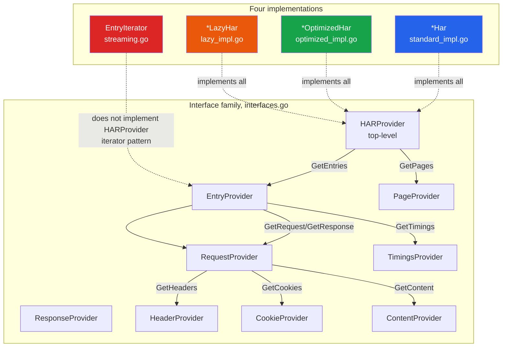
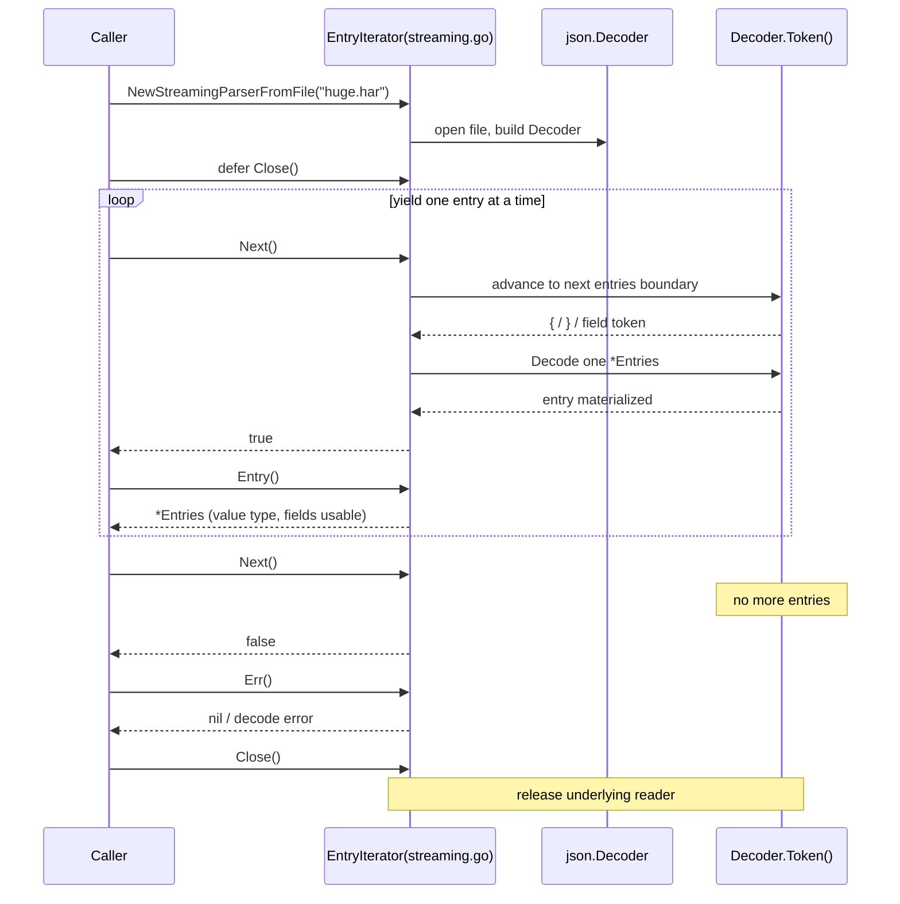
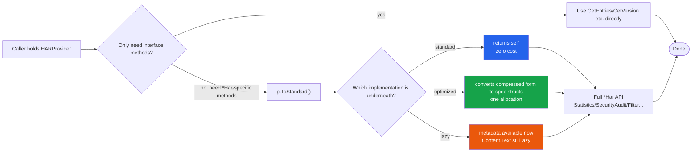

# Provider Interfaces

The four parsing strategies return different concrete types (`*Har`, `*OptimizedHar`, `*LazyHar`, `EntryIterator`). The SDK unifies them with a family of `Provider` interfaces in `interfaces.go`, so you can program to an abstraction and fall back to the full `*Har` via `ToStandard()` whenever needed.

## Why an interface family

Suppose you write a generic function that counts requests in a HAR from any source. If it accepts only `*Har`, callers with `*OptimizedHar` or `*LazyHar` must `ToStandard()` first — possibly negating the memory benefits of optimized/lazy. The interface family lets the function signature take `HARProvider`; callers pass in the real implementation without upfront materialization.

```go
// Generic handler: indifferent to standard / optimized / lazy
func countEntries(p har.HARProvider) int {
    return len(p.GetEntries())
}
```

`standard_impl.go`, `optimized_impl.go`, and `lazy_impl.go` each make their own type implement this family, so the same `countEntries` accepts all three implementations.

### How the interface family maps to the four implementations

The diagram below shows how the `interfaces.go` interface family corresponds to the four implementations: solid lines mean "implements", the dashed line means streaming takes the iterator path rather than the Provider path.



## HARProvider — the top-level interface

```go
type HARProvider interface {
    GetVersion() string
    GetCreator() Creator
    GetBrowser() Browser
    GetEntries() []EntryProvider
    GetPages() []PageProvider
    ToStandard() *Har
}
```

`GetEntries()` returns `[]EntryProvider`, not `[]Entries` — a recursive abstraction: each entry is also an interface, materialized to `Entries` on demand via `.ToStandard()`. `ToStandard()` is the escape hatch: any time you need the full set of `*Har` methods (`Statistics()`, `SecurityAudit()`, `Filter()`, ...), you can get it back.

```go
p, err := har.ParseFile("capture.har", har.WithMemoryOptimized())
if err != nil {
    log.Fatal(err)
}
// p is HARProvider; take the standard form on demand
h := p.ToStandard()
report := h.SecurityAudit()
fmt.Println("security score:", report.Score)
```

::: tip ToStandard() cost varies by implementation
- standard: returns itself, zero cost.
- optimized: converts the compressed representation back to spec structs in one allocation.
- lazy: metadata is immediately available after conversion, but `Content.Text` stays lazy until accessed.
:::

## EntryProvider — the per-entry interface

```go
type EntryProvider interface {
    GetStartedDateTime() time.Time
    GetTime() float64
    GetRequest() RequestProvider
    GetResponse() ResponseProvider
    GetTimings() TimingsProvider
    GetPageref() string
    ToStandard() Entries
}
```

`EntryProvider` is the basic unit when walking entries. Note it returns `RequestProvider` / `ResponseProvider` / `TimingsProvider` — abstraction all the way down.

```go
func printStatuses(p har.HARProvider) {
    for _, ep := range p.GetEntries() {
        req := ep.GetRequest()
        resp := ep.GetResponse()
        fmt.Printf("%s %s -> %d\n", req.GetMethod(), req.GetURL(), resp.GetStatus())
    }
}
```

In the lazy implementation, `ep.GetResponse().GetContent().GetText()` is what triggers parsing of that entry's body — the key to how interface abstraction cooperates with lazy evaluation: the caller code looks identical to standard, but the body parse is deferred.

## RequestProvider / ResponseProvider

```go
type RequestProvider interface {
    GetMethod() string
    GetURL() string
    GetHTTPVersion() string
    GetHeaders() []HeaderProvider
    GetCookies() []CookieProvider
    GetQueryString() []QueryString
    GetPostData() *PostData
    GetBodySize() int
    GetHeadersSize() int
    ToStandard() Request
}

type ResponseProvider interface {
    GetStatus() int
    GetStatusText() string
    GetHTTPVersion() string
    GetHeaders() []HeaderProvider
    GetCookies() []CookieProvider
    GetContent() ContentProvider
    GetBodySize() int
    GetHeadersSize() int
    ToStandard() Response
}
```

Note `GetQueryString()` returns the value type `[]QueryString` directly, while `GetHeaders()` returns `[]HeaderProvider` — the asymmetry is intentional: query strings are simple and traversed in full frequently, whereas headers are a `map` in the optimized implementation and need an interface adapter for uniform access.

## HeaderProvider / CookieProvider / ContentProvider

These three are the finest-grained interfaces, covering headers, cookies, and response content.

```go
type HeaderProvider interface {
    GetName() string
    GetValue() string
    ToStandard() Headers
}

type CookieProvider interface {
    GetName() string
    GetValue() string
    GetDomain() string
    GetPath() string
    GetExpires() time.Time
    IsHTTPOnly() bool
    IsSecure() bool
    GetSameSite() string
    ToStandard() Cookie
}

type ContentProvider interface {
    GetSize() int
    GetMimeType() string
    GetText() string
    GetEncoding() string
    GetCompression() int
    ToStandard() Content
}
```

`CookieProvider` uses `IsHTTPOnly()` / `IsSecure()` rather than `GetHTTPOnly()` — following the Go naming convention for boolean getters. `ContentProvider.GetText()` is the deferred trigger point of the lazy strategy.

## TimingsProvider / PageProvider / PageTimingsProvider

```go
type TimingsProvider interface {
    GetBlocked() float64
    GetDNS() float64
    GetConnect() float64
    GetSend() float64
    GetWait() float64
    GetReceive() float64
    GetSSL() float64
    ToStandard() Timings
}

type PageProvider interface {
    GetID() string
    GetTitle() string
    GetStartedDateTime() time.Time
    GetPageTimings() PageTimingsProvider
    ToStandard() Pages
}

type PageTimingsProvider interface {
    GetOnContentLoad() float64
    GetOnLoad() float64
    ToStandard() PageTimings
}
```

`TimingsProvider` exposes only the spec's core fields, omitting the Chrome extensions `_blocked_queueing` / `_blocked_proxy` — the interface focuses on what is stable across implementations. When you need the extension fields, use `ToStandard()` to get the full `Timings`.

## How each implementation satisfies the interfaces

| Implementation | File | HARProvider | EntryProvider | Notes |
|----------------|------|-------------|---------------|-------|
| standard | `standard_impl.go` | `*Har` | `*Entries` returned directly | `ToStandard()` returns self |
| optimized | `optimized_impl.go` + `memory.go` | `*OptimizedHar` | `*OptimizedEntries` | Also has `ToStandardHar()` alias and `SearchBy*` |
| lazy | `lazy_impl.go` | `*LazyHar` | `*LazyEntries` | `GetText()` triggers lazy parse |
| streaming | `streaming.go` | **does not implement** | via `EntryIterator` | iterator pattern, no random access |

`standard_impl.go` makes `*Har` implement the interface directly — the fields are the return values, no conversion. Compile-time assertions `var _ HARProvider = (*Har)(nil)` and `var _ HARProvider = (*LazyHar)(nil)` keep the contract from breaking.

```go
// standard_impl.go (simplified)
func (h *Har) GetVersion() string          { return h.Log.Version }
func (h *Har) GetCreator() Creator         { return h.Log.Creator }
func (h *Har) GetBrowser() Browser         { return h.Log.Browser }
func (h *Har) GetEntries() []EntryProvider { /* adapt []Entries into []EntryProvider */ }
func (h *Har) GetPages() []PageProvider    { /* same */ }
func (h *Har) ToStandard() *Har            { return h }
```

## streaming is an iterator pattern, not a Provider

The `streaming` strategy deliberately does not implement `HARProvider`: streaming does not support "get all entries", so it has no `GetEntries()` / `ToStandard()`. It returns `EntryIterator`; callers advance with `Next()` and read the current entry with `Entry()`.

```go
iter, err := har.NewStreamingParserFromFile("huge.har")
if err != nil {
    log.Fatal(err)
}
defer iter.Close()

for iter.Next() {
    e := iter.Entry() // *Entries, already a value type, fields usable directly
    if e.Response.Status >= 500 {
        fmt.Println("5xx:", e.Request.URL)
    }
}
if err := iter.Err(); err != nil {
    log.Fatal(err)
}
```

If you hold an `EntryIterator` but want an interface view of an entry, you can use `*Entries` directly (it satisfies `EntryProvider`, since the standard implementation defines the interface methods on `*Entries`).

The advance sequence of the streaming iterator — `Decoder.Token()` drives incrementally, and each `Entry()` is the `*Entries` decoded by the previous `Next()`:



## A typical "program to the abstraction" pattern

```go
// 1. Accept HARProvider, indifferent to source
func summarize(p har.HARProvider) {
    fmt.Printf("HAR %s, %d entries, creator=%s\n",
        p.GetVersion(), len(p.GetEntries()), p.GetCreator().Name)

    // 2. Only ToStandard() when you actually need the full API
    h := p.ToStandard()
    stats := h.Statistics()
    fmt.Printf("total entries: %d, total size: %d\n",
        stats.TotalEntries, stats.TotalSize)
}

func main() {
    // The same summarize works for all three implementations
    if p, err := har.ParseFile("a.har"); err == nil {
        summarize(p)
    }
    if p, err := har.ParseFile("b.har", har.WithMemoryOptimized()); err == nil {
        summarize(p)
    }
    if p, err := har.ParseFile("c.har", har.WithLazyLoading()); err == nil {
        summarize(p)
    }
}
```

The points of this pattern:

1. **Take `HARProvider` at the entry point**; callers can pass any implementation without changing the function.
2. **Defer `ToStandard()`** until you truly need `*Har`-specific methods. If the function only uses interface methods, skip the conversion entirely.
3. **Handle streaming separately** — it is an iterator and does not enter the `HARProvider` path.

The flowchart below summarizes the call flow of "program to the abstraction → ToStandard() on demand for the full API":



## Next steps

- For the `Option`s and presets that control which strategy `Parse()` takes, see [Functional options](./functional-options).
- For how to filter entries once you have a `*Har`, see [Filtering and chained results](./filtering).
