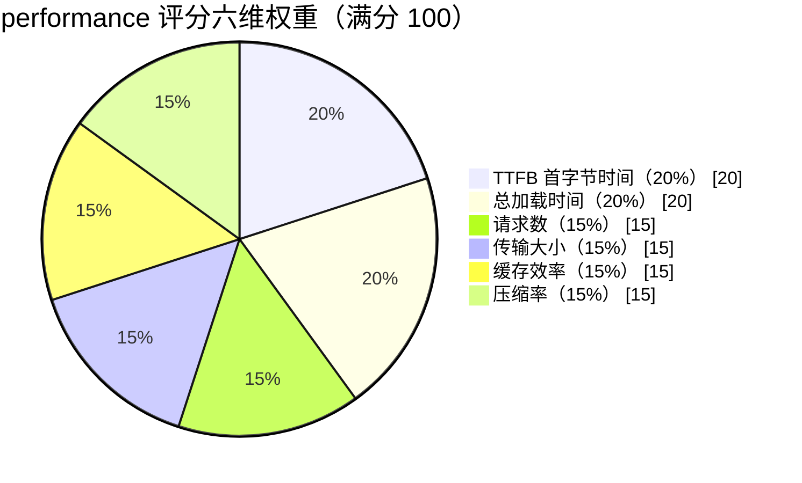
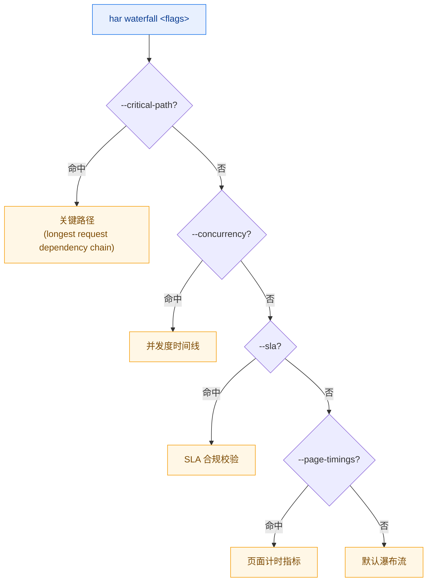

# 深度分析

Level 4 的 8 个命令面向"已经知道 HAR 里有什么、现在要把它讲清楚"的场景：性能打分、Cookie/缓存审计、索引查询、域名/内容/连接统计、瀑布流可视化。它们大多只读、不改文件，适合做报告与排查。

所有示例都可在仓库根目录直接运行，使用 `testdata/example.har` 或 `testdata/full.har`。

## performance — 性能评分

Lighthouse 风格的性能评分，输出 **A/B/C/D 等级**与可执行建议。无需任何 flag，跑完即给结论。

```bash
har -f testdata/full.har performance
```

### 六维加权

评分由六个维度加权而成，满分 100：



| 维度 | 权重 | 关注点 |
|------|------|--------|
| TTFB（首字节时间） | 20% | 服务端响应是否及时 |
| 总加载时间 | 20% | 整体耗时是否过长 |
| 请求数 | 15% | 请求数量是否过多 |
| 传输大小 | 15% | 字节数是否超标 |
| 缓存效率 | 15% | 可缓存资源是否被正确缓存 |
| 压缩率 | 15% | 文本响应是否启用 gzip/br |

### Flags

本命令无专有 flag，仅使用 [全局参数](./global-flags.md)。

### 示例

输出 JSON 报告，便于归档对比：

```bash
har -f testdata/full.har performance --format json -o perf.json
```

文本形态直接看等级与建议：

```bash
har -f testdata/full.har performance
```

### 实现原理

底层调用 `(*Har).PerformanceScore()`，返回 `*PerformanceReport`。报告里每个维度是一个子评分，按上表权重汇总成总分；`Grade()` 据总分映射为 A（≥90）/ B（≥80）/ C（≥60）/ D（其余）。建议项由各维度子模块产生，针对低分维度给出可执行提示。CLI 把报告序列化成 JSON 或由 `formatPerformanceReport` 拼成文本。

## cookie — Cookie 审计

检查 Cookie 的安全属性与生命周期，默认做安全审计；加 `--evolution` 切到「Cookie 演变时间线」视图。

```bash
har -f testdata/full.har cookie
```

### 检查内容

审计模式逐条 Cookie 检查：

- **过期/会话**：永久 Cookie 是否必要、会话 Cookie 是否合理
- **Secure**：是否只走 HTTPS
- **HttpOnly**：是否防 JS 读取
- **SameSite**：是否设了 SameSite（Lax/Strict/None）
- **第三方**：是否跨站投递
- **超大**：体积是否异常
- **重复**：同名 Cookie 是否多处冲突

### Flags

| Flag | 类型 | 默认值 | 说明 |
|------|------|--------|------|
| `--audit` | bool | `true` | 执行 Cookie 安全审计 |
| `--evolution` | bool | `false` | 显示 Cookie 演变时间线 |
| `--name` | string | `""` | 仅显示指定名称的 Cookie |
| `--severity` | string | `info` | 最低严重性过滤（`info`/`low`/`medium`/`high`） |

### 示例

只看某个 Cookie 的安全属性：

```bash
har -f testdata/full.har cookie --name session_id
```

查看 Cookie 在请求序列中的演变（哪些请求新增、删除、改值）：

```bash
har -f testdata/full.har cookie --evolution
```

只看中危以上：

```bash
har -f testdata/full.har cookie --severity medium
```

输出 JSON 供后续处理：

```bash
har -f testdata/full.har cookie --format json -o cookie.json
```

### 实现原理

审计走 `(*Har).CookieAudit()`，返回 `*CookieAuditReport`；演变走 `(*Har).CookieEvolution()`，返回 `map[string][]CookieEvolutionEntry`。`--name` 在两个分支里都做按名过滤，`--severity` 用 `report.FindBySeverity` 过滤审计发现。CLI 据分支选择 `formatCookieAuditReport` 或演变表格渲染。

## cache — 缓存分析

解析 `Cache-Control`、`ETag`、`Last-Modified`、`Vary` 等缓存相关头，评估每条响应的可缓存性。

```bash
har -f testdata/full.har cache
```

### Flags

| Flag | 类型 | 默认值 | 说明 |
|------|------|--------|------|
| `--non-cacheable` | bool | `false` | 仅显示不可缓存的条目 |
| `--url` | string | `""` | 仅显示指定 URL 的缓存评估 |

### 示例

只列出不可缓存的条目，定位缓存失效点：

```bash
har -f testdata/full.har cache --non-cacheable
```

查某条 URL 的缓存评估：

```bash
har -f testdata/full.har cache --url "https://example.com/static/app.js"
```

输出 JSON：

```bash
har -f testdata/full.har cache --format json -o cache.json
```

### 实现原理

底层调用 `(*Har).CacheAnalysis()`，返回 `*CacheReport`。报告逐条 entry 解析缓存头，判定可缓存性（可缓存 / 需校验 / 不可缓存）并给出理由（如 `no-store`、`no-cache`、缺少校验器等）。`--non-cacheable` 在客户端按结果过滤，`--url` 按精确 URL 过滤。

## index — 构建索引查询

在内存里为 HAR 建一个多维度索引，支持按 URL、方法、状态码、域名、MIME、URL 正则快速查找。**不带任何 flag 时默认显示索引统计。**

```bash
har -f testdata/full.har index --stats
```

### Flags

| Flag | 类型 | 默认值 | 说明 |
|------|------|--------|------|
| `--stats` | bool | `false` | 显示索引统计 |
| `--url` | string | `""` | 按精确 URL 查询 |
| `--method` | string | `""` | 按 HTTP 方法查询 |
| `--status` | int | `0` | 按状态码查询（0 表示不过滤） |
| `--domain` | string | `""` | 按域名查询 |
| `--mime` | string | `""` | 按 MIME 类型查询 |
| `--pattern` | string | `""` | 按 URL 正则查询 |

### 示例

查所有 POST 请求：

```bash
har -f testdata/full.har index --method POST
```

查所有 404：

```bash
har -f testdata/full.har index --status 404
```

按域名查：

```bash
har -f testdata/full.har index --domain example.com
```

按 MIME 查所有 JSON 响应：

```bash
har -f testdata/full.har index --mime "application/json"
```

用正则查 v2 API：

```bash
har -f testdata/full.har index --pattern "api/v[0-9]+"
```

### 实现原理

底层调用 `(*Har).BuildIndex()` 构建多键索引，再以 `LookupByURL` / `LookupByMethod` / `LookupByStatus` / `LookupByDomain` / `LookupByMIME` / `LookupByPattern` 等方法查询。CLI 按哪个 flag 非空就走对应查询分支；全部为空时走 `--stats` 默认分支，打印索引规模（条目数、各键基数）。

## domains — 按域名统计

把所有请求按域名聚合，给出请求数、耗时、体积、错误数等指标，并支持排序与截断。

```bash
har -f testdata/full.har domains
```

### Flags

| Flag | 类型 | 默认值 | 说明 |
|------|------|--------|------|
| `--sort` | string | `count` | 排序键（`count`/`time`/`size`/`errors`） |
| `--limit`/`-n` | int | `0` | 只显示前 N 个域名（0 = 全部） |

### 示例

按总耗时排序，看哪些域名最拖慢：

```bash
har -f testdata/full.har domains --sort time
```

按体积排序，取前 10：

```bash
har -f testdata/full.har domains --sort size --limit 10
```

按错误数排序，定位故障域名：

```bash
har -f testdata/full.har domains --sort errors
```

### 实现原理

底层调用 `(*Har).DomainSummary()`，返回 `map[string]*DomainStats`（每个域名含请求数、总耗时、总大小、错误数）。CLI 按指定 `--sort` 键排序，再用 `--limit` 截断。

## content — 内容类型分析

按 MIME 类型统计响应体大小、压缩情况与分类分布。

```bash
har -f testdata/full.har content
```

### Flags

| Flag | 类型 | 默认值 | 说明 |
|------|------|--------|------|
| `--by-mime` | bool | `false` | 显示逐 MIME 类型明细 |

### 示例

默认按大类（脚本/样式/图片/字体/文档/JSON/其他）汇总：

```bash
har -f testdata/full.har content
```

展开到每个具体 MIME：

```bash
har -f testdata/full.har content --by-mime
```

JSON 输出：

```bash
har -f testdata/full.har content --format json
```

### 实现原理

底层调用 `(*Har).ContentTypeDistribution()`，返回按 MIME 聚合的统计结构。`--by-mime` 控制是否展开到具体 MIME（如 `application/json`、`text/css`），默认则归并到大类。压缩率由响应 `Content-Encoding` 推断。

## connections — 连接复用

展示哪些条目共享同一连接（连接池复用分析），无专有 flag。

```bash
har -f testdata/full.har connections
```

### 示例

JSON 输出便于程序处理：

```bash
har -f testdata/full.har connections --format json
```

### 实现原理

底层调用 `(*Har).ConnectionReuse()`，返回按 `connection` 字段分组的复用情况。HAR 1.2 的 `connection` 字段标识同一 TCP 连接，多条 entry 共用同一 ID 即表示连接被复用；CLI 据此输出复用表与统计。

## waterfall — 瀑布流

把请求时序画成 ASCII 瀑布，或切到关键路径、并发度、SLA 校验、页面计时等子视图。

```bash
har -f testdata/full.har waterfall
```

### 互斥优先级

五个视图互斥，按下列顺序取首个命中的 flag：



即同时传多个 flag 时，排在前面的优先。

### Flags

| Flag | 类型 | 默认值 | 说明 |
|------|------|--------|------|
| `--critical-path` | bool | `false` | 显示关键路径 |
| `--concurrency` | bool | `false` | 显示并发度时间线 |
| `--sla` | stringSlice | `[]` | SLA 规则，格式 `name:urlPattern:maxDurationMs` |
| `--page-timings` | bool | `false` | 显示页面计时指标 |

### 示例

::: code-group

```bash [默认瀑布流]
har -f testdata/full.har waterfall
```

```bash [关键渲染路径]
har -f testdata/full.har waterfall --critical-path
```

```bash [并发度时间线（看并行度峰值）]
har -f testdata/full.har waterfall --concurrency
```

```bash [SLA 校验：API 路径 2s 内、静态资源 500ms 内]
har -f testdata/full.har waterfall \
  --sla "API:/api/:2000" \
  --sla "Static:/static/:500"
```

```bash [页面计时指标（onContentLoad、onLoad 等）]
har -f testdata/full.har waterfall --page-timings
```

:::

::: tip --sla 格式
每条规则三段，用冒号分隔：`name:urlPattern:maxDurationMs`。`urlPattern` 是 URL 子串匹配，`maxDurationMs` 是该匹配条目的最大允许耗时（毫秒）。超时会在报告中标红并给出超出量。
:::

### 实现原理

各视图分别对应：`(*Har).CriticalPath()` 返回关键路径上的 entry 序列；`(*Har).ConcurrencyTimeline()` 返回按时间切片的并发度；`(*Har).SLACheck(rules)` 接受 `[]SLARule` 返回逐条合规结果；`(*Har).PageTimingMetrics()` 返回页面计时；`(*Har).Waterfall()` 返回默认瀑布流数据。CLI 按上表互斥优先级选择分支，`parseSLARules` 把 `--sla` 字符串解析成 `[]SLARule`。

## 小结

| 命令 | 视角 | 是否改文件 |
|------|------|-----------|
| `performance` | 性能打分 | 否 |
| `cookie` | Cookie 安全/演变 | 否 |
| `cache` | 缓存可缓存性 | 否 |
| `index` | 内存索引查询 | 否 |
| `domains` | 按域名聚合 | 否 |
| `content` | 按 MIME 聚合 | 否 |
| `connections` | 连接复用 | 否 |
| `waterfall` | 时序可视化 | 否 |

Level 4 全部只读，适合反复试。配合 [性能优化工作流](../workflows/performance.md) 可串成一条完整排查链。
