# 基础操作

Level 1 的 6 个命令覆盖最高频的 HAR 分析动作：看一眼整体、列出条目、按条件搜索、翻头部、拆计时、抠响应体。它们只读、不改文件，是日常排查的第一站。

所有示例都可在仓库根目录直接运行，使用 `testdata/example.har` 或 `testdata/full.har`。

## info — 显示 HAR 概要

一条命令把 HAR 的整体画像画出来：版本、创建者、页面数、请求数、传输量、时间百分位（中位 / P95 / P99）、状态码与方法分布、域名与内容类型 Top 10。跑完即知这份抓包「长什么样」。

::: code-group

```bash [文本概要]
har -f testdata/example.har info
```

```bash [JSON（便于归档对比）]
har -f testdata/example.har info --format json
```

```bash [写文件留底]
har -f testdata/full.har info --format json -o summary.json
```

:::

### Flags

本命令无专有 flag，仅使用 [全局参数](./global-flags.md)。

### 实现原理

底层调用 `(*Har).Statistics()` 返回 `*HarStatistics`（含 `TotalRequests` / `TotalTransferred` / `P95Time` 等）；文本输出再额外调 `StatusCodeDistribution()` / `MethodDistribution()` / `ContentTypeDistribution()` 拼「分布」小节。`formatInfoText` 把这些拼成分节文本；JSON 走 `MarshalIndent`，序列化 `*HarStatistics`。

## list — 列出条目

逐条列出请求（方法、状态、体积、耗时、URL），支持排序、过滤、截断。常用于「先把慢的 / 大的 / 失败的列出来」。

```bash
har -f testdata/full.har list --limit 20
```

按体积排序，只看 GET：

```bash
har -f testdata/full.har list --sort size --method GET
```

按状态码过滤、升序排：

```bash
har -f testdata/full.har list --status 200 --sort time --order asc
```

### Flags

| Flag | 类型 | 默认值 | 说明 |
|------|------|--------|------|
| `--limit`/`-n` | int | `0` | 限制输出条数（0 = 全部） |
| `--sort` | string | `time` | 排序键（`time`/`size`/`url`/`status`） |
| `--order` | string | `desc` | 排序方向（`asc`/`desc`） |
| `--method` | string | `""` | 按 HTTP 方法过滤 |
| `--status` | int | `0` | 按状态码过滤（0 = 不过滤） |
| `--domain` | string | `""` | 按域名过滤 |

::: tip url/status 排序
`--sort url` 与 `--sort status` 当前保持 HAR 原始顺序（SDK 未提供对应排序方法），需要严格按 URL 或状态排序时建议配合 `--format json | jq` 在外层处理。
:::

### 实现原理

`--method`/`--status` 走 `h.FilterWith(har.WithFilterMethod(...), har.WithFilterStatusCode(...))`；`--domain` 在结果上再用 `har.ExtractDomain` 客户端过滤。排序分支调 `FilterResult.SortBySize[Desc]` / `SortByDuration[Desc]`；`--limit` 调 `result.Limit(n)`。输出经 `internal.WriteOutput` 分发，文本走 `formatListTable`（tabwriter 表格）。

## find — 多维搜索

22 个 flag 的多维搜索，能按 URL（含正则）、方法、状态码与区间、内容类型、资源类型、域名、服务器 IP、连接 ID、请求/响应头、Cookie、时间范围、慢/快/大、错误/重定向/缓存命中组合查询。多个条件之间是**交集**。

```mermaid
flowchart TD
    START["用户想找什么？"]:::q
    START --> Q1{"找错误/重定向?"}
    Q1 -- "4xx/5xx" --> F1["--errors"]:::flag
    Q1 -- "3xx" --> F2["--redirects"]:::flag
    START --> Q2{"找慢/快/大?"}
    Q2 -- "慢于阈值" --> F3["--slow N"]:::flag
    Q2 -- "最慢 N 条" --> F4["--slowest N"]:::flag
    Q2 -- "最快 N 条" --> F5["--fastest N"]:::flag
    Q2 -- "最大 N 条" --> F6["--largest N"]:::flag
    START --> Q3{"按状态码?"}
    Q3 -- "精确" --> F7["--status-code"]:::flag
    Q3 -- "区间" --> F8["--status-min / --status-max"]:::flag
    START --> Q4{"按 URL / 域 / IP?"}
    Q4 -- "子串" --> F9["pattern 位置参数"]:::flag
    Q4 -- "正则" --> F10["pattern --regex"]:::flag
    Q4 -- "域名" --> F11["--domain"]:::flag
    Q4 -- "服务器 IP" --> F12["--server-ip"]:::flag
    START --> Q5{"按头部 / Cookie?"}
    Q5 -- "请求头" --> F13["--header"]:::flag
    Q5 -- "响应头" --> F14["--response-header"]:::flag
    Q5 -- "Cookie 名" --> F15["--cookie"]:::flag
    START --> Q6{"按时间范围?"}
    Q6 -- "起止" --> F16["--start-time / --end-time"]:::flag
    START --> Q7{"其它维度?"}
    Q7 -- "方法" --> F17["--method"]:::flag
    Q7 -- "内容类型" --> F18["--content-type"]:::flag
    Q7 -- "资源类型" --> F19["--resource-type"]:::flag
    Q7 -- "连接 ID" --> F20["--connection"]:::flag
    Q7 -- "缓存命中" --> F21["--cache-hits"]:::flag

    classDef q fill:#e8f0fe,stroke:#1a73e8,color:#0b3d91
    classDef flag fill:#fff7e6,stroke:#f59e0b,color:#7c4a03
```



找所有 4xx/5xx 错误请求：

```bash
har -f testdata/full.har find --errors
```

最慢的 10 条：

```bash
har -f testdata/full.har find --slowest 10
```

按 URL 子串搜，再叠加响应头条件：

```bash
har -f testdata/full.har find "api/users" \
  --response-header "Content-Type:application/json"
```

按请求头存在性过滤（只给名字，不写值即「存在该头」）：

```bash
har -f testdata/full.har find --header Authorization
```

按时间范围过滤（RFC3339）：

```bash
har -f testdata/full.har find \
  --start-time "2024-01-01T00:00:00Z" \
  --end-time   "2024-12-31T23:59:59Z"
```

正则 URL + 域名组合：

```bash
har -f testdata/full.har find "^/api/v2" --regex --domain api.example.com
```

::: tip 多条件是交集
`--errors --slow 1000` 表示「既是错误、又慢于 1 秒」。`--slowest` / `--fastest` / `--largest` 是先取全集的 Top-N 再与其它条件求交，因此 `find --slowest 10 --method GET` 给出「GET 请求里落在最慢 10 名」的条目，而非「最慢的 10 条 GET」。
:::

### Flags

| Flag | 类型 | 默认值 | 说明 |
|------|------|--------|------|
| `--regex` | bool | `false` | 把位置参数 pattern 当正则匹配 |
| `--method` | string | `""` | 按 HTTP 方法过滤 |
| `--status-code` | int | `0` | 按精确状态码过滤 |
| `--status-min` | int | `0` | 状态码下界（区间过滤） |
| `--status-max` | int | `0` | 状态码上界（区间过滤） |
| `--content-type` | string | `""` | 按内容类型过滤 |
| `--resource-type` | string | `""` | 按资源类型过滤（document/script/stylesheet/image/font/xhr 等） |
| `--domain` | string | `""` | 按域名过滤 |
| `--server-ip` | string | `""` | 按服务器 IP 过滤 |
| `--connection` | string | `""` | 按连接 ID 过滤 |
| `--header` | stringSlice | `[]` | 按请求头过滤，格式 `name` 或 `name:value` |
| `--response-header` | stringSlice | `[]` | 按响应头过滤，格式同上 |
| `--cookie` | string | `""` | 按含某名称 Cookie 过滤 |
| `--start-time` | string | `""` | 起始时间（RFC3339） |
| `--end-time` | string | `""` | 结束时间（RFC3339） |
| `--slow` | float64 | `0` | 找慢于该毫秒数的请求 |
| `--slowest` | int | `0` | 找最慢的 N 条 |
| `--fastest` | int | `0` | 找最快的 N 条 |
| `--largest` | int | `0` | 找响应体最大的 N 条 |
| `--errors` | bool | `false` | 找所有 4xx/5xx |
| `--redirects` | bool | `false` | 找所有 3xx |
| `--cache-hits` | bool | `false` | 找有缓存命中的条目 |
| `--limit`/`-n` | int | `0` | 限制输出条数（0 = 全部） |

::: tip 多条件是交集
`--errors --slow 1000` 表示「既是错误、又慢于 1 秒」。`--slowest` / `--fastest` / `--largest` 是先取全集的 Top-N 再与其它条件求交，因此 `find --slowest 10 --method GET` 给出「GET 请求里落在最慢 10 名」的条目，而非「最慢的 10 条 GET」。
:::

### 实现原理

URL/方法/状态码/内容类型/资源类型/慢请求走 `h.FilterWith(...)` 一次组合；`--domain` 在结果上用 `har.ExtractDomain` 二次过滤；`--response-header`/`--cookie`/`--server-ip`/`--connection`/`--cache-hits`/`--redirects`/时间范围/`--slowest`/`--fastest`/`--largest` 各自调对应 `FindBy*` / `FindCacheHits` / `SlowestRequests` 等方法，再用 `intersectResults` 以「URL+Method」为键求交。`--limit` 最后调 `result.Limit(n)` 截断。

## headers — 显示头部

显示匹配条目的请求和响应头部。可以只看请求或响应，也可按头部名称（不区分大小写）过滤。

```bash
har -f testdata/full.har headers "api/users"
```

只看响应头，且只看 `content-type`：

```bash
har -f testdata/full.har headers --response --name content-type
```

前 5 条的请求头：

```bash
har -f testdata/full.har headers --request --limit 5
```

### Flags

| Flag | 类型 | 默认值 | 说明 |
|------|------|--------|------|
| `--request` | bool | `false` | 仅显示请求头部 |
| `--response` | bool | `false` | 仅显示响应头部 |
| `--name` | string | `""` | 按头部名称过滤（不区分大小写） |
| `--limit`/`-n` | int | `1` | 显示的条目数 |

::: tip 两者都不指定则同时显示
`--request` 与 `--response` 都不传时，CLI 会把两者都置为 `true`，即同时显示请求与响应头部。`--limit` 默认 1，因此不带 flag 时默认只看第一条。
:::

### 实现原理

位置参数当 URL 子串过滤（`strings.Contains`），`--limit` 在客户端截断。`--name` 用 `strings.EqualFold` 不区分大小写匹配。`--request`/`--response` 都为 false 时双双置 true。输出经 `internal.WriteOutput`：JSON 走 `buildHeadersJSON`（每条带 `requestHeaders` / `responseHeaders` 两个 map），文本走 `formatHeadersText` 分节渲染。

## timing — 计时分解

把每条请求的 `Timings` 拆成 blocked / dns / connect / ssl / send / wait / receive 七阶段，或切到汇总视图看平均与最大值。

```bash
har -f testdata/full.har timing
```

按 wait 排序，看哪些请求「等服务器」最久：

```bash
har -f testdata/full.har timing --sort wait --limit 10
```

看汇总（各阶段平均与最大）：

```bash
har -f testdata/full.har timing --summary
```

只看某 API 的计时：

```bash
har -f testdata/full.har timing --filter "api/users"
```

### Flags

| Flag | 类型 | 默认值 | 说明 |
|------|------|--------|------|
| `--filter` | string | `""` | URL 过滤字符串 |
| `--sort` | string | `time` | 排序键（`time`/`wait`/`dns`/`connect`） |
| `--limit`/`-n` | int | `0` | 限制输出条数（0 = 全部） |
| `--summary` | bool | `false` | 显示汇总统计（与单条目互斥） |

::: tip --summary 与单条目互斥
`--summary` 优先级最高：一旦置 true，就走 `(*Har).TimingStatistics()` 的汇总分支，`--filter`/`--sort`/`--limit` 在该分支不再生效（汇总是对全集做的）。需要先过滤再汇总时，建议先用 `find`/`list` 拿到目标，或在外层用 JSON + `jq` 处理。
:::

### 实现原理

`--filter` 在客户端按 URL 子串过滤；`sortEntries` 按 `--sort` 选字段降序排（`time` 走 `entry.Time`，其它走 `entry.Timings.*`）；`--limit` 截断。`--summary` 分支调 `(*Har).TimingStatistics()` 返回 `*TimingsSummary`（各阶段 Avg/Max）。负计时值（HAR 规范里表示「不适用」）由 `formatTimingValue` 渲染为 `-`。

## extract — 提取响应内容

把匹配条目的响应体抠出来，默认自动解码 base64 与 gzip/deflate 压缩。适合「把某条 API 的 JSON 抠出来直接看」。

```bash
har -f testdata/full.har extract "api/users"
```

按索引抠第 3 条：

```bash
har -f testdata/full.har extract --index 3
```

抠出来直接存文件：

```bash
har -f testdata/full.har extract --index 3 -o response.json
```

抠所有匹配，分节拼接：

```bash
har -f testdata/full.har extract "api/" --all
```

### Flags

| Flag | 类型 | 默认值 | 说明 |
|------|------|--------|------|
| `--index` | int | `-1` | 按索引提取指定条目（`-1` = 不按索引） |
| `--decode` | bool | `true` | 自动解码 base64/gzip/deflate |
| `--all` | bool | `false` | 提取所有匹配条目（默认仅首个） |

::: tip 选择优先级
`--index` 命中（`0 ≤ index < len`）时直接提取该条，**忽略** URL pattern 与 `--all`；未指定索引时，按 URL 子串过滤，`--all` 决定是只取首个还是全部。无匹配且非 `--all` 时打印「未找到匹配的条目」到 stderr。
:::

### 实现原理

`--index` 命中时走 `extractSingleEntry`；否则按 URL 子串过滤后，`--all` 走 `extractMultipleEntries`（分节拼接、逐条带 `# 条目 #N` 头注），否则取 `entries[0]`。`--decode` 为 true 时调 `(*Entries).DecodeContent()` 自动解码 base64 与压缩；为 false 时直接取 `entry.Response.Content.Text` 原文。输出走 `internal.WriteStringOutput`，写入文件或 stdout。

## 小结

| 命令 | 视角 | 是否改文件 |
|------|------|-----------|
| `info` | 整体画像 | 否 |
| `list` | 条目列表 | 否 |
| `find` | 多维搜索 | 否 |
| `headers` | 头部细节 | 否 |
| `timing` | 计时分解 | 否 |
| `extract` | 响应体抠取 | 否 |

Level 1 全部只读，可放心反复试。需要对比、合并、拆分、验证时进 [文件操作](./files.md)。
