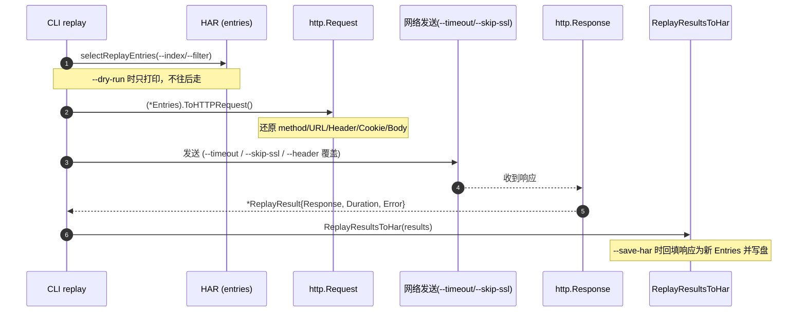

# 转换与导出

Level 5 的 4 个命令负责"改写 HAR 本身或把它转成别的格式"：`transform` 改请求、`export` 转格式、`dedup` 去重、`replay` 重放。它们会产出新文件（或新格式输出），适合迁移、清洗、回归测试。

所有示例都可在仓库根目录直接运行，使用 `testdata/example.har` 或 `testdata/full.har`。

## transform — 转换请求

改写 URL、增删头、切换协议、删查询参数，输出一个新的 HAR（除非 `--in-place`）。所有规则类 flag 都是 stringSlice，可重复传。

```bash
har -f testdata/full.har transform --rewrite-url "http://localhost->https://api.example.com" -o prod.har
```

### Flags

| Flag | 类型 | 默认值 | 说明 |
|------|------|--------|------|
| `--rewrite-url` | stringSlice | `[]` | URL 重写规则，格式 `from->to` |
| `--remove-header` | stringSlice | `[]` | 移除指定请求头 |
| `--add-header` | stringSlice | `[]` | 添加请求头，格式 `name:value` |
| `--add-header-target` | string | `both` | 添加目标（`request`/`response`/`both`） |
| `--change-scheme` | stringSlice | `[]` | 协议变更规则，格式 `from->to` |
| `--remove-query-param` | stringSlice | `[]` | 移除指定查询参数 |
| `--in-place` | bool | `false` | 原地改写输入文件 |

### 示例

把 staging URL 重写到生产：

```bash
har -f testdata/full.har transform \
  --rewrite-url "http://staging.example.com->https://prod.example.com" \
  -o prod.har
```

去掉敏感头，避免泄露：

```bash
har -f testdata/full.har transform \
  --remove-header Authorization --remove-header Cookie \
  -o clean.har
```

同时加请求头与响应头：

```bash
har -f testdata/full.har transform \
  --add-header "X-Env:production" \
  --add-header-target both \
  -o with-headers.har
```

把所有 http 升到 https：

```bash
har -f testdata/full.har transform --change-scheme "http->https" -o https.har
```

删掉缓存破坏器查询参数（见下方 dedup 说明）：

```bash
har -f testdata/full.har transform --remove-query-param "_" --remove-query-param "cb" -o stripped.har
```

多条 `--rewrite-url` 链式应用：

```bash
har -f testdata/full.har transform \
  --rewrite-url "http://localhost->https://api.example.com" \
  --rewrite-url "http://127.0.0.1->https://api.example.com" \
  -o prod.har
```

原地改写（覆盖原文件，先备份）：

```bash
har -f testdata/full.har transform --change-scheme "http->https" --in-place
```

### 实现原理

CLI 把各 flag 翻译成 `[]har.TransformRule`：`--rewrite-url` → `TransformURLRewrite`、`--remove-header` → `TransformHeaderRemove`、`--change-scheme` → `TransformSchemeChange`、`--remove-query-param` → `TransformQueryParamRemove`。规则拼好后调用 `(*Har).Transform(rules)` 返回新 `*Har`；`--add-header` 走独立的 `(*Har).AddHeaders(map, target)`（`target` 即 `--add-header-target`）。`--in-place` 时调 `(*Har).TransformInPlace(rules)` 直接改原对象并写回，否则 `ToJSON(true)` 写到 `-o` 或 stdout。

## export — 导出其他格式

把 HAR 转成 curl/wget/python 等可执行代码，或 xml/yaml/json/jsonl/csv/markdown/html/text 等数据格式。`format` 是位置参数，必填。

```bash
har -f testdata/full.har export curl
```

### 支持的格式

| format | 产出 |
|--------|------|
| `curl` | 每条 entry 一条 curl 命令 |
| `wget` | 每条 entry 一条 wget 命令 |
| `python` | Python `requests` 代码 |
| `postman` | Postman Collection JSON |
| `xml` | XML 文档 |
| `yaml` | YAML 文档 |
| `json` | 标准 HAR JSON（可指定单条） |
| `jsonl` | JSON Lines，每行一条 entry |
| `csv` | CSV 表格 |
| `markdown` / `md` | Markdown 表格 |
| `html` | HTML 表格 |
| `text` | 纯文本表格 |

### Flags

| Flag | 类型 | 默认值 | 说明 |
|------|------|--------|------|
| `--index` | int | `-1` | 只导出指定索引的 entry（-1 = 全部） |
| `--filter` | string | `""` | URL 过滤模式，仅导出匹配条目 |

### 示例

生成 curl 命令一键复现：

```bash
har -f testdata/full.har export curl
```

生成 Python requests 代码：

```bash
har -f testdata/full.har export python -o replay.py
```

导出 Postman 集合：

```bash
har -f testdata/full.har export postman -o collection.json
```

只导第 0 条 entry 为 JSON：

```bash
har -f testdata/full.har export json --index 0 -o entry0.json
```

按 URL 过滤后导出 JSONL：

```bash
har -f testdata/full.har export jsonl --filter "api" -o entries.jsonl
```

导出 Markdown 报告表：

```bash
har -f testdata/full.har export markdown -o report.md
```

导出 HTML 表：

```bash
har -f testdata/full.har export html -o report.html
```

### 实现原理

各 format 对应一个 SDK 方法：`(*Har).ToCurl()`、`ToWget()`、`ToPythonRequests()`、`ToPostmanCollection()`（返回 `[]byte`）、`ToXML()`、`ToYAML()`、`ToJSON(indent)`。`--index` 在客户端选单条 entry，`--filter` 用 URL 子串匹配过滤条目后再导出。`jsonl`/`csv`/`markdown`/`html`/`text` 由 CLI 内部格式化器按 entry 序列拼装。

## dedup — 去重

找出或删除重复/近似重复请求。默认用 `pattern` 策略；加 `--remove` 输出清理后的 HAR。

```bash
har -f testdata/full.har dedup
```

### 三种策略

::: info 三种去重策略
| 策略 | 判定方式 | 适用场景 |
|------|----------|----------|
| `exact` | URL 完全相同 | 严格逐字符重复 |
| `pattern` | 忽略指定参数后 URL 相同 | 带缓存破坏器的近似重复（默认） |
| `content-hash` | 响应体哈希相同 | 不同 URL 但内容一致 |

`pattern` 是默认值，因为它能识别 `_`、`cb`、`timestamp` 等缓存破坏器——这些参数每次请求值都不同，但请求实质重复。用 `--ignore-param` 显式列出要忽略的参数。
:::

### Flags

| Flag | 类型 | 默认值 | 说明 |
|------|------|--------|------|
| `--strategy` | string | `pattern` | 去重策略（`exact`/`pattern`/`content-hash`） |
| `--ignore-param` | stringSlice | `[]` | 去重时忽略的查询参数 |
| `--compare-headers` | bool | `false` | 比较时包含请求头 |
| `--compare-body` | bool | `false` | 比较时包含请求体 |
| `--remove` | bool | `false` | 去除重复，输出清理后的 HAR |

### 示例

默认 pattern 策略找重复：

```bash
har -f testdata/full.har dedup
```

精确 URL 匹配：

```bash
har -f testdata/full.har dedup --strategy exact
```

内容哈希匹配（找不同 URL 的相同响应）：

```bash
har -f testdata/full.har dedup --strategy content-hash
```

忽略常见缓存破坏器后去重：

```bash
har -f testdata/full.har dedup \
  --ignore-param "_" \
  --ignore-param "cb" \
  --ignore-param "timestamp" \
  --ignore-param "_t"
```

连同头与体一起比较（更严格）：

```bash
har -f testdata/full.har dedup --compare-headers --compare-body
```

删除重复，输出干净 HAR：

```bash
har -f testdata/full.har dedup --remove -o cleaned.har
```

### 实现原理

CLI 用 `har.DefaultDeduplicateOptions()` 初始化选项，写入 `--strategy`、`--ignore-param`、`--compare-headers`、`--compare-body`。`--remove` 时调 `(*Har).Deduplicate(opts)` 返回去重后的新 `*Har`，再 `ToJSON(true)` 输出；否则调 `(*Har).FindDuplicates(opts)` 返回重复分组并格式化展示。`pattern` 策略在比较 URL 前剥离被忽略的参数，`content-hash` 策略对响应体取哈希后比较。

## replay — 重放 HTTP 请求

把记录的请求重新发出去，用于回归测试、灾备验证、API 迁移验证。**默认会真实发请求**；用 `--dry-run` 只预览不发。



::: warning replay 会发真实请求
不加 `--dry-run` 时，`replay` 会按 HAR 里的 URL、方法、头、体真实发起请求。对生产环境务必先用 `--dry-run` 核对，确认目标与数量后再实跑。
:::

```bash
har -f testdata/full.har replay --dry-run
```

### Flags

| Flag | 类型 | 默认值 | 说明 |
|------|------|--------|------|
| `--timeout` | duration | `30s` | 单请求超时 |
| `--no-follow-redirects` | bool | `false` | 不跟随重定向 |
| `--max-redirects` | int | `10` | 最大重定向次数 |
| `--skip-ssl` | bool | `false` | 跳过 SSL 证书验证 |
| `--header` | stringSlice | `[]` | 覆盖请求头，格式 `name:value` |
| `--index` | int | `-1` | 仅重放指定索引的条目（-1 = 全部） |
| `--filter` | string | `""` | URL 过滤模式，仅重放匹配条目 |
| `--dry-run` | bool | `false` | 仅预览，不实际请求 |
| `--save-har` | string | `""` | 把重放结果存为新 HAR |

### 示例

预览将重放的请求（不发流量）：

```bash
har -f testdata/full.har replay --dry-run
```

设 10 秒超时实跑：

```bash
har -f testdata/full.har replay --timeout 10s
```

跳过 SSL 验证（自签证书环境）：

```bash
har -f testdata/full.har replay --skip-ssl
```

只重放第 0 条：

```bash
har -f testdata/full.har replay --index 0
```

只重放匹配 `api` 的条目：

```bash
har -f testdata/full.har replay --filter "api"
```

覆盖 Authorization 头后重放：

```bash
har -f testdata/full.har replay --header "Authorization:Bearer NEW_TOKEN"
```

不跟随重定向：

```bash
har -f testdata/full.har replay --no-follow-redirects
```

把重放结果存成 HAR，便于与原 HAR diff：

```bash
har -f testdata/full.har replay --timeout 10s --save-har results.har
```

### 实现原理

CLI 构造 `har.ReplayOptions{Timeout, FollowRedirects, MaxRedirects, SkipSSL, Headers}`（`--no-follow-redirects` 取反映射到 `FollowRedirects`）。`--index` 与 `--filter` 经 `selectReplayEntries` 选出要重放的 `[]har.Entries`。每条 entry 调 `(*Entries).Replay(opts)` 返回 `*ReplayResult`；`--save-har` 时用 `har.ReplayResultsToHar(results)` 把结果拼成新 `*Har` 再写出。`--dry-run` 跳过 `Replay` 调用，只打印将要发送的请求清单。

## 小结

| 命令 | 产出 | 是否改原文件 |
|------|------|-------------|
| `transform` | 新 HAR（改写后） | 仅 `--in-place` |
| `export` | 其他格式文本 | 否 |
| `dedup` | 重复报告或清理后 HAR | 仅 `--remove` 时输出新文件 |
| `replay` | 重放结果（文本或新 HAR） | 否，`--save-har` 另存 |

典型链路：`transform` 改 URL → `replay --dry-run` 核对 → `replay --save-har` 实跑 → 用 `diff` 比对结果。完整流程见 [API 迁移测试](../workflows/api-migration.md)。
