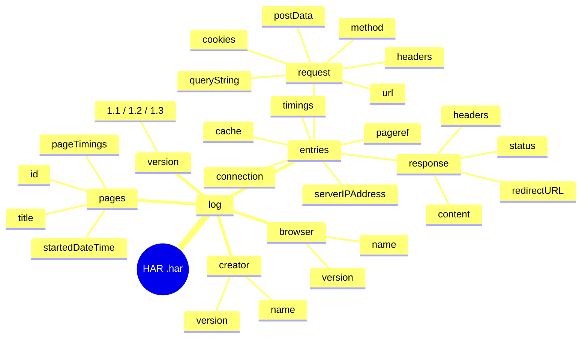
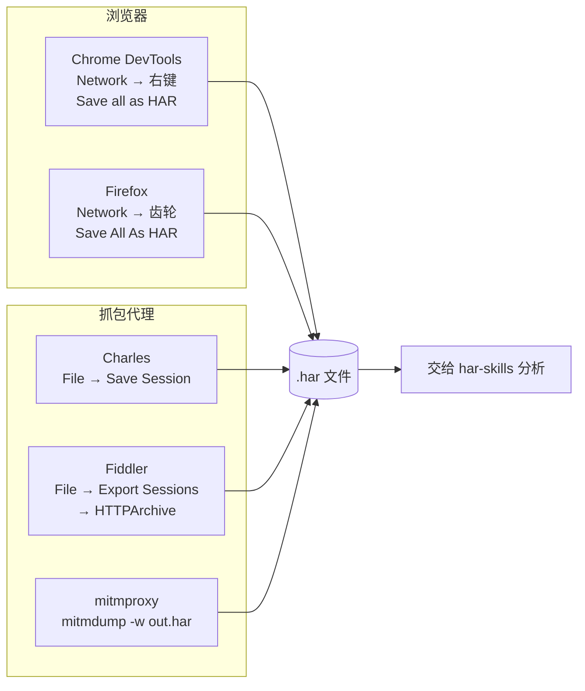

# HAR 格式入门

在用 HAR Skills 之前，先弄清楚 HAR 是什么、长什么样、字段含义与获取方式。这一页是后续所有命令与 SDK 调用的共同前置知识。

## HAR 是什么

HAR（HTTP Archive）是一种 **JSON 格式的 HTTP 事务归档**，由 W3C 的 [HTTP Archive 规范](http://www.softwareishard.com/blog/har-12-spec/) 定义。浏览器与抓包工具把一次浏览会话里的全部 HTTP 请求/响应、时间、Cookie、头等记录下来，导出为一个 `.har` 文件，本质就是一段 JSON。

它常用于：性能回放分析、安全审计、bug 复现、API 行为比对、数据脱敏后分享。

## 顶层结构

一个 HAR 文件只有一个顶层对象，其中 `log` 是根。下图把整棵结构树展开到关键字段层级：



```
{
  "log": {
    "version": "1.2",
    "creator": { "name": "...", "version": "..." },
    "browser":  { "name": "...", "version": "..." },   // 可选
    "pages":    [ ... ],                                // 可选，页面分组
    "entries":  [ ... ]                                 // 核心：每条 HTTP 事务
  }
}
```

| 字段 | 含义 |
| --- | --- |
| `version` | HAR 格式版本，1.1 / 1.2 / 1.3 |
| `creator` | 导出本文件的程序名与版本 |
| `browser` | 浏览器信息（可选） |
| `pages` | 页面分组，每页含 `id`/`title`/`startedDateTime`/`pageTimings` |
| `entries` | HTTP 事务数组，是分析的主体 |

## entries：核心数组

每条 `entry` 描述一次完整的 HTTP 请求/响应事务：

| 字段 | 含义 |
| --- | --- |
| `startedDateTime` | 请求发起时刻（ISO 8601，含时区） |
| `time` | 总耗时（毫秒） |
| `request` | 请求对象（见下） |
| `response` | 响应对象（见下） |
| `cache` | 缓存元数据（如 `beforeRequest`/`afterRequest`） |
| `timings` | 各阶段耗时明细（见下） |
| `pageref` | 引用 `pages` 里的页面 id，用于分组 |
| `serverIPAddress` | 服务器 IP |
| `connection` | 连接 ID，用于连接复用分析 |

### request 结构

```json
{
  "method": "GET",
  "url": "https://example.com/test",
  "httpVersion": "HTTP/1.1",
  "cookies": [],
  "headers": [
    { "name": "Accept", "value": "*/*" }
  ],
  "queryString": [],
  "headersSize": 150,
  "bodySize": 0,
  "postData": { "mimeType": "...", "text": "..." }   // 仅在有请求体时存在
}
```

| 字段 | 含义 |
| --- | --- |
| `method` | HTTP 方法 |
| `url` | 完整请求 URL |
| `httpVersion` | HTTP 协议版本 |
| `cookies` | 请求携带的 Cookie 数组 |
| `headers` | 请求头数组，每项 `{name, value}` |
| `queryString` | 查询参数数组，每项 `{name, value}` |
| `headersSize` | 请求头字节数 |
| `bodySize` | 请求体字节数 |
| `postData` | 请求体（mimeType + text 或 params） |

### response 结构

```json
{
  "status": 200,
  "statusText": "OK",
  "httpVersion": "HTTP/1.1",
  "cookies": [],
  "headers": [
    { "name": "Content-Type", "value": "text/plain" }
  ],
  "content": {
    "size": 100,
    "mimeType": "text/plain"
  },
  "redirectURL": "",
  "headersSize": 200,
  "bodySize": 100
}
```

| 字段 | 含义 |
| --- | --- |
| `status` | HTTP 状态码 |
| `statusText` | 状态原因短语 |
| `httpVersion` | 响应的 HTTP 版本 |
| `cookies` | 响应 Set-Cookie 解析后的数组 |
| `headers` | 响应头数组 |
| `content` | 响应体元数据：`size`、`mimeType`、`text`、`encoding`（如 base64） |
| `redirectURL` | 重定向目标 URL |
| `headersSize` | 响应头字节数 |
| `bodySize` | 响应体字节数 |

## timings：各阶段耗时

`timings` 把一次请求的总耗时拆成网络各阶段，单位为毫秒。下图把七个阶段按典型顺序铺在时间轴上（数值仅为示意，真实值由网络决定）：

```mermaid
gantt
  title 一次 HTTP 请求的各阶段（示意，单位 ms）
  dateFormat X
  axisFormat %S
  section 排队与建连
  blocked  :0, 5
  dns      :5, 12
  connect  :12, 27
  ssl      :27, 45
  section 收发
  send     :45, 46
  wait     :46, 120
  receive  :120, 145
```



| 字段 | 含义 |
| --- | --- |
| `blocked` | 等待网络连接（含队列） |
| `dns` | DNS 解析 |
| `connect` | TCP 连接建立 |
| `ssl` | TLS 握手 |
| `send` | 发送请求 |
| `wait` | 等待首字节（TTFB） |
| `receive` | 接收响应体 |

::: warning -1 表示未测量
规范规定：**未测量的阶段值为 `-1`**。解析与统计时必须把 `-1` 当作"缺失"而非"0"，否则会拉低平均值。HAR Skills 在 `TimingStatistics()` 等方法中已处理该约定。
:::

各阶段之和（忽略 `-1`）应近似等于 `entry.time`，HAR Skills 的 `validate` 命令可据此检查一致性（`--timings-tolerance` 控制容差，默认 10ms）。

## 如何获取 HAR 文件

各工具的导出路径不同，但产物都是同一种 `.har` JSON：



### Chrome DevTools

1. 打开 DevTools（F12）→ Network 面板。
2. 确保勾选 "Preserve log"（保留跨页日志）。
3. 复现操作后，在网络列表上**右键 → Save all as HAR with content**。

### Firefox

Network 面板右上角齿轮 → **Save All As HAR**。

### 抓包工具

| 工具 | 导出方式 |
| --- | --- |
| Charles | File → Save Session → 选 HAR 格式 |
| Fiddler | File → Export Sessions → HTTPArchive |
| mitmproxy | `mitmdump -w out.har` 或 `mitmweb` 导出 |

::: tip 录制建议
为便于后续分析，录制前清理一次缓存（或在 DevTools 里勾选 "Disable cache"），否则大量 `304`/`disk cache` 条目会干扰性能与缓存分析。
:::

## 扩展字段：下划线前缀

::: details HAR 规范允许工具自定义扩展字段，约定以 `_` 开头
HAR 规范允许工具自定义扩展字段，约定以 **下划线 `_` 开头**。Chrome DevTools 就大量使用这类字段：

| 字段 | 含义 |
| --- | --- |
| `_initiator` | 请求的发起来源（脚本/解析器等） |
| `_resourceType` | 资源类型（xhr/script/stylesheet/...） |
| `_priority` | 请求优先级 |
| `_webSocketMessages` | WebSocket 消息 |

HAR Skills 保留 `_` 前缀的扩展字段，不在解析时丢弃。`find` 命令的 `--resource-type` 即直接读取 Chrome 的 `_resourceType`。详见 [扩展字段保真原理](./internals/custom-fields.md)。
:::

## 一个最小 HAR 示例

以下来自仓库 `testdata/minimal_valid.har`，是一个能通过校验的最小 HAR：

```json
{
  "log": {
    "version": "1.2",
    "creator": {
      "name": "Go-HAR Test",
      "version": "1.0"
    },
    "entries": []
  }
}
```

它只有 `version`、`creator` 和一个空 `entries` 数组——这是规范要求的最低集合。真实 HAR 的 `entries` 里会填满上面描述的 request/response/timings 等字段。仓库里更完整的样例见 `testdata/example.har` 与 `testdata/full.har`。

## 下一步

- 装好工具对真实文件跑一遍：[快速开始](./quick-start.md)
- 用 `validate` 命令校验你的 HAR：[CLI 参考](./cli/files.md)
- 深入字段语义与解析策略：[数据结构](./sdk/data-structures.md)、[四种解析策略](./sdk/parsing-strategies.md)
