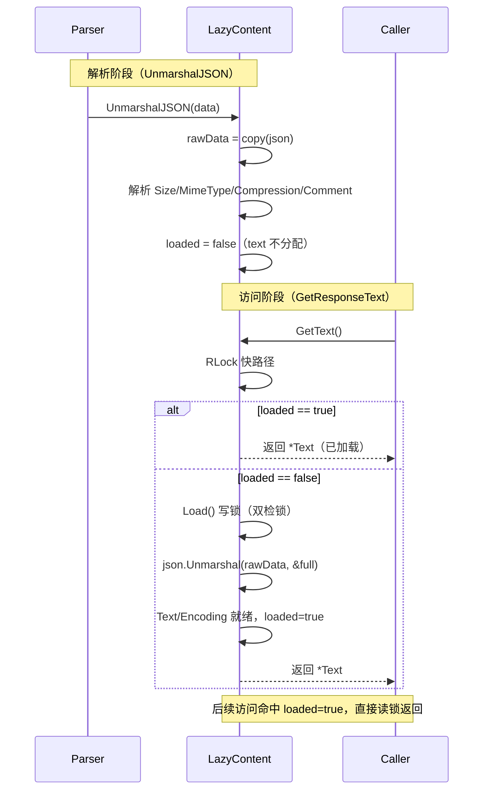
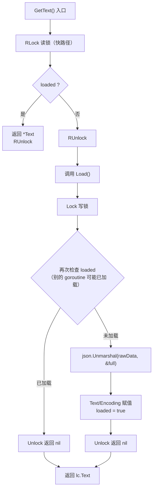
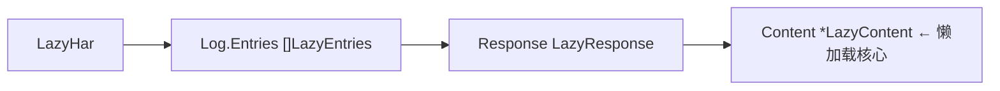
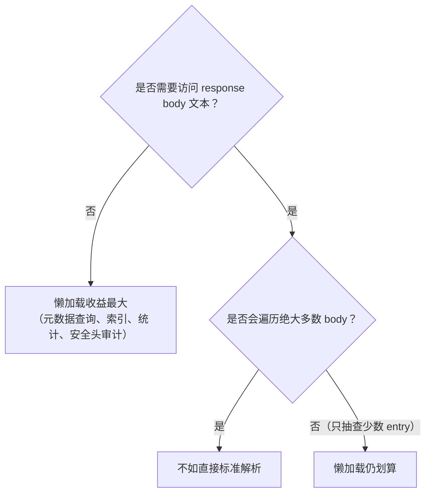

# 懒加载原理

HAR 文件中 `response.content.text` 经常是体积最大的字段——图片、字体、JS bundle 的 base64 编码动辄数百 KB 到数 MB。标准解析会把所有响应体一次性载入内存。`LazyHar` 的做法是：解析阶段只取元数据，把原始 JSON 存起来；等到真正需要 body 文本时才二次解析。

## 问题：响应体可能巨大

一个典型 HAR 条目：

```
entry.response.content = {
  "size": 1843200,            ← 元数据，小
  "mimeType": "image/png",    ← 元数据，小
  "compression": 0,           ← 元数据，小
  "text": "iVBORw0KGgoAAA..." ← 实际 body，可能 2MB+
}
```

做统计分析、安全审计、URL 索引时，往往根本不读 `text`。但标准 `json.Unmarshal` 会把它整个反序列化成 Go 字符串，全部驻留内存。对于几千条 entry 的 HAR，这就是 GB 级的浪费。

## 方案：LazyContent 的"先存原始、按需解析"

`LazyContent` 拆成两层字段：

```go
// lazy.go
type LazyContent struct {
    // 基本信息总是加载
    Size        int    `json:"size"`
    MimeType    string `json:"mimeType"`
    Compression int    `json:"compression,omitempty"`

    // 实际内容延迟加载
    Text     *string `json:"text,omitempty"`
    Encoding *string `json:"encoding,omitempty"`
    Comment  string  `json:"comment,omitempty"`

    // 用于延迟加载的原始数据（不参与 JSON 序列化）
    rawData   json.RawMessage `json:"-"`
    loaded    bool            `json:"-"`
    loadMutex sync.RWMutex    `json:"-"`
}
```

关键在自定义 `UnmarshalJSON`：它**不解析 text/encoding**，只把整段原始 JSON 拷贝进 `rawData`，并解析轻量的元数据字段：

```go
// lazy.go
func (lc *LazyContent) UnmarshalJSON(data []byte) error {
    // 1. 保存原始数据用于延迟加载
    lc.rawData = make(json.RawMessage, len(data))
    copy(lc.rawData, data)

    // 2. 只解析基本信息（不碰 text/encoding 这两个大字段）
    type BasicContent struct {
        Size        int    `json:"size"`
        MimeType    string `json:"mimeType"`
        Compression int    `json:"compression"`
        Comment     string `json:"comment"`
    }
    var basic BasicContent
    if err := json.Unmarshal(data, &basic); err != nil {
        return WrapJSONUnmarshalError(err)
    }
    lc.Size = basic.Size
    lc.MimeType = basic.MimeType
    lc.Compression = basic.Compression
    lc.Comment = basic.Comment
    lc.loaded = false
    return nil
}
```

`rawData` 是 `json.RawMessage`（即 `[]byte` 的别名，原始字节切片）。它只是把已读到的 JSON 字节"截留"一份，不会触发对 text 的字符串分配。

## Load() 的双检锁

真正需要 body 时调用 `Load()`，它用 `sync.RWMutex` 做双检锁（double-checked locking），保证并发安全且只解析一次：

```go
// lazy.go
func (lc *LazyContent) Load() error {
    lc.loadMutex.Lock()         // 写锁
    defer lc.loadMutex.Unlock()
    if lc.loaded {              // 再次检查（可能被别的 goroutine 抢先加载）
        return nil
    }
    type FullContent struct {
        Text     *string `json:"text,omitempty"`
        Encoding *string `json:"encoding,omitempty"`
    }
    var full FullContent
    if err := json.Unmarshal(lc.rawData, &full); err != nil {
        return NewJSONParseError("无法加载延迟加载的内容", err)
    }
    lc.Text = full.Text
    lc.Encoding = full.Encoding
    lc.loaded = true
    return nil
}
```

公开的 `GetText()` 则先走**读锁**快路径——已加载就立即返回，未加载才升级为 `Load()`（写锁）：

```go
// lazy.go
func (lc *LazyContent) GetText() (*string, error) {
    lc.loadMutex.RLock()              // 读锁：快路径
    if lc.loaded {
        text := lc.Text
        lc.loadMutex.RUnlock()
        return text, nil
    }
    lc.loadMutex.RUnlock()

    if err := lc.Load(); err != nil { // 写锁：慢路径
        return nil, err
    }
    return lc.Text, nil
}
```

时序如下：



## Load() 的双检锁流程

`Load()` 内部用读锁做第一次检查、写锁做第二次检查，保证并发安全且只解析一次：



<details>
<summary>ASCII 备份图</summary>

```
解析阶段（UnmarshalJSON）          访问阶段（GetResponseText）
─────────────────────────         ─────────────────────────
│ rawData = copy(json)     │     │ RLock                     │
│ Size/MimeType/... = 解析 │     │  loaded? ── 否 ──► Load() │
│ loaded = false           │     │            是             │
│ text 字段不分配          │     │            ▼              │
│          │               │     │  返回 *Text（已加载）     │
│          ▼               │     │  RUnlock / Unlock         │
│   （此时 text 不占内存） │     │  后续访问命中 loaded=true │
└──────────────────────────┘     └───────────────────────────┘
```
</details>

## 类型与入口



| 类型 | 作用 |
|------|------|
| `LazyContent` | 响应体懒加载容器（`rawData` + `loaded` + `loadMutex`） |
| `LazyResponse` | 含 `*LazyContent` 的响应 |
| `LazyEntries` | 含 `LazyResponse` 的条目；其余字段（Request/Cache/Timings...）仍为标准结构 |
| `LazyHar` | 顶层容器，实现 `HARProvider` |

入口：

```go
// lazy.go
lh, err := ParseHarWithLazyLoading(harBytes)       // 从字节
lh, err := ParseHarFileWithLazyLoading("big.har")  // 从文件
// 内部：json.Unmarshal 整个 LazyHar，但 LazyContent.UnmarshalJSON
//       拦截了 content 的解析，只取元数据
```

经函数选项的统一入口：

```go
provider, err := har.Parse(harBytes, har.WithLazyLoading())
// 返回 HARProvider（实际为 *LazyHar）
```

按索引访问，避免一次性遍历全部 body：

```go
count := lh.GetEntriesCount()           // 不触发任何 body 加载
entry, err := lh.GetEntry(i)           // 不触发 body 加载
content, err := lh.GetResponseContent(i) // 拿到 LazyContent，仍未加载
text, err := lh.GetResponseText(i)      // ← 这里才触发 Load()
```

`(*LazyHar).ToStandardHar()` 会逐条 `Load()` 后转标准 `*Har`——注意这会一次性加载所有 body，等于放弃懒加载优势，仅在确实需要全量标准结构时使用。

## 接口适配：lazyContentWrapper

`*LazyContent` 本身的方法签名（`GetText() (*string, error)`）与 `ContentProvider.GetText() string` 不一致。`lazyContentWrapper` 负责适配：

```go
// lazy_impl.go
type lazyContentWrapper struct {
    content *LazyContent
}

func (w *lazyContentWrapper) GetText() string {
    text, err := w.content.GetText() // (*string, error)
    if err != nil || text == nil {
        return ""
    }
    return *text
}
```

`LazyResponse.GetContent()` 返回的就是这个包装器，从而让 `LazyHar` 能无缝接入 `HARProvider` 体系。`GetEncoding()`/`ToStandard()` 内部同样会调用 `Load()` 保证 body 已就绪。

## 适用场景与代价



<details>
<summary>ASCII 备份图</summary>

```
┌─────────────────────────────────────────────────────────────┐
│ 是否需要访问 response body 文本？                             │
└────────┬───────────────────────────┬────────────────────────┘
    否   │                       是  │
         ▼                           ▼
   懒加载收益最大              是否会遍历绝大多数 body？
   (元数据查询、索引、           是 → 不如直接标准解析
    统计、安全头审计)            否（只抽查少数 entry） → 懒加载仍划算
```
</details>

- **适合**：响应体巨大但你只需要元数据的场景——安全头审计、URL/域名索引、状态码统计、`info` 摘要。解析阶段省下的内存可能从 GB 降到 MB。
- **代价**：首次访问 body 会有**额外解析开销**——`rawData` 的字节早已驻留内存，`Load()` 才把它二次 `json.Unmarshal` 出字符串。如果你最终会遍历所有 entry 的 body，懒加载反而比标准解析多一次拷贝。
- **注意**：`rawData` 在 `Load()` 后并不释放（仍保留原始 JSON），这是为了让多次 `GetText()` 调用幂等且线程安全；如需回收，转成标准 `*Har` 后丢弃 `LazyHar`。
