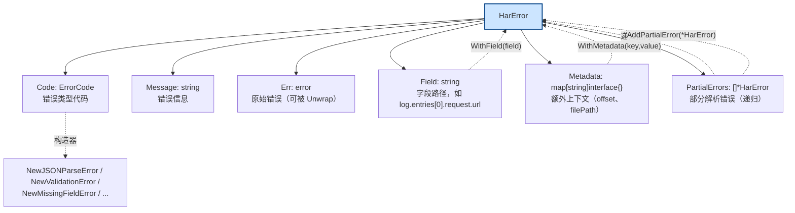
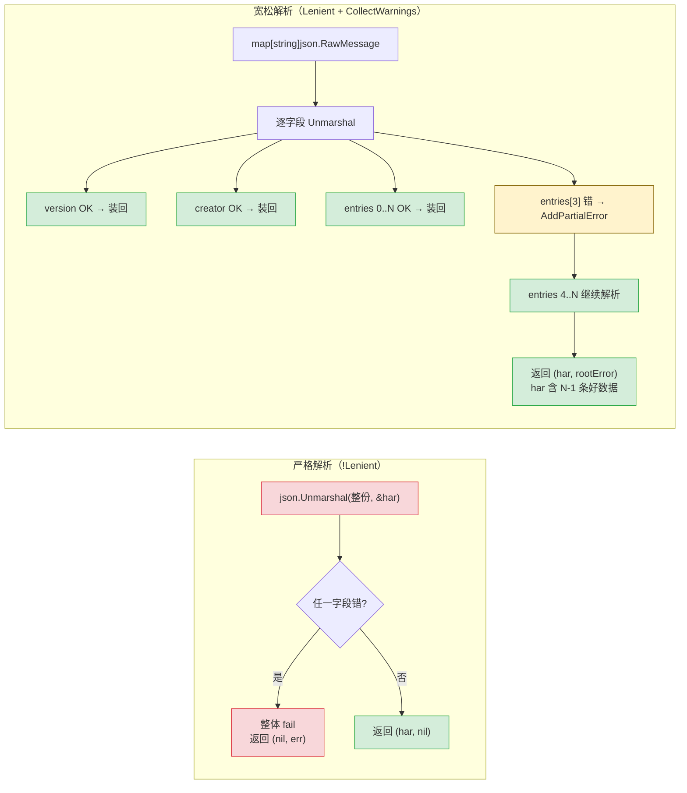
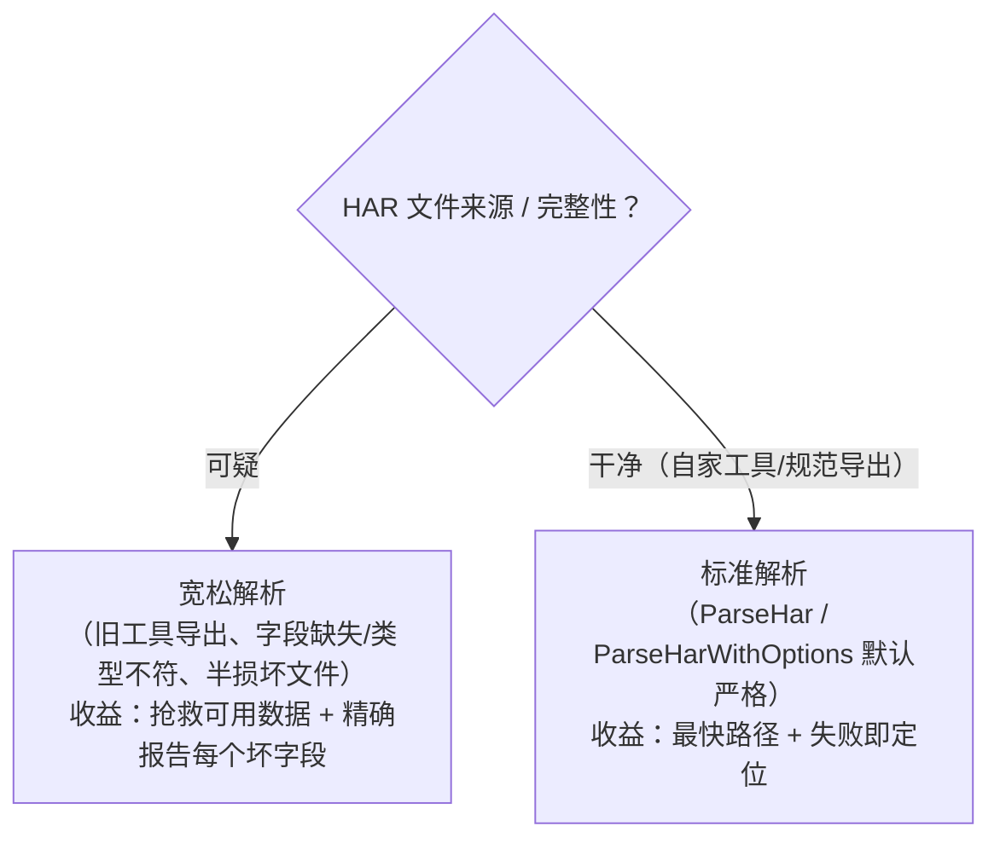

# 宽松解析与错误体系

真实世界的 HAR 文件常常"半损坏"——旧工具漏字段、字段类型不符、个别 entry 结构错位。标准 `json.Unmarshal` 遇到第一处错误就整体失败，连 999 条好数据也拿不到。har-skills 用 `HarError` 错误体系 + `parseLenient` 宽松解析，做到"逐字段容错、坏字段记入警告、好数据照常返回"。

## 错误体系

### ErrorCode 枚举

```go
// errors.go
type ErrorCode int

const (
    ErrCodeUnknown ErrorCode = iota
    ErrCodeFileSystem      // 文件系统错误（打开/读取/关闭）
    ErrCodeJSONParse       // JSON 解析错误
    ErrCodeInvalidFormat   // 格式错误（如不是 JSON）
    ErrCodeValidation      // 验证错误（不符合 HAR 规范）
    ErrCodeMissingField    // 必需字段缺失
    ErrCodeInvalidValue    // 字段值无效
    ErrCodeUnsupported     // 不支持的操作
)
```

### HarError 结构

```go
// errors.go
type HarError struct {
    Code          ErrorCode            // 错误类型代码
    Message       string               // 错误信息
    Err           error                // 原始错误（可被 Unwrap）
    Field         string               // 字段路径，如 "log.entries[0].request.url"
    Metadata      map[string]interface{}  // 额外上下文（如 offset、filePath）
    PartialErrors []*HarError          // 部分解析错误（递归）
}
```

`HarError` 是错误体系的中心。它实现了 `error`、`Unwrap()`（支持 `errors.Is/As`），并带一组构建/查询方法：



| 类别 | 方法 |
|------|------|
| 构建上下文 | `WithField(field)`、`WithMetadata(key, value)` |
| 部分错误 | `AddPartialError(*HarError)`、`HasPartialErrors()`、`GetPartialErrors()` |
| 查询 | `GetCode()`、`IsFileSystemError()`、`IsJSONParseError()`、`IsFormatError()`、`IsValidationError()` |

`Error()` 会把 Field、原始 Err、PartialErrors 全拼进消息，便于一眼看清出错位置与原因：

```go
// errors.go — Error() 的输出形如：
// 字段 'log.entries[3].request.url': 无效的URL格式: ... - original error
//   (部分错误: 无法解析第3个entry: ...; 字段 'log.entries[5]': ...)
```

### 构造器与 JSON 错误包装

```go
// errors.go
NewHarError(code, message, err)        // 通用
NewFileSystemError(message, err)       // ErrCodeFileSystem
NewJSONParseError(message, err)        // ErrCodeJSONParse
NewValidationError(message, field)     // ErrCodeValidation + Field
NewInvalidFormatError(message)         // ErrCodeInvalidFormat
NewMissingFieldError(field)            // ErrCodeMissingField + Field
NewInvalidValueError(field, value, reason)  // + Metadata["value"]
NewUnsupportedError(message)           // ErrCodeUnsupported
```

`WrapJSONUnmarshalError` 是关键：它把 `encoding/json` 的原始错误**分类细化**，提取 `Offset`/`Field`/类型信息：

```go
// errors.go
func WrapJSONUnmarshalError(err error) *HarError {
    switch e := err.(type) {
    case *json.UnmarshalTypeError:
        return NewJSONParseError(
            fmt.Sprintf("类型不匹配: 预期 %s 类型，但得到 %s",
                e.Type.String(), e.Value), err).
            WithField(e.Field).WithMetadata("offset", e.Offset)
    case *json.SyntaxError:
        return NewJSONParseError(
            fmt.Sprintf("JSON语法错误: %s", e.Error()), err).
            WithMetadata("offset", e.Offset)
    }
    // 其他 "cannot unmarshal" 形态的错误也尽量拆出消息
    if strings.Contains(err.Error(), "cannot unmarshal") { /* ... */ }
    return NewJSONParseError("JSON解析错误", err)
}
```

这样调用方拿到的不是干巴巴的 "unexpected end of JSON input"，而是带偏移量、字段路径、预期类型的结构化错误。

## 宽松解析核心：PartialErrors 实现部分成功

`parseLenient` 的策略是 **逐字段用 `json.RawMessage` 解析**：先把 `log` 解析成 `map[string]json.RawMessage`，再对每个子字段单独 `json.Unmarshal`。单字段失败只记一条 `PartialError`，不中断其他字段：

```go
// parser.go — parseLenient 的核心循环（节选）
var logData map[string]json.RawMessage
if err := json.Unmarshal(logBytes, &logData); err != nil {
    return nil, WrapJSONUnmarshalError(err)
}

rootError := &HarError{Code: ErrCodeJSONParse,
    Message: "HAR解析过程中发生错误，但部分内容已成功解析"}

// version 字段：单独解析，失败只记 partial
if versionBytes, ok := logData["version"]; ok {
    var version string
    if err := json.Unmarshal(versionBytes, &version); err == nil {
        har.Log.Version = version          // 成功 → 装回 Har
    } else {
        rootError.AddPartialError(
            NewJSONParseError("无法解析version字段", err).
                WithField("log.version"))
    }
}
// entries 数组：逐条 RawMessage，单条坏掉不影响其他条
if entriesBytes, ok := logData["entries"]; ok {
    var entries []json.RawMessage
    if err := json.Unmarshal(entriesBytes, &entries); err == nil {
        for i, entryBytes := range entries {
            var entry Entries
            if err := json.Unmarshal(entryBytes, &entry); err == nil {
                har.Log.Entries = append(har.Log.Entries, entry)
            } else {
                rootError.AddPartialError(
                    NewJSONParseError(
                        fmt.Sprintf("无法解析第%d个entry", i+1), err).
                        WithField(fmt.Sprintf("log.entries[%d]", i)))
            }
        }
    }
}
```

返回逻辑：

```go
// 有错误且收集警告 → 若已解析出有效内容(version/entries/pages)，返回 Har + 警告
if rootError.HasPartialErrors() && options.CollectWarnings {
    if har.Log.Version != "" || len(har.Log.Entries) > 0 || len(har.Log.Pages) > 0 {
        return har, rootError  // 部分成功
    }
    return nil, rootError      // 完全失败
}
```

## 严格 vs 宽松对比



<details>
<summary>ASCII 备份图</summary>

```
严格解析（!Lenient）                      宽松解析（Lenient + CollectWarnings）
─────────────────────                    ─────────────────────────────────
│ json.Unmarshal(整份, &har)   │          │ map[string]json.RawMessage      │
│        │                     │          │        │                         │
│        ▼                     │          │        ▼ 逐字段 Unmarshal        │
│  任一字段错 → 整体 fail       │          │  version OK → 装回               │
│  (返回 nil, err)             │          │  creator OK → 装回               │
│                              │          │  entries[0..N] OK → 装回         │
│                              │          │  entries[3] 错 → AddPartialError │
│                              │          │  entries[4..N] 继续解析          │
│                              │          │        ▼                         │
│                              │          │  返回 (har, rootError)           │
│                              │          │  har 含 N-1 条好数据              │
└──────────────────────────────┘          └─────────────────────────────────┘
```
</details>

## 入口与 ParseOptions

```go
// errors.go
type ParseOptions struct {
    Lenient         bool  // 宽松模式
    SkipValidation  bool  // 跳过规范验证
    CollectWarnings bool  // 收集警告而非直接失败
    MaxWarnings     int   // 最大警告数（默认 100）
}
```

`ParseOptions` 是**结构体式**选项，与 `options.go` 的**函数式 Option**（`WithSkipValidation()`/`WithMemoryOptimized()` 等）互补：前者适合显式、可序列化的配置；后者适合链式调用。两者通过 `options.toParseOptions()` 互转。

四档入口，从底层到便利：

```go
// parser.go
// 1. 全控制（结构体选项）
har, err := ParseHarWithOptions(bytes, ParseOptions{Lenient: true, CollectWarnings: true})
har, err := ParseHarFileWithOptions("capture.har", opts)

// 2. 增强版：返回 (*Har, *HarError)，错误带结构
har, harErr := ParseHarEnhanced(bytes)
har, harErr := ParseHarFileEnhanced("capture.har")

// 3. 一键宽松
har, err := ParseHarLenient(bytes)        // = Default + Lenient + CollectWarnings
har, err := ParseHarFileLenient("capture.har")

// 4. 警告模式：返回 (*Result, error)
res, err := ParseHarWithWarnings(bytes)        // res.Har + res.Warnings
res, err := ParseHarFileWithWarnings("capture.har")
```

`Result` 与 `ParseHarWithWarnings`：

```go
// parser.go
type Result struct {
    Har      *Har
    Warnings []*HarError
}
```

它比 `ParseHarLenient` 多两步：解析后跑 `validateURLs`（检查空格、缺协议、`url.Parse` 失败）和 `performFullValidation`（把 `ValidateHarFile` 的 partial errors 转成警告），并对警告去重（`appendWarnings` 用 `field:message` 做 key）。最终 `res.Warnings` 是一份完整的"问题清单"，`res.Har` 仍可正常使用。

## 适用场景



<details>
<summary>ASCII 备份图</summary>

```
┌──────────────────────────────────────────────────────────────┐
│ HAR 文件来源 / 完整性？                                        │
└────────┬───────────────────────────┬─────────────────────────┘
  可疑    │                       干净│ （自家工具/规范导出）
         ▼                           ▼
   宽松解析                       标准解析
   (旧工具导出、                   (ParseHar / ParseHarWithOptions
    字段缺失/类型不符,               默认严格)
    半损坏文件)                     收益：最快路径 + 失败即定位
   收益：抢救可用数据 +
         精确报告每个坏字段
```
</details>

- **适合**：处理半损坏 HAR——旧版浏览器/抓包工具导出（字段命名不规范）、传输截断、手动编辑出错。`ParseHarWithWarnings` 尤其适合 CI/数据入库前的"体检"：拿到结果与问题清单。
- **错误体系独立价值**：即使不用宽松解析，`WrapJSONUnmarshalError` 也让 `ParseHar` 的失败信息从模糊变得可定位（带 offset、field、类型），便于上游日志与告警。
- **注意**：宽松模式**不能修复语义错误**——它能跳过解析失败的字段，但对"类型对但值非法"（如 URL 缺协议）只能记警告、不会改写。需要修正请配合 `transform` 命令或 SDK 的 `Transform`/`RewriteURL`。
