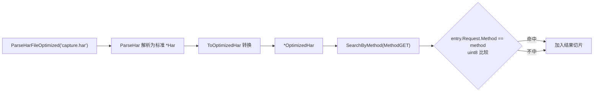
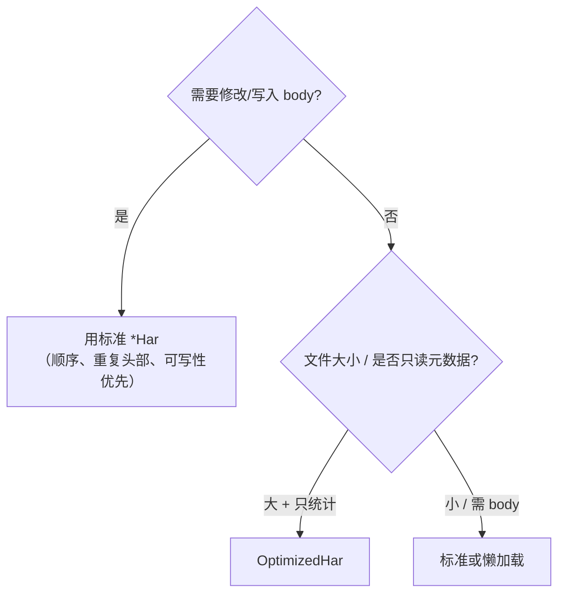

# 内存优化原理

标准 `*Har` 结构忠实映射 HAR 规范的字段，便于读写与序列化；但在处理大文件、只关心聚合统计时，它会浪费可观的内存。`OptimizedHar` 通过三招压缩常驻内存：HTTP 方法枚举化、头部/查询参数 map 化、可选字段指针化。

## 问题：标准结构的内存浪费

标准结构有三个低效点：

| 低效点 | 标准表示 | 问题 |
|--------|----------|------|
| HTTP 方法 | `string`（8 字节头部 + 字符串本体） | 实际只有 9 种取值，用字符串存属于"用大炮打蚊子" |
| Headers / QueryString | `[]Headers`、`[]QueryString`（切片） | 按名查找需 O(n) 线性扫描；切片头 24 字节 |
| 可选字段（HeadersSize/BodySize/PageRef...） | 值类型 `int`/`string` | 即使源文件未提供，零值仍占内存，且无法区分"0"与"缺失" |

下面是同一份请求在两种结构下的内存布局对比：


<details>
<summary>ASCII 备份图</summary>

```
标准 OptimizedRequest（[]Headers 切片）          优化 OptimizedRequest（map[string]string）

┌──────────────────────────────┐                ┌──────────────────────────────┐
│ Method    string  ──►"GET"   │ 8B+3B          │ Method    HTTPMethod = 2    │ 1B  (uint8)
│ URL       string  ──►"/api"  │                │ URL       string            │
│ HTTPVer   string  ──►"HTTP/1.1"              │ HTTPVer   string            │
├──────────────────────────────┤                ├──────────────────────────────┤
│ Headers   []Headers          │ 24B 切片头     │ Headers   map[string]string │ 查找 O(1)
│  ┌─[0] Name  "Accept"        │                │  "Accept"     → "*/*"        │
│  │    Value "*/*"            │                │  "User-Agent" → "curl/8.0"   │
│  └─[1] Name  "User-Agent"    │                ├──────────────────────────────┤
│       Value "curl/8.0"       │                │ HeadersSize *int  ──► nil    │ 缺省=不占额外
├──────────────────────────────┤                │ BodySize    *int  ──► &128  │
│ HeadersSize int = 0          │ 占 8B(零值)    │                              │ 区分"0"与"缺失"
│ BodySize    int = 128        │                └──────────────────────────────┘
└──────────────────────────────┘   查找头部: O(n)
```
</details>

## 方案一：HTTPMethod 枚举

把 9 种方法压成 `uint8`，每个请求省下字符串头部与本体：

```go
// memory.go
type HTTPMethod uint8

const (
    MethodUnknown HTTPMethod = iota
    MethodGET
    MethodPOST
    MethodPUT
    MethodDELETE
    MethodHEAD
    MethodOPTIONS
    MethodPATCH
    MethodCONNECT
    MethodTRACE
)

// 双向映射，便于与字符串互转
var stringToMethod = map[string]HTTPMethod{
    "GET": MethodGET, "POST": MethodPOST, /* ... */
}

func ParseMethod(method string) HTTPMethod {
    if m, ok := stringToMethod[strings.ToUpper(method)]; ok {
        return m
    }
    return MethodUnknown
}
```

`ParseMethod` 大小写不敏感，未命中返回 `MethodUnknown`，绝不会 panic。`GetMethod()` 再用 `switch` 反查回字符串（见 `optimized_impl.go`），保持对外接口与标准结构一致。

## 方案二：map 替代切片

`Headers` 与 `QueryString` 改用 `map[string]string`：

```go
// memory.go
type OptimizedRequest struct {
    Method      HTTPMethod
    URL         string
    HTTPVersion string
    Cookies     []Cookie
    Headers     map[string]string // O(1) 查找
    QueryString map[string]string
    PostData    *PostData
    HeadersSize *int
    BodySize    *int
}
```

代价：map 失去原始顺序、同名多值头部会被合并。因此该结构**不适合需要按序输出或处理重复头部的场景**。但统计分析（按域名聚合、按状态码统计）几乎不关心顺序，正合适。

头部查询从 O(n) 变为 O(1)：

```go
func (req *OptimizedRequest) GetRequestHeaderValue(name string) (string, bool) {
    value, ok := req.Headers[name]
    return value, ok
}
```

## 方案三：指针表达可选字段

HAR 中 `HeadersSize`、`BodySize`、`PageRef`、`ServerIPAddress`、`Connection`、`TransferSize` 等字段都是可选的。标准结构用值类型，零值（`0`/`""`）与"字段缺失"无法区分。优化结构用指针：

```go
type OptimizedTimings struct {
    Blocked         *float64 // nil = 该计时阶段未采集
    DNS             *float64
    Connect         *float64
    Send            *float64
    Wait            *float64
    Receive         *float64
    Ssl             *float64
    BlockedQueueing *float64
    BlockedProxy    *float64
}
```

`OptimizedTimings` 的 getter 由此能返回 `-1` 表示"缺失"，与 HAR 规范的"未采集计时用 -1"约定对齐：

```go
// optimized_impl.go
func (t *OptimizedTimings) GetDNS() float64 {
    if t == nil {
        return -1
    }
    if t.DNS != nil {
        return *t.DNS
    }
    return -1 // 缺省值
}
```

转换时（`convertToOptimizedEntry`）只在原值非零时才分配指针，从而"真的缺失"的字段不占任何堆内存：

```go
// memory.go
if entry.Timings.Blocked != 0 {
    blocked := entry.Timings.Blocked
    optimizedEntry.Timings.Blocked = &blocked // 仅在有值时分配
}
```

## 类型与转换

整套优化类型与标准类型一一对应，且双向可转：


<details>
<summary>ASCII 备份图</summary>

```
        ToOptimizedHar(har)                (*OptimizedHar).ToStandardHar()
*Har ─────────────────────────► *OptimizedHar ─────────────────────────► *Har
   ▲                                 │                                        │
   │                                 │ 实现 HARProvider                        │ 实现 HARProvider
   └─────────────────────────────────┘                                        │
        .ToStandard()  (HARProvider 统一出口)                                  │
```
</details>

类型清单（均定义于 `memory.go`）：

| 类型 | 对应标准类型 | 关键差异 |
|------|--------------|----------|
| `OptimizedHar` | `Har` | 内嵌 `[]OptimizedEntries` |
| `OptimizedEntries` | `Entries` | `PageRef/ServerIP/Connection` 指针化 |
| `OptimizedRequest` | `Request` | `Method` 枚举、`Headers/QueryString` map 化 |
| `OptimizedResponse` | `Response` | `Headers` map 化、`Content/TransferSize` 指针化 |
| `OptimizedContent` | `Content` | `Text/Encoding/Comment` 指针化 |
| `OptimizedTimings` | `Timings` | 全字段指针化，缺失返回 -1 |

`OptimizedHar` 实现了 `HARProvider` 接口（`GetVersion/GetCreator/GetBrowser/GetPages/GetEntries/ToStandard`），因此可与标准、懒加载结构混用——调用方拿到 `HARProvider` 后用 `.ToStandard()` 取回完整 `*Har`。

## 入口与搜索

直接入口（绕过函数选项）：

```go
// memory.go
oh, err := ParseHarFileOptimized("capture.har") // 从文件
oh, err := ParseHarOptimized(harBytes)          // 从字节
// 内部流程：先 ParseHar 解析为标准 Har，再 ToOptimizedHar 转换
```

经函数选项的统一入口：

```go
provider, err := har.Parse(harBytes, har.OptMemoryEfficient...)
// OptMemoryEfficient = WithMemoryOptimized() + WithSkipValidation()
// 返回 HARProvider（实际为 *OptimizedHar），用 .ToStandard() 取回 *Har
```

`OptimizedHar` 自带几个基于优化布局的快速搜索方法（`SearchByURL/SearchByMethod/SearchByStatusCode`），其中按方法搜索直接比较 `uint8`，无需字符串比对：



```go
func (oh *OptimizedHar) SearchByMethod(method HTTPMethod) []OptimizedEntries {
    var results []OptimizedEntries
    for _, entry := range oh.Log.Entries {
        if entry.Request.Method == method { // uint8 比较
            results = append(results, entry)
        }
    }
    return results
}
```

## 适用场景



<details>
<summary>ASCII 备份图</summary>

```
                ┌─────────────────────────────────────────────┐
                │            需要修改/写入 body?                │
                └──────────────┬──────────────────────────────┘
                  是           │                否
            ┌─────────────────┘                └─────────────────┐
            ▼                                                     ▼
   用标准 *Har                                    文件大小 / 是否只读元数据?
   (顺序、重复头部、                              ┌───────────────┐
    可写性优先)                                是  │ 大 + 只统计     │
                                               └──┴─► OptimizedHar
                                                   否  │ 小/需 body     │
                                                       └─► 标准或懒加载
```
</details>

- **适合**：对大文件做统计分析（`Statistics`、按域名/状态码聚合、`SearchBy*`），只需聚合结果、不修改响应体、不要求头部顺序。
- **不适合**：需要按原始顺序回写 HAR、需保留重复同名头部、需要 `body` 文本进行编辑或导出 curl/postman 的场景——此时用标准 `*Har` 或在导出前 `.ToStandard()`。

> 注意 `OptimizedContent.GetCompression()` 固定返回 `0`（优化结构不跟踪压缩字段），如需压缩信息请走标准结构或 `ToStandard()`。
