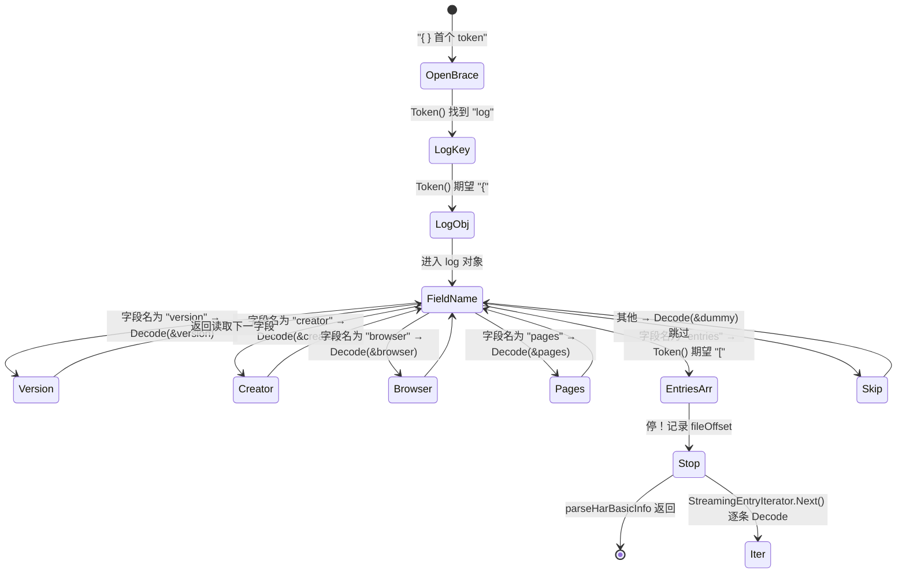
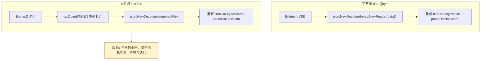
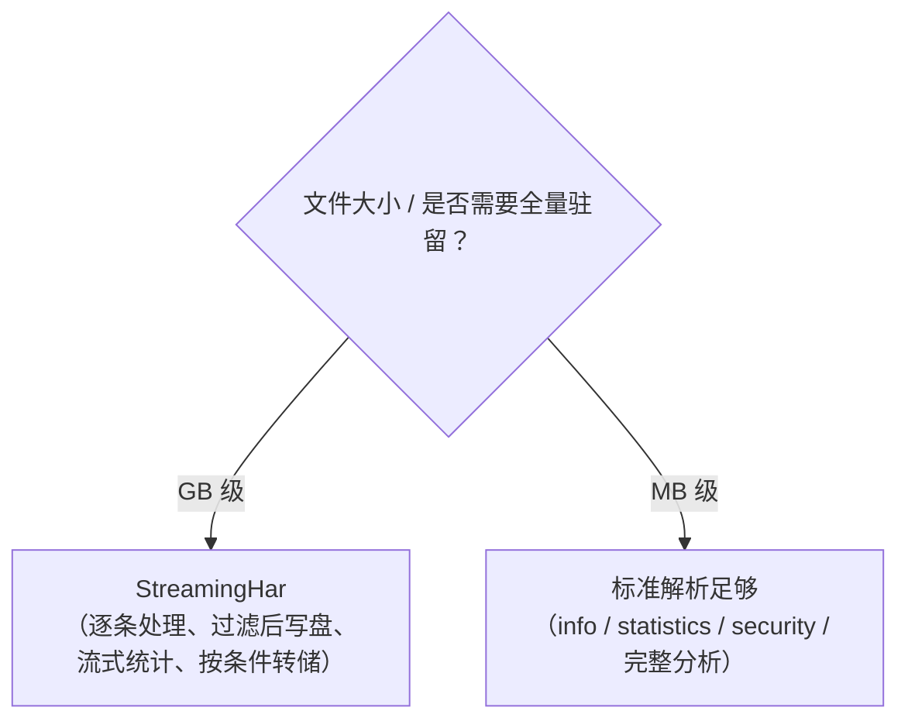

# 流式解析原理

GB 级 HAR 文件无法整份驻留内存——光是把 `[]byte` 读进来就已经超限。`StreamingHar` 用 `json.Decoder` 的 token 推进，只解析元信息，`entries` 数组则逐条 `Decode`，让一条条 entry 像流水线一样流过你的处理函数。

## 问题：GB 级文件无法全量驻留

标准 `ParseHar` 的第一步是 `json.Unmarshal(bytes, &har)`，前提是整个文件的 `[]byte` 都在内存里。一个 2GB 的 HAR 在 64 位 Go 里至少要 2GB 连续堆内存，还不算反序列化出的对象图。这既不现实，也没必要——大多数分析任务只需要遍历 entry 一次。

## 方案：json.Decoder 的 Token/Decode 增量推进

`encoding/json` 的 `Decoder` 能以 token 为单位前进。`StreamingHar` 的解析分两阶段：

1. **元信息阶段**：用 `Token()` 推进到 `log` 对象内，逐字段 `Decode` 出 `version/creator/browser/pages`，直到遇到 `entries` 后的数组起始符 `[`。
2. **条目阶段**：停在 `[` 之后，反复调用 `decoder.More()` + `decoder.Decode(&entry)` 逐条解析单个 `Entries`，直到 `]`。

### Token 推进状态机



<details>
<summary>ASCII 备份图</summary>

```
                       Token() 推进序列
                       ─────────────────
  {  ──► "log"  ──►  {  ──►  字段名(字符串)  ──►  Decode(值)  ──► ... ──►  }
  ▲                                              │
  │                                              │ 字段名为以下之一:
  findHarObjectStart                             │  "version"  → Decode(&version)
  (期望首个 token 为 '{')                         │  "creator"  → Decode(&creator)
                                                 │  "browser"  → Decode(&browser)
                                                 │  "pages"    → Decode(&pages)
                                                 │  "entries"  → Token() 期望 '[' → 停！
                                                 │  (其他)     → Decode(&dummy) 跳过
                                                 ▼
                                          遇到 "entries" + '['
                                                 │
                                                 ▼
                                   parseHarBasicInfo 返回，记录 fileOffset
                                                 │
                                                 ▼
                            StreamingEntryIterator.Next() 逐条 Decode
```
</details>

关键代码（`streaming.go`）：

```go
func findHarObjectStart(decoder *json.Decoder) error {
    token, err := decoder.Token() // 期望 '{'
    if delim, ok := token.(json.Delim); !ok || delim != '{' {
        return errors.New("expected { at the start of HAR file")
    }
    for {
        token, err := decoder.Token() // 找 "log"
        if str, ok := token.(string); ok && str == "log" {
            break
        }
    }
    token, _ = decoder.Token() // 期望 '{'
    if delim, ok := token.(json.Delim); !ok || delim != '{' {
        return errors.New("expected { after log field")
    }
    return nil
}
```

`parseHarBasicInfo` 用 `switch` 分派字段名；遇到不认识的字段就 `Decode(&dummy interface{})` 跳过——这是 `Decoder` 比 `Unmarshal` 强的地方：**可以跳过不需要的字段而不报错**。

## 关键：文件源可重开

迭代器必须能"重置"——多次调用 `Entries()` 各拿一个独立游标。但 `json.Decoder` 不可回退。文件源（`*os.File`）的处理是：**重新打开文件，再走一遍 `findHarObjectStart` + `parseHarBasicInfo` 跳到 entries 数组**：

```go
// streaming.go — (*StreamingHar).Entries() 的文件分支
filePath := h.file.Name()
reopenedFile, err := os.Open(filePath)              // 重新打开
reopenedDecoder := json.NewDecoder(reopenedFile)
findHarObjectStart(reopenedDecoder)                 // 重新定位到 log.{
throwawayHar := &StreamingHar{}
parseHarBasicInfo(reopenedDecoder, throwawayHar)   // 重新推进到 entries[
return &StreamingEntryIterator{
    har:            h,
    file:           reopenedFile,
    decoder:        reopenedDecoder,
    entriesStarted: true,
}
```

字节源（`data []byte`）更简单——每次 `Entries()` 都新建一个 `bytes.NewReader`，零成本。



<details>
<summary>ASCII 备份图</summary>

```
字节源 data []byte                 文件源 *os.File
────────────────────              ────────────────────────────
Entries()                          Entries()
  └─ json.NewDecoder(bytes.NewReader(data))   └─ os.Open(同路径) 重新打开
      └─ 重新 findHarObjectStart + parseHarBasicInfo
                                              （原 file 句柄仍保留，
                                               供元信息查询；不参与迭代）
```
</details>

`StreamingHar` 在构造时记录 `har.fileOffset = decoder.InputOffset()`，但实际迭代并不用它 seek——重开策略更简单可靠，且 `os.Open` 在大多数 OS 上是廉价操作。

## 类型与接口

```go
// streaming.go
type EntryIterator interface {
    Next() bool          // 推进到下一条；无更多则 false
    Entry() *Entries     // 当前条目
    Err() error          // 迭代过程中的错误（io.EOF 归一为 nil）
    Close() error        // 关闭资源
}

type StreamingHar struct {
    file       *os.File   // 文件源（可能为 nil）
    fileOffset int64
    mutex      sync.Mutex
    creator    Creator
    browser    Browser
    pages      []Pages
    version    string
    data       []byte     // 字节源（可能为 nil）
}

type StreamingEntryIterator struct {
    har            *StreamingHar
    decoder        *json.Decoder
    err            error
    file           *os.File
    currentPos     int
    entry          Entries
    closed         bool
    entriesStarted bool
}
```

`StreamingHar` 的方法分两类：

| 方法 | 说明 |
|------|------|
| `GetVersion/GetCreator/GetBrowser/GetPages` | 元信息访问，已在构造时解析，O(1) |
| `Entries()` | 返回新的 `*StreamingEntryIterator`（每次新建游标） |
| `GetAllEntries()` | 便捷方法，内部用 `Entries()` 全量收集到切片——**会加载所有内容到内存**，仅作便利 |
| `Close()` | 关闭底层文件句柄 |

`StreamingEntryIterator` 的 `Next()`：

```go
func (it *StreamingEntryIterator) Next() bool {
    if it.closed || it.err != nil { return false }
    if !it.entriesStarted { /* 找 "entries" + '[' */ }
    if !it.decoder.More() { return false }       // 数组耗尽
    var entry Entries
    if err := it.decoder.Decode(&entry); err != nil {
        it.err = wrapStreamingIteratorError("failed to decode streaming entry", err)
        return false
    }
    it.entry = entry
    it.currentPos++
    return true
}
```

## 入口

`streaming.go` 直接构造：

```go
sh, err := NewStreamingHarFromFile("huge.har")  // 文件源
sh, err := NewStreamingHarFromBytes(data)       // 字节源（注意：字节源会先全量 Unmarshal 取元信息）
it  := sh.Entries()
for it.Next() {
    e := it.Entry() // *Entries
    // 处理单条
}
if err := it.Err(); err != nil { /* ... */ }
it.Close()
```

`parse.go` 包装为 `EntryIterator`（与函数选项体系对齐）：

```go
// parse.go
func NewStreamingParser(harBytes []byte, opts ...Option) (EntryIterator, error)
func NewStreamingParserFromFile(filePath string, opts ...Option) (EntryIterator, error)
```

> 注意 `Parse(...)` 函数选项入口在 `useStreaming` 时会返回 `ErrCodeUnsupported`——流式解析不返回完整 HAR 对象，必须用 `NewStreamingParser*`。这是设计上的有意为之。

## 重要：StreamingHar 不是完整 HARProvider

`StreamingHar` **不实现** `HARProvider` 接口——它没有 `GetEntries() []EntryProvider`（那会要求全量驻留）。它是流式专用入口，只暴露元信息访问和迭代器。若需要完整 `HARProvider` 语义，把 `GetAllEntries()` 的结果装回 `*Har` 即可，但那就放弃了流式的内存优势。

## 适用场景



<details>
<summary>ASCII 备份图</summary>

```
┌──────────────────────────────────────────────────────────────┐
│ 文件大小 / 是否需要全量驻留？                                  │
└────────┬───────────────────────────┬─────────────────────────┘
  GB 级  │                       MB  │
         ▼                           ▼
   StreamingHar               标准解析足够
   (逐条处理、过滤后写盘、      (info / statistics /
    流式统计、按条件转储)        security / 完整分析)
```
</details>

- **适合**：超大文件逐条处理——流式统计（按域名/状态码计数）、按条件过滤后转储到新 HAR、只对匹配 entry 做 body 提取。
- **不适合**：需要随机访问任意 index、需要 diff/merge 这类跨 entry 全量操作、需要完整 `HARProvider` 接口的场景。
- **字节源注意**：`NewStreamingHarFromBytes` 内部仍会 `json.Unmarshal` 整份数据取元信息——它适合"已有字节、想用统一迭代 API"的场景；真正要省内存请用 `NewStreamingHarFromFile` 直接读文件。
