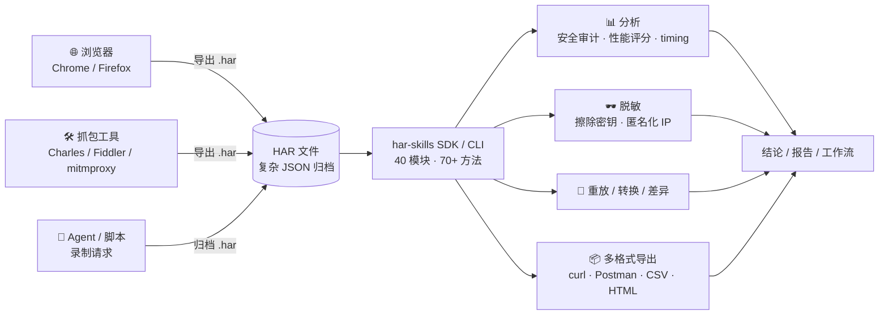
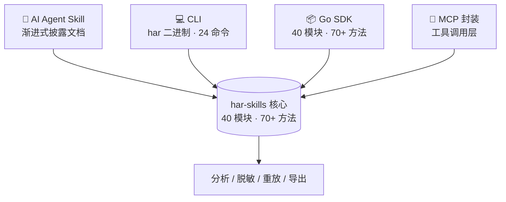

# HAR Skills — AI 原生的 HAR 分析工具箱

HAR Skills 是一个面向 **AI Agent 优先设计**的 HAR（HTTP Archive）文件分析工具箱，同时以 **Go SDK** 和 **CLI** 两种形式暴露能力。它能在一处完成 HAR 文件的解析、搜索过滤、安全审计、性能评分、脱敏、重放、转换、差异对比与多格式导出。

下面这张图展示了 HAR 数据如何从浏览器/抓包工具流出，经过 har-skills 的统一处理，最终化为分析结论、脱敏产物与多格式导出：

## 项目要解决什么问题

HAR 文件是浏览器与抓包工具导出的网络流量归档，本质是一份结构复杂的 JSON。它有三个让传统工具难以招架的特征：

- **体量大**：一次完整页面加载动辄数百条请求，单文件可达上百 MB。
- **结构复杂**：嵌套层次深，request/response/headers/cookies/timings/postData 层层套叠。
- **含敏感信息**：Authorization 头、Cookie、API Key、表单密码往往原样留存。

::: warning 为什么"肉眼读 JSON + 一次性脚本"行不通
传统做法要么靠肉眼读 JSON，要么用一次性脚本拼凑，缺乏可复用、可编程、可审计的工程化能力。脚本写完即扔，下次遇到新 HAR 又得重来；而脱敏不彻底的文件一旦外泄，Authorization 与 Cookie 就是直接的入侵凭证。
:::

HAR Skills 把这一整条流水线收口为一套工具箱：从原始字节到结构化数据，再到分析结论与脱敏产物，全程可由 AI Agent 调度。

## 解决得如何

| 维度 | 数字 |
| --- | --- |
| Go 模块 | 40 个 |
| 公开方法 | 70+ |
| CLI 命令 | 24 个 |
| 运行时依赖 | 0（SDK 零外部依赖） |
| 测试覆盖 | 100% |
| 支持 HAR 版本 | 1.1 / 1.2 / 1.3 |

::: tip 零运行时依赖的含义
SDK 在生产环境不依赖任何第三方库，`go get` 之后即可编译，便于嵌入任何 Go 项目而不引入供应链负担。测试框架 testify 仅在测试时引入。
:::

## 核心能力一览

HAR Skills 覆盖 HAR 文件的完整生命周期：

| 阶段 | 能力 | 关键入口 |
| --- | --- | --- |
| 解析 | 4 种策略（标准、内存优化、懒加载、流式），适配不同体量与内存约束 | `Parse` / `ParseHarFileAuto` |
| 搜索过滤 | 按 URL、状态码、方法、域名、头、Cookie、时间区间、服务器 IP、连接 ID、缓存命中检索，支持正则 | `find` 命令 / `FilterWith` |
| 安全审计 | 检查安全头、Cookie 属性、混合内容、CORS、信息泄露，输出 0–100 评分 | `security` / `SecurityAudit()` |
| 性能评分 | Lighthouse 风格的 A/B/C/D 评级与改进建议 | `performance` / `PerformanceScore()` |
| 脱敏 | 按头、Cookie、查询参数、POST 字段定向擦除，可匿名化 IP | `redact` / `Redact()` |
| 重放 | 以可配置超时、跳过 SSL、自定义头重新发送请求，可保存为 HAR | `replay` |
| 转换 | 改写 URL、增删头、切换 scheme、删除查询参数 | `transform` / `Transform()` |
| 差异对比 | 两个 HAR 间的增删改对比，可按 URL 或索引匹配 | `diff` / `Diff()` |
| 多格式导出 | curl / wget / Python / Postman / XML / YAML / JSON / JSONL / CSV / Markdown / HTML / 文本 | `export` / `ToCurl()` 等 |

::: tip 一条命令能做多少事
`security`、`performance`、`waterfall` 等命令一条就输出完整报告——传统脚本往往需要上百行才能拼出等价结论，而且漏掉 `-1` 这类规范细节。
:::

## 核心设计原则

四条原则让 HAR Skills 既好上手又能扛住复杂工程场景。每条都可展开看落地细节。

::: details 渐进式披露 —— 先概要，再下钻，最后看原理
文档与 API 分层暴露：先用一条命令拿到概要，再按需深入到字段级分析、再到实现原理。CLI 命令也按难度分层（基础操作 → 文件操作 → 安全 → 深度分析 → 转换导出），AI Agent 可按任务复杂度逐级调用。

- Level 1 基础：`info` / `list` / `find` / `headers` / `timing` / `extract`
- Level 2 文件：`diff` / `merge` / `split` / `validate`
- Level 3 安全：`security` / `redact`
- Level 4 深度：`performance` / `cookie` / `cache` / `index` / `domains` / `content` / `connections` / `waterfall`
- Level 5 转换导出：`transform` / `export` / `dedup` / `replay`
:::

::: details 双 API 风格 —— 结构体式与函数式选项等价
SDK 同时提供两套等价接口：

- **结构体式**：`h.Statistics()`、`h.SecurityAudit()` —— 直观，适合写脚本与示例。
- **函数式选项**：`h.FilterWith(har.WithFilterURL("api"), har.WithFilterMethod("GET"))` —— 类型安全、可组合、可扩展，适合构建复杂查询。

两套接口背后走的是同一实现，挑你顺手的那套即可。
:::

::: details Provider 接口抽象多策略 —— 解析与使用解耦
`HARProvider` 接口把"解析"与"使用"解耦：四种解析策略都实现同一接口，调用方拿到 `HARProvider` 后用 `.ToStandard()` 转为 `*Har` 即可访问全部 API。这让"如何解析"成为一个可替换的决策，而非散落各处的 if-else。
:::

::: details 克隆语义（不可变）—— 变换返回新对象
所有 `*Har` 上的变换方法（脱敏、转换、增删头等）都返回**新的** `*Har` 实例，原对象保持不变。只有名字带 `InPlace` 的方法才就地修改。这让链式调用与并发场景下的共享变得安全。
:::

## 四种接入方式

HAR Skills 的同一套能力可经四条路径接入，按你的运行环境选择即可：

| 方式 | 适用场景 | 形态 |
| --- | --- | --- |
| **AI Agent Skill** | 让 Claude / 其它 Agent 直接"会用"本工具 | 渐进式披露的 Skill 文档 |
| **CLI** | 终端、CI/CD、Shell 脚本 | `har` 二进制，24 个 Cobra 命令 |
| **Go SDK** | 嵌入 Go 程序、构建上层产品 | 40 个模块、70+ 方法的 Go 包 |
| **MCP** | 让 MCP 客户端把 HAR 分析作为一项工具调用 | MCP 封装层 |

::: tip 不确定选哪条？
终端里临时分析 → CLI；要写进 Go 程序 → SDK；让 AI Agent 自动干 → Skill；接 MCP 客户端 → MCP。四条路背后是同一套实现，结论一致。
:::

## 下一步

- 装好工具：[安装](./install.md)
- 三步上手：[快速开始](./quick-start.md)
- 不熟 HAR 格式？先看 [HAR 格式入门](./har-basics.md)
