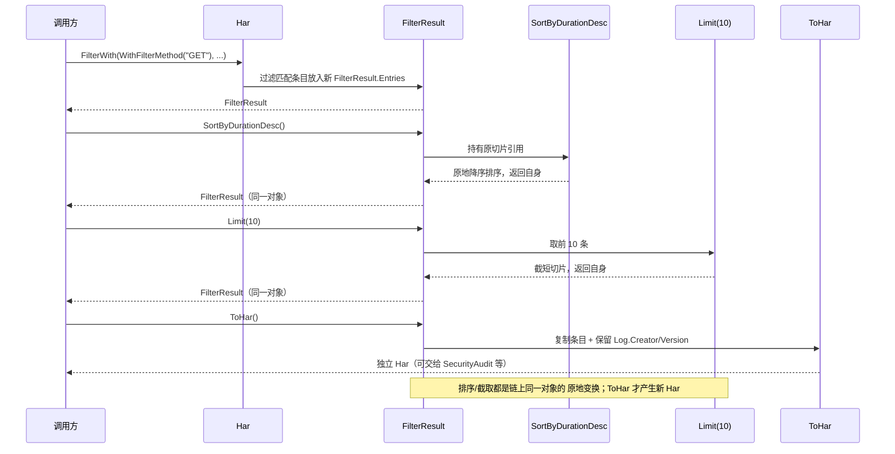
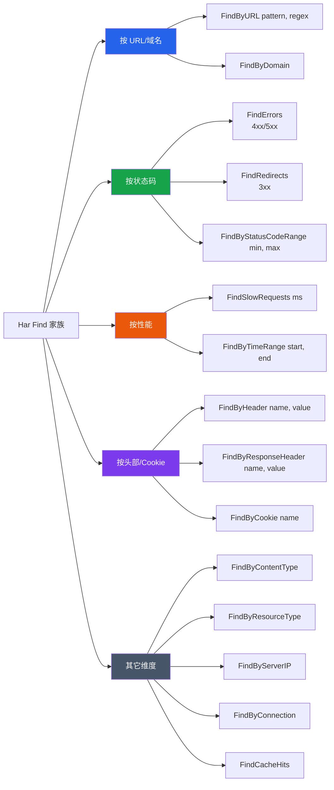

# 过滤与链式结果

`filter.go` 是 SDK 中最常用的模块之一。`Filter(FilterOptions)` 返回 `*FilterResult`，后者提供一整套链式方法（排序、截取、链式再过滤、转回 `*Har`）。同时 `*Har` 上挂了一批 `Find*` 快捷方法覆盖常见查询。`functional_options.go` 又提供了函数式 `FilterWith(WithFilter*...)`。三套 API 共同覆盖"结构化过滤 + 链式变换 + 函数式拼装"三种风格。

## FilterOptions 字段

`FilterOptions` 是结构体式配置，所有字段都是零值友好（零值表示"不过滤该维度"）：

```go
type FilterOptions struct {
    URL             string    // URL 包含的字符串，或配合 UseRegex 后的正则
    Method          string    // 请求方法
    StatusCode      int       // 精确状态码
    StatusCodeMin   int       // 最小状态码（与 Max 组成区间）
    StatusCodeMax   int       // 最大状态码
    ContentType     string    // 内容类型（MIME 子串匹配）
    StartTime       time.Time // 开始时间下界
    EndTime         time.Time // 结束时间上界
    MinDuration     float64   // 最小持续时间（ms）
    MaxDuration     float64   // 最大持续时间（ms）
    ResourceType    string    // Chrome _resourceType
    HasError        bool      // 是否有错误（_error 非空）
    HeaderName      string    // 请求头名
    HeaderValue     string    // 请求头值（空表示只按名存在性）
    RespHeaderName  string    // 响应头名
    RespHeaderValue string    // 响应头值
    UseRegex        bool      // 是否对 URL 用正则匹配
}
```

字段之间存在组合：`StatusCodeMin`+`StatusCodeMax` 构成区间；`StartTime`+`EndTime` 构成时间窗；`MinDuration`+`MaxDuration` 构成耗时区间。`HasError` 为 true 时只保留带 `_error` 的条目。

## Filter 返回 FilterResult

```go
type FilterResult struct {
    Entries []Entries
}

func (h *Har) Filter(options FilterOptions) *FilterResult
```

`Filter` 不会修改原 `*Har`——它把匹配的条目切片放进新的 `FilterResult`。结果对象是链式操作的起点。

```go
h, _ := har.ParseHarFile("capture.har")

// 找出 GET 且状态码 200 的请求
result := h.Filter(har.FilterOptions{
    Method:    "GET",
    StatusCode: 200,
})
fmt.Println("matched:", result.Count())
```

::: tip 访问结果条目
`FilterResult.Entries` 是导出切片，可直接遍历：`for i := range result.Entries { ... }`。`First()`/`Last()`/`At(i)` 是便捷访问器，`Count()` 返回数量。
:::

## 链式方法

链式调用是一条处理管道：每一步返回 `*FilterResult`，下一步在前一步的结果上继续。下面的时序图展示了 `FilterWith(...) → SortByDurationDesc() → Limit(10) → ToHar()` 的完整流转，各阶段如何传递切片、最终如何打包成独立 `*Har`：



`*FilterResult` 的方法都返回 `*FilterResult`（除了 `ToHar()` 和访问器），因此可以串起来。按职责归类如下：

### 计数与访问器

| 方法 | 作用 | 返回 |
|------|------|------|
| `Count() int` | 条目数 | `int` |
| `First() *Entries` | 第一条 | `*Entries` |
| `Last() *Entries` | 最后一条 | `*Entries` |
| `At(i) *Entries` | 第 i 条（越界返回 nil） | `*Entries` |

### 排序（链式）

| 方法 | 作用 | 返回 |
|------|------|------|
| `SortByTime() *FilterResult` | 按开始时间升序 | 链 |
| `SortByDuration() *FilterResult` | 按总耗时升序 | 链 |
| `SortByDurationDesc() *FilterResult` | 按总耗时降序 | 链 |
| `SortBySize() *FilterResult` | 按响应大小升序 | 链 |
| `SortBySizeDesc() *FilterResult` | 按响应大小降序 | 链 |

### 分页与链式再过滤（链式）

| 方法 | 作用 | 返回 |
|------|------|------|
| `Limit(n) *FilterResult` | 取前 n 条 | 链 |
| `Offset(n) *FilterResult` | 跳过前 n 条 | 链 |
| `Chain(opts) *FilterResult` | 在当前结果上再过滤 | 链 |

### 转换出口

| 方法 | 作用 | 返回 |
|------|------|------|
| `ToHar() *Har` | 转回独立 `*Har`（保留元信息） | `*Har` |

```go
// 最慢的 10 个 GET/200 请求
top := h.Filter(har.FilterOptions{
    Method:    "GET",
    StatusCode: 200,
}).SortByDurationDesc().Limit(10)

for _, e := range top.Entries {
    fmt.Printf("%6.1fms  %s\n", e.Time, e.Request.URL)
}
```

`Chain` 让你在已过滤结果上叠加新条件，无需重新从原 `*Har` 过滤：

```go
// 先按域名，再按状态码
apiResult := h.Filter(har.FilterOptions{URL: "api.example.com"}).
    Chain(har.FilterOptions{StatusCode: 500})
```

`ToHar()` 把当前结果集打包成一个独立的 `*Har`，原 `Log.Creator`/`Version` 等元信息保留——适合把子集交给其他分析方法或导出。

## 快捷 Find 方法

`*Har` 上挂了一批 `Find*` 方法，覆盖最常见的查询，省去手写 `FilterOptions`。先看这张家族分类图——按"按什么维度查"归成 5 类，每类对应若干方法：



| 方法 | 等价 FilterOptions |
|------|-------------------|
| `FindErrors()` | 状态码 4xx/5xx |
| `FindRedirects()` | 状态码 3xx |
| `FindSlowRequests(ms)` | `MinDuration = ms` |
| `FindByDomain(domain)` | URL 含该域名 |
| `FindByURL(pattern, regex)` | `URL=pattern`，`UseRegex=regex` |
| `FindByStatusCodeRange(min, max)` | `StatusCodeMin/Max` |
| `FindByContentType(ct)` | `ContentType=ct` |
| `FindByHeader(name, value)` | `HeaderName/HeaderValue` |
| `FindByResponseHeader(name, value)` | `RespHeaderName/RespHeaderValue` |
| `FindByCookie(name)` | 存在名为 name 的 Cookie |
| `FindByResourceType(rt)` | `ResourceType=rt` |
| `FindByServerIP(ip)` | `ServerIPAddress` 匹配 |
| `FindByConnection(connID)` | `Connection` 匹配 |
| `FindCacheHits()` | 缓存命中 |
| `FindByTimeRange(start, end)` | `StartTime/EndTime` |

```go
// 5xx 错误，按耗时降序
errs := h.FindByStatusCodeRange(500, 599).SortByDurationDesc()

// 慢于 1s 的请求
slow := h.FindSlowRequests(1000)

// 正则匹配 API 路径
api := h.FindByURL(`^https://api\.example\.com/v[0-9]+`, true)

// 含 Authorization 头的请求
authed := h.FindByHeader("Authorization", "")
```

`FindByURL` 第二个参数是 `regex bool`：false 做子串匹配，true 做正则。这与 CLI `find "pattern" --regex` 一一对应。

## 函数式 FilterWith

`functional_options.go` 提供函数式入口 `FilterWith(opts ...FilterOption) *FilterResult`，与 `Filter(FilterOptions)` 完全等价，只是配置用 `WithFilter*` 闭包：

```go
result := h.FilterWith(
    har.WithFilterMethod("GET"),
    har.WithFilterStatusCode(200),
).SortByDurationDesc().Limit(10).ToHar()
```

`WithFilter*` 工厂一览（详见 [函数式选项](./functional-options)）：

- `WithFilterURL(s)` / `WithFilterRegex()` — URL 匹配，`WithFilterRegex()` 切正则模式
- `WithFilterMethod(m)` / `WithFilterStatusCode(c)` / `WithFilterStatusCodeRange(min, max)`
- `WithFilterContentType(ct)` / `WithFilterResourceType(rt)`
- `WithFilterTimeRange(start, end)` / `WithFilterDuration(min, max)`
- `WithFilterHasError()` / `WithFilterHeader(name, value)` / `WithFilterResponseHeader(name, value)`

函数式的优势在于**条件拼装**——根据运行时条件决定加哪些过滤维度，无需预填一个巨大结构体：

```go
opts := []har.FilterOption{har.WithFilterMethod("GET")}
if only2xx {
    opts = append(opts, har.WithFilterStatusCodeRange(200, 299))
}
if minMs > 0 {
    opts = append(opts, har.WithFilterDuration(minMs, 0))
}
result := h.FilterWith(opts...).SortByDurationDesc().Limit(50)
```

## 链式组合示例

把上面所有能力串起来——一个真实的"慢接口排查"流程：

```go
h, _ := har.ParseHarFile("capture.har")

// 目标：找出 API 域名下、5xx、最慢的 10 个请求，导出为独立 HAR
hot := h.FilterWith(
    har.WithFilterURL("api.example.com"),
    har.WithFilterStatusCodeRange(500, 599),
).SortByDurationDesc().Limit(10)

fmt.Printf("found %d problematic endpoints\n", hot.Count())
for i := range hot.Entries {
    e := hot.Entries[i]
    fmt.Printf("  %6.1fms  %d  %s\n", e.Time, e.Response.Status, e.Request.URL)
}

// 打包成独立 HAR，交给 security 审计或导出
subHar := hot.ToHar()
report := subHar.SecurityAudit()
fmt.Println("sub-set security score:", report.Score)
```

这段代码同时演示了：函数式拼装（`FilterWith`）、链式变换（`SortByDurationDesc().Limit`）、访问器（`Count`）、直接遍历切片（`range hot.Entries`）、转回 `*Har`（`ToHar`）后接入其他分析模块。

## 下一步

- 过滤选项的函数式 `With*` 全表，见 [函数式选项](./functional-options)。
- 拿到 `*Har` 子集后做安全/性能分析，见数据结构页中 `SecurityAudit`/`PerformanceScore` 等方法的引用。
