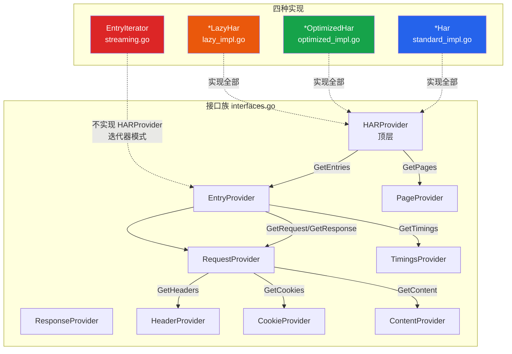
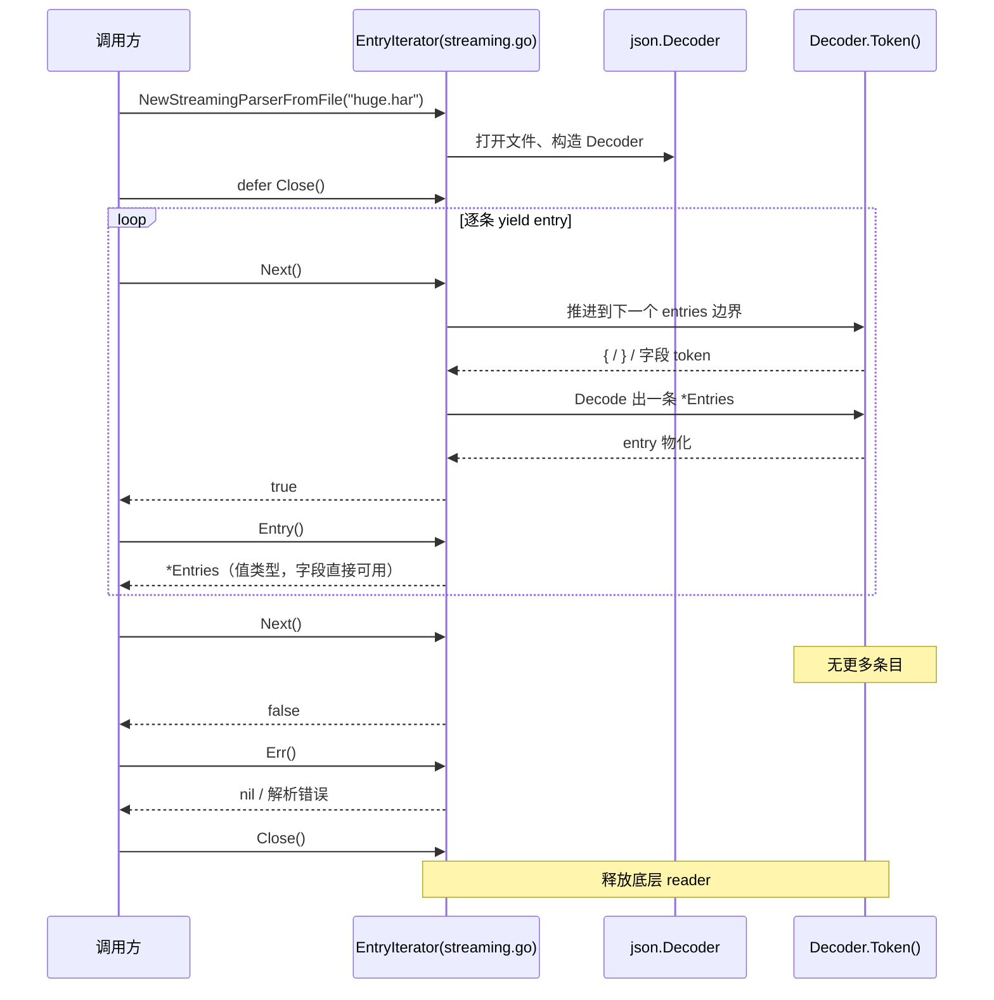
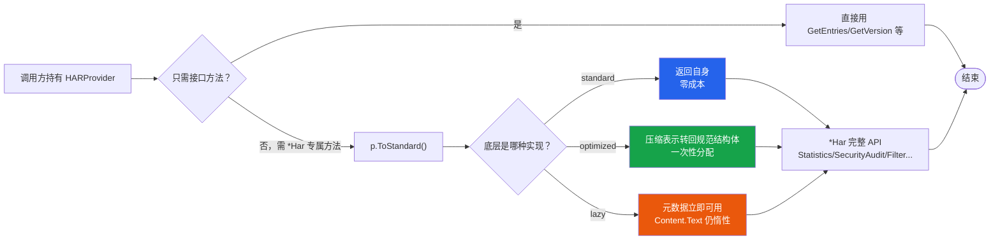

# Provider 接口

四种解析策略返回的具体类型各不相同（`*Har`、`*OptimizedHar`、`*LazyHar`、`EntryIterator`）。SDK 用 `interfaces.go` 中的一族 `Provider` 接口把它们统一起来，让你能面向抽象编程，再按需用 `ToStandard()` 取回完整 `*Har`。

## 为什么需要接口族

假设你写了一个通用函数，想统计任意来源 HAR 的请求总数。如果它只接受 `*Har`，那么 `*OptimizedHar` 和 `*LazyHar` 的调用方就必须先 `ToStandard()` 做一次转换——可能抵消 optimized/lazy 的内存收益。接口族让函数签名收 `HARProvider`，调用方传入真实实现即可，无需提前物化。

```go
// 通用处理：不关心底层是 standard / optimized / lazy
func countEntries(p har.HARProvider) int {
    return len(p.GetEntries())
}
```

`standard_impl.go`、`optimized_impl.go`、`lazy_impl.go` 各自让自己的类型实现这族接口，因此同一个 `countEntries` 能吃下三种实现。

### 接口族与四种实现的关系

下图是 `interfaces.go` 接口族与四种实现的对应关系：实线表示"实现接口"，虚线表示 streaming 走的是迭代器而非 Provider 路径。



## HARProvider —— 顶层接口

```go
type HARProvider interface {
    GetVersion() string
    GetCreator() Creator
    GetBrowser() Browser
    GetEntries() []EntryProvider
    GetPages() []PageProvider
    ToStandard() *Har
}
```

`GetEntries()` 返回的是 `[]EntryProvider`，而不是 `[]Entries`——这是递归的抽象：每个条目也是接口，按需 `.ToStandard()` 物化成 `Entries`。`ToStandard()` 是逃生舱：任何时候你需要 `*Har` 的全部方法（`Statistics()`、`SecurityAudit()`、`Filter()` 等），都能拿回来。

```go
p, err := har.ParseFile("capture.har", har.WithMemoryOptimized())
if err != nil {
    log.Fatal(err)
}
// p 是 HARProvider；按需取标准形态
h := p.ToStandard()
report := h.SecurityAudit()
fmt.Println("security score:", report.Score)
```

::: tip ToStandard() 的代价因实现而异
- standard：返回自身，零成本。
- optimized：把压缩表示转回规范结构体，一次性分配。
- lazy：转回时元数据立即可用，但 `Content.Text` 仍保持惰性，直到被访问。
:::

## EntryProvider —— 单条目接口

```go
type EntryProvider interface {
    GetStartedDateTime() time.Time
    GetTime() float64
    GetRequest() RequestProvider
    GetResponse() ResponseProvider
    GetTimings() TimingsProvider
    GetPageref() string
    ToStandard() Entries
}
```

`EntryProvider` 是遍历条目时的基本单元。注意它返回的是 `RequestProvider`/`ResponseProvider`/`TimingsProvider`，层层抽象。

```go
func printStatuses(p har.HARProvider) {
    for _, ep := range p.GetEntries() {
        req := ep.GetRequest()
        resp := ep.GetResponse()
        fmt.Printf("%s %s -> %d\n", req.GetMethod(), req.GetURL(), resp.GetStatus())
    }
}
```

在 lazy 实现里，`ep.GetResponse().GetContent().GetText()` 才会触发该条目响应体的解析——这是接口抽象与惰性求值协同的关键：调用方代码看起来与 standard 完全一样，但底层的 body 解析被推迟了。

## RequestProvider / ResponseProvider

```go
type RequestProvider interface {
    GetMethod() string
    GetURL() string
    GetHTTPVersion() string
    GetHeaders() []HeaderProvider
    GetCookies() []CookieProvider
    GetQueryString() []QueryString
    GetPostData() *PostData
    GetBodySize() int
    GetHeadersSize() int
    ToStandard() Request
}

type ResponseProvider interface {
    GetStatus() int
    GetStatusText() string
    GetHTTPVersion() string
    GetHeaders() []HeaderProvider
    GetCookies() []CookieProvider
    GetContent() ContentProvider
    GetBodySize() int
    GetHeadersSize() int
    ToStandard() Response
}
```

注意 `GetQueryString()` 直接返回值类型 `[]QueryString`，而 `GetHeaders()` 返回 `[]HeaderProvider`——这种不对称是有意的：查询参数简单且高频全量遍历，header 在 optimized 实现里是 map，需要接口适配才能统一访问。

## HeaderProvider / CookieProvider / ContentProvider

这三个是最细粒度的接口，分别对应头部、Cookie、响应内容。

```go
type HeaderProvider interface {
    GetName() string
    GetValue() string
    ToStandard() Headers
}

type CookieProvider interface {
    GetName() string
    GetValue() string
    GetDomain() string
    GetPath() string
    GetExpires() time.Time
    IsHTTPOnly() bool
    IsSecure() bool
    GetSameSite() string
    ToStandard() Cookie
}

type ContentProvider interface {
    GetSize() int
    GetMimeType() string
    GetText() string
    GetEncoding() string
    GetCompression() int
    ToStandard() Content
}
```

`CookieProvider` 用 `IsHTTPOnly()`/`IsSecure()` 而非 `GetHTTPOnly()`——遵循 Go 对布尔 getter 的命名惯例。`ContentProvider.GetText()` 是 lazy 策略的延迟触发点。

## TimingsProvider / PageProvider / PageTimingsProvider

```go
type TimingsProvider interface {
    GetBlocked() float64
    GetDNS() float64
    GetConnect() float64
    GetSend() float64
    GetWait() float64
    GetReceive() float64
    GetSSL() float64
    ToStandard() Timings
}

type PageProvider interface {
    GetID() string
    GetTitle() string
    GetStartedDateTime() time.Time
    GetPageTimings() PageTimingsProvider
    ToStandard() Pages
}

type PageTimingsProvider interface {
    GetOnContentLoad() float64
    GetOnLoad() float64
    ToStandard() PageTimings
}
```

`TimingsProvider` 只暴露规范核心字段，省略了 Chrome 扩展的 `_blocked_queueing`/`_blocked_proxy`——接口聚焦跨实现稳定存在的部分。需要扩展字段时，用 `ToStandard()` 取回完整 `Timings`。

## 各实现如何满足接口

| 实现 | 文件 | HARProvider | EntryProvider | 备注 |
|------|------|-------------|---------------|------|
| standard | `standard_impl.go` | `*Har` | `*Entries` 直接返回 | `ToStandard()` 返回自身 |
| optimized | `optimized_impl.go` + `memory.go` | `*OptimizedHar` | `*OptimizedEntries` | 另有 `ToStandardHar()` 别名与 `SearchBy*` |
| lazy | `lazy_impl.go` | `*LazyHar` | `*LazyEntries` | `GetText()` 触发惰性解析 |
| streaming | `streaming.go` | **不实现** | 通过 `EntryIterator` | 迭代器模式，无随机访问 |

`standard_impl.go` 让 `*Har` 直接实现接口——字段就是接口返回值，零转换。编译期断言 `var _ HARProvider = (*Har)(nil)` 和 `var _ HARProvider = (*LazyHar)(nil)` 保证契约不被破坏。

```go
// standard_impl.go（简化）
func (h *Har) GetVersion() string          { return h.Log.Version }
func (h *Har) GetCreator() Creator         { return h.Log.Creator }
func (h *Har) GetBrowser() Browser         { return h.Log.Browser }
func (h *Har) GetEntries() []EntryProvider { /* 把 []Entries 适配成 []EntryProvider */ }
func (h *Har) GetPages() []PageProvider    { /* 同上 */ }
func (h *Har) ToStandard() *Har            { return h }
```

## streaming 是迭代器模式，不是 Provider

`streaming` 策略有意识地不实现 `HARProvider`：流式解析不支持"获取全部条目"，因此没有 `GetEntries()`/`ToStandard()`。它返回 `EntryIterator`，调用方用 `Next()` 推进、`Entry()` 取当前条目。

```go
iter, err := har.NewStreamingParserFromFile("huge.har")
if err != nil {
    log.Fatal(err)
}
defer iter.Close()

for iter.Next() {
    e := iter.Entry() // *Entries，已是值类型，可直接用字段
    if e.Response.Status >= 500 {
        fmt.Println("5xx:", e.Request.URL)
    }
}
if err := iter.Err(); err != nil {
    log.Fatal(err)
}
```

如果你拿到一个 `EntryIterator` 却又需要某条目的接口视图，可以直接用 `*Entries`（它满足 `EntryProvider`，因为 standard 实现就在 `*Entries` 上定义了接口方法）。

streaming 迭代器的推进时序——`Decoder.Token()` 增量推进，每条 `Entry()` 都是上一轮 `Next()` 解码出的 `*Entries`：



## 面向抽象编程的典型模式

```go
// 1. 接收 HARProvider，不关心来源
func summarize(p har.HARProvider) {
    fmt.Printf("HAR %s, %d entries, creator=%s\n",
        p.GetVersion(), len(p.GetEntries()), p.GetCreator().Name)

    // 2. 只在需要完整 API 时才 ToStandard()
    h := p.ToStandard()
    stats := h.Statistics()
    fmt.Printf("total entries: %d, total size: %d\n",
        stats.TotalEntries, stats.TotalSize)
}

func main() {
    // 同一个 summarize 适用于三种实现
    if p, err := har.ParseFile("a.har"); err == nil {
        summarize(p)
    }
    if p, err := har.ParseFile("b.har", har.WithMemoryOptimized()); err == nil {
        summarize(p)
    }
    if p, err := har.ParseFile("c.har", har.WithLazyLoading()); err == nil {
        summarize(p)
    }
}
```

这个模式的要点：

1. **入口处收 `HARProvider`**，调用方传任何实现都不用改函数。
2. **延迟 `ToStandard()`** 到真正需要 `*Har` 专属方法时。如果函数只用接口方法，连转换都省了。
3. **streaming 单独处理**——它是迭代器，不进 `HARProvider` 路径。

下面的流程图概括了"面向抽象编程 → 按需 ToStandard() 取回完整 API"的调用流：



## 下一步

- 控制 `Parse()` 走哪种策略的 `Option` 与预设，见 [函数式选项](./functional-options)。
- 拿到 `*Har` 后如何筛选条目，见 [过滤与链式结果](./filtering)。
